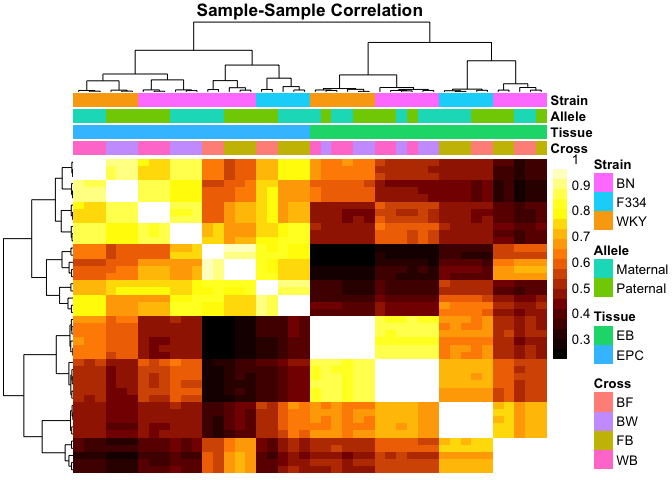
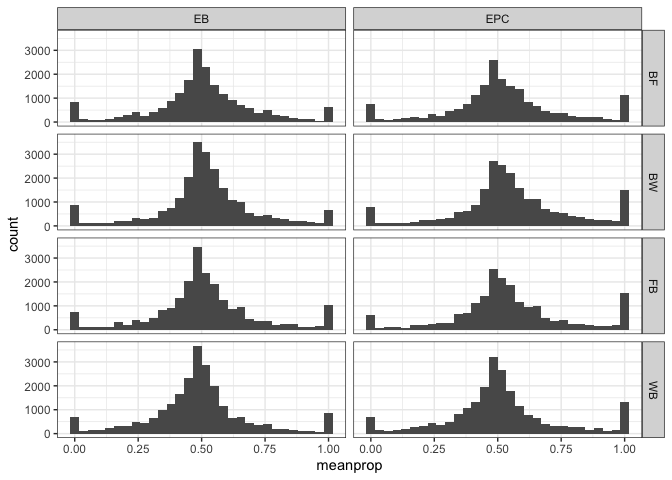

Assessing allele imbalance in the rat imprintome
================
Keegan Korthauer
25/03/2022

# Setup

## Load libraries

``` r
library(tidyverse)
library(broom)
library(Biobase)
library(ggplot2)
theme_set(theme_bw())
library(limma)
library(ggfortify)
library(edgeR)
library(pheatmap)
library(UpSetR)
```

## Read in and format data

Read in `.txt` file provided by Julien.

``` r
ase.raw <- read.delim("Book2.txt")
```

Print basic info.

``` r
str(ase.raw)
```

    ## 'data.frame':    73059 obs. of  52 variables:
    ##  $ chr                                    : chr  "chr1" "chr1" "chr1" "chr1" ...
    ##  $ start                                  : int  53395 56565 197017 237908 237908 249305 318092 390868 400255 515556 ...
    ##  $ end                                    : int  56311 60411 211255 241172 243880 269871 329799 396476 409676 519170 ...
    ##  $ strand                                 : chr  "-" "-" "-" "-" ...
    ##  $ name                                   : chr  "XR_001835498.1" "XR_589829.2" "XR_589830.2" "XM_017589816.1" ...
    ##  $ ID                                     : chr  "XR_001835498.1" "XR_589829.2" "XR_589830.2" "XM_017589816.1" ...
    ##  $ ExonLength                             : int  1182 1735 2185 1647 1870 2703 2589 1752 2037 1866 ...
    ##  $ Wistar_blood_RNA_PRJEB23955_rep1.9_RPKM: num  0 0 0.0743 0.2956 0.7811 ...
    ##  $ BW_EB_RNA_rep1_BN_F1540_q255_RPM       : num  0 0 0 0 0 0 0 0 0 0 ...
    ##  $ BW_EB_RNA_rep1_WKY_NCrl_F1540_q255_RPM : num  0 0 0 0 0 0 0 0 0 0 ...
    ##  $ BW_EB_RNA_rep2_BN_F1540_q255_RPM       : num  0 0 0 0 0 0 0 0 0 0 ...
    ##  $ BW_EB_RNA_rep2_WKY_NCrl_F1540_q255_RPM : num  0 0 0 0 0 0 0 0 0 0 ...
    ##  $ BW_EB_RNA_rep3_BN_F1540_q255_RPM       : num  0 0 0 0 0 0 0 0 0 0 ...
    ##  $ BW_EB_RNA_rep3_WKY_NCrl_F1540_q255_RPM : num  0 0 0 0 0 0 0 0 0 0 ...
    ##  $ WB_EB_RNA_rep1_BN_F1540_q255_RPM       : num  0 0 0 0 0 0 0 0 0 0 ...
    ##  $ WB_EB_RNA_rep1_WKY_NCrl_F1540_q255_RPM : num  0 0 0 0 0 0 0 0 0 0 ...
    ##  $ WB_EB_RNA_rep2_BN_F1540_q255_RPM       : num  0 0 0 0 0 0 0 0 0 0 ...
    ##  $ WB_EB_RNA_rep2_WKY_NCrl_F1540_q255_RPM : num  0 0 0 0 0 0 0 0 0 0 ...
    ##  $ WB_EB_RNA_rep3_BN_F1540_q255_RPM       : num  0 0 0 0 0 0 0 0 0 0 ...
    ##  $ WB_EB_RNA_rep3_WKY_NCrl_F1540_q255_RPM : num  0 0 0 0 0 0 0 0 0 0 ...
    ##  $ BF_EB_RNA_rep1_BN_F1540_q255_RPM       : num  0 0 0 0 0 0 0 0 0 0 ...
    ##  $ BF_EB_RNA_rep1_F334_N_F1540_q255_RPM   : num  0 0 0 0 0 0 0 0 0 0 ...
    ##  $ BF_EB_RNA_rep2_BN_F1540_q255_RPM       : num  0 0 13.1 0 0 ...
    ##  $ BF_EB_RNA_rep2_F334_N_F1540_q255_RPM   : num  0 0 0 0 0 ...
    ##  $ FB_EB_RNA_rep1_BN_F1540_q255_RPM       : num  0 0 0 0 0 0 0 0 0 0 ...
    ##  $ FB_EB_RNA_rep1_F334_N_F1540_q255_RPM   : num  0 0 0 0 0 0 0 0 0 0 ...
    ##  $ FB_EB_RNA_rep2_BN_F1540_q255_RPM       : num  0 0 0 0 0 0 0 0 0 0 ...
    ##  $ FB_EB_RNA_rep2_F334_N_F1540_q255_RPM   : num  0 0 0 0 0 0 0 0 0 0 ...
    ##  $ FB_EB_RNA_rep3_BN_F1540_q255_RPM       : num  0 0 0 0 0 0 0 0 0 0 ...
    ##  $ FB_EB_RNA_rep3_F334_N_F1540_q255_RPM   : num  0 0 0 0 0 0 0 0 0 0 ...
    ##  $ BW_EPC_RNA_rep1_BN_F1540_q255_RPM      : num  0 0 0 0 0 0 0 0 0 0 ...
    ##  $ BW_EPC_RNA_rep1_WKY_NCrl_F1540_q255_RPM: num  0 0 0 0 0 0 0 0 0 0 ...
    ##  $ BW_EPC_RNA_rep3_BN_F1540_q255_RPM      : num  0 0 0 0 0 0 0 0 0 0 ...
    ##  $ BW_EPC_RNA_rep3_WKY_NCrl_F1540_q255_RPM: num  0 0 0 0 0 0 0 0 0 0 ...
    ##  $ BW_EPC_RNA_rep4_BN_F1540_q255_RPM      : num  0 0 0 0 0 0 0 0 0 0 ...
    ##  $ BW_EPC_RNA_rep4_WKY_NCrl_F1540_q255_RPM: num  0 0 0 0 0 0 0 0 0 0 ...
    ##  $ WB_EPC_RNA_rep1_BN_F1540_q255_RPM      : num  0 0 0 0 0 0 0 0 0 0 ...
    ##  $ WB_EPC_RNA_rep1_WKY_NCrl_F1540_q255_RPM: num  0 0 0 0 0 0 0 0 0 0 ...
    ##  $ WB_EPC_RNA_rep2_BN_F1540_q255_RPM      : num  0 0 0 0 0 0 0 0 0 0 ...
    ##  $ WB_EPC_RNA_rep2_WKY_NCrl_F1540_q255_RPM: num  0 0 0 0 0 0 0 0 0 0 ...
    ##  $ WB_EPC_RNA_rep3_BN_F1540_q255_RPM      : num  0 0 0 0 0 0 0 0 0 0 ...
    ##  $ WB_EPC_RNA_rep3_WKY_NCrl_F1540_q255_RPM: num  0 0 0 0 0 0 0 0 0 0 ...
    ##  $ BF_EPC_RNA_rep1_BN_F1540_q255_RPM      : num  0 0 0 0 0 0 0 0 0 0 ...
    ##  $ BF_EPC_RNA_rep1_F334_N_F1540_q255_RPM  : num  0 0 0 0 0 0 0 0 0 0 ...
    ##  $ BF_EPC_RNA_rep2_BN_F1540_q255_RPM      : num  0 0 0 0 0 0 0 0 0 0 ...
    ##  $ BF_EPC_RNA_rep2_F334_N_F1540_q255_RPM  : num  0 0 0 0 0 0 0 0 0 0 ...
    ##  $ FB_EPC_RNA_rep1_BN_F1540_q255_RPM      : num  0 0 0 0 0 0 0 0 0 0 ...
    ##  $ FB_EPC_RNA_rep1_F334_N_F1540_q255_RPM  : num  0 0 0 0 0 0 0 0 0 0 ...
    ##  $ FB_EPC_RNA_rep2_BN_F1540_q255_RPM      : num  0 0 0 0 0 0 0 0 0 0 ...
    ##  $ FB_EPC_RNA_rep2_F334_N_F1540_q255_RPM  : num  0 0 0 0 0 0 0 0 0 0 ...
    ##  $ FB_EPC_RNA_rep3_BN_F1540_q255_RPM      : num  0 0 0 0 0 0 0 0 0 0 ...
    ##  $ FB_EPC_RNA_rep3_F334_N_F1540_q255_RPM  : num  0 0 0 0 0 ...

``` r
length(unique(ase.raw$name))
```

    ## [1] 73057

Pull out sample metadata from sample names.

``` r
pd <- data.frame(Sample = colnames(ase.raw)[-c(1:8)])
rownames(pd) <- pd$Sample
attrlist <- strsplit(pd$Sample, "_")
pd <- pd %>%
  mutate(Cross = sapply(attrlist, function(x) x[1]),
         Tissue =  sapply(attrlist, function(x) x[2]),
         Rep =  sapply(attrlist, function(x) x[4]),
         Strain = sapply(attrlist, function(x) x[5]),
         Allele = ifelse(substr(Cross, 1, 1) == substr(Strain, 1, 1),
                         "Maternal", "Paternal"),
         Rat = paste0(Rep, Cross, Tissue),
         Cross_group = ifelse(Cross %in% c("BF", "FB"), "BF/FB", "BW/WB"),
         Cross_direction = ifelse(Cross %in% c("BF", "BW"), "Forward", "Reverse"))

# change rep4 (BW EPC) to rep2 (in that cross rep2 is missing)
pd <- pd %>%
  mutate(Rep = gsub("rep4", "rep2", Rep))

str(pd)
```

    ## 'data.frame':    44 obs. of  9 variables:
    ##  $ Sample         : chr  "BW_EB_RNA_rep1_BN_F1540_q255_RPM" "BW_EB_RNA_rep1_WKY_NCrl_F1540_q255_RPM" "BW_EB_RNA_rep2_BN_F1540_q255_RPM" "BW_EB_RNA_rep2_WKY_NCrl_F1540_q255_RPM" ...
    ##  $ Cross          : chr  "BW" "BW" "BW" "BW" ...
    ##  $ Tissue         : chr  "EB" "EB" "EB" "EB" ...
    ##  $ Rep            : chr  "rep1" "rep1" "rep2" "rep2" ...
    ##  $ Strain         : chr  "BN" "WKY" "BN" "WKY" ...
    ##  $ Allele         : chr  "Maternal" "Paternal" "Maternal" "Paternal" ...
    ##  $ Rat            : chr  "rep1BWEB" "rep1BWEB" "rep2BWEB" "rep2BWEB" ...
    ##  $ Cross_group    : chr  "BW/WB" "BW/WB" "BW/WB" "BW/WB" ...
    ##  $ Cross_direction: chr  "Forward" "Forward" "Forward" "Forward" ...

``` r
table(pd$Cross, pd$Allele, pd$Rep, pd$Tissue)
```

    ## , ,  = rep1,  = EB
    ## 
    ##     
    ##      Maternal Paternal
    ##   BF        1        1
    ##   BW        1        1
    ##   FB        1        1
    ##   WB        1        1
    ## 
    ## , ,  = rep2,  = EB
    ## 
    ##     
    ##      Maternal Paternal
    ##   BF        1        1
    ##   BW        1        1
    ##   FB        1        1
    ##   WB        1        1
    ## 
    ## , ,  = rep3,  = EB
    ## 
    ##     
    ##      Maternal Paternal
    ##   BF        0        0
    ##   BW        1        1
    ##   FB        1        1
    ##   WB        1        1
    ## 
    ## , ,  = rep1,  = EPC
    ## 
    ##     
    ##      Maternal Paternal
    ##   BF        1        1
    ##   BW        1        1
    ##   FB        1        1
    ##   WB        1        1
    ## 
    ## , ,  = rep2,  = EPC
    ## 
    ##     
    ##      Maternal Paternal
    ##   BF        1        1
    ##   BW        1        1
    ##   FB        1        1
    ##   WB        1        1
    ## 
    ## , ,  = rep3,  = EPC
    ## 
    ##     
    ##      Maternal Paternal
    ##   BF        0        0
    ##   BW        1        1
    ##   FB        1        1
    ##   WB        1        1

There are 3 replicates for each cross in each tissue, except for the BF
cross, for which there are 2 replicates. So in all, there are 11 samples
for each tissue (3 reps in each FB, BW, WB, 2 reps in BF) for a total of
22 samples. Each of these has a maternal and paternal allele count, for
a total of 44 rows in our dataset.

Remove duplicate feature:

``` r
length(ase.raw$name)
```

    ## [1] 73059

``` r
length(unique(ase.raw$name))
```

    ## [1] 73057

``` r
(tab <- which(table(ase.raw$name) == 2))
```

    ## NM_001014271.1 NM_001170534.2 
    ##           7169          14497

``` r
ase.raw <- ase.raw %>%
  filter(!name %in% names(tab))
```

Remove the following features:

1.  features with max RPKMs \< 1  
2.  those that don’t satisfy: RPKM >= 0.5 (total from maternal and
    paternal allele) in at least 2 out of 5 or 6 reps in *either* cross
    in *either* tissue (i.e. required to have 2 reps each for *either*
    cross in *either* EB or EPC)
3.  those not on canonical autosomes

``` r
filt1 <- ase.raw %>% 
  select(-c(1:8)) %>%
  apply(., 1, max) >= 1
sum(filt1)
```

    ## [1] 52625

``` r
filt2 <- ase.raw %>% 
  select(-c(1:4, 6:8)) %>%
  pivot_longer(names_to = "Sample",
               values_to = "RPKM",
               cols = -1) %>%
  left_join(pd) %>%
  select(-Sample, -Strain, -Rat) %>%
  group_by(name, Cross, Cross_group, Tissue, Rep) %>%
  summarize(sumRPKM = sum(RPKM)) %>%
  ungroup() %>%
  group_by(name, Tissue, Cross_group) %>%
  summarize(total = n(),
            pass = sum(sumRPKM >= 0.5) >= 2) %>%
  ungroup() %>%
  group_by(name, Tissue) %>%
  summarize(pass = sum(pass) > 0) %>%
  ungroup() %>%
  group_by(name) %>%
  summarize(pass = sum(pass) > 0) %>%
  ungroup() %>%
  left_join(ase.raw, ., by = "name") %>%
  pull(pass)
```

    ## Joining, by = "Sample"

    ## `summarise()` has grouped output by 'name', 'Cross', 'Cross_group', 'Tissue'. You can override using the `.groups` argument.

    ## `summarise()` has grouped output by 'name', 'Tissue'. You can override using the `.groups` argument.

    ## `summarise()` has grouped output by 'name'. You can override using the `.groups` argument.

``` r
sum(filt2)
```

    ## [1] 45686

``` r
filt3 <- ase.raw$chr %in% paste0("chr", 1:20)
sum(filt3)
```

    ## [1] 70129

``` r
filt <- filt1 & filt2 & filt3
sum(filt)
```

    ## [1] 44531

``` r
ase <- ase.raw %>% filter(filt)
dim(ase)
```

    ## [1] 44531    52

Let’s put this metadata into a single DGEList object:

``` r
dge <- DGEList(counts = ase %>% select(-c(1:8)), 
               samples = pd,
               genes = ase %>% select(c(1:7)))
dge
```

    ## An object of class "DGEList"
    ## $counts
    ##   BW_EB_RNA_rep1_BN_F1540_q255_RPM BW_EB_RNA_rep1_WKY_NCrl_F1540_q255_RPM
    ## 1                          0.00000                               50.15189
    ## 2                          9.62018                                0.00000
    ## 3                          0.00000                                0.00000
    ## 4                          0.00000                               13.18501
    ## 5                          0.00000                               16.45685
    ##   BW_EB_RNA_rep2_BN_F1540_q255_RPM BW_EB_RNA_rep2_WKY_NCrl_F1540_q255_RPM
    ## 1                                0                             130.226003
    ## 2                                0                               3.990941
    ## 3                                0                               8.459061
    ## 4                                0                              22.774368
    ## 5                                0                              26.591817
    ##   BW_EB_RNA_rep3_BN_F1540_q255_RPM BW_EB_RNA_rep3_WKY_NCrl_F1540_q255_RPM
    ## 1                                0                               68.44488
    ## 2                                0                               13.80127
    ## 3                                0                               18.43286
    ## 4                                0                                0.00000
    ## 5                                0                                0.00000
    ##   WB_EB_RNA_rep1_BN_F1540_q255_RPM WB_EB_RNA_rep1_WKY_NCrl_F1540_q255_RPM
    ## 1                         0.000000                              53.918769
    ## 2                         0.000000                               6.549642
    ## 3                         1.058528                              19.185819
    ## 4                         0.000000                               5.424956
    ## 5                         0.000000                              12.371545
    ##   WB_EB_RNA_rep2_BN_F1540_q255_RPM WB_EB_RNA_rep2_WKY_NCrl_F1540_q255_RPM
    ## 1                                0                              90.230385
    ## 2                                0                               0.000000
    ## 3                                0                              18.236044
    ## 4                                0                              21.987740
    ## 5                                0                               4.416541
    ##   WB_EB_RNA_rep3_BN_F1540_q255_RPM WB_EB_RNA_rep3_WKY_NCrl_F1540_q255_RPM
    ## 1                           0.0000                              61.156882
    ## 2                           0.0000                               0.000000
    ## 3                          10.5658                               0.000000
    ## 4                           0.0000                               1.467472
    ## 5                           0.0000                               6.273443
    ##   BF_EB_RNA_rep1_BN_F1540_q255_RPM BF_EB_RNA_rep1_F334_N_F1540_q255_RPM
    ## 1                          0.00000                             27.66315
    ## 2                          0.00000                              0.00000
    ## 3                         19.16594                              0.00000
    ## 4                         18.88270                              0.00000
    ## 5                          0.00000                              1.88827
    ##   BF_EB_RNA_rep2_BN_F1540_q255_RPM BF_EB_RNA_rep2_F334_N_F1540_q255_RPM
    ## 1                                0                             62.98712
    ## 2                                0                              0.00000
    ## 3                                0                              0.00000
    ## 4                                0                              0.00000
    ## 5                                0                              0.00000
    ##   FB_EB_RNA_rep1_BN_F1540_q255_RPM FB_EB_RNA_rep1_F334_N_F1540_q255_RPM
    ## 1                                0                            20.427281
    ## 2                                0                             7.647652
    ## 3                                0                             0.000000
    ## 4                                0                             8.251414
    ## 5                                0                            27.471224
    ##   FB_EB_RNA_rep2_BN_F1540_q255_RPM FB_EB_RNA_rep2_F334_N_F1540_q255_RPM
    ## 1                                0                             38.47130
    ## 2                                0                              0.00000
    ## 3                                0                              0.00000
    ## 4                                0                             15.97070
    ## 5                                0                             10.46355
    ##   FB_EB_RNA_rep3_BN_F1540_q255_RPM FB_EB_RNA_rep3_F334_N_F1540_q255_RPM
    ## 1                          0.00000                             17.71398
    ## 2                          0.00000                              0.00000
    ## 3                          0.00000                              0.00000
    ## 4                         11.39601                             10.27409
    ## 5                          0.00000                             11.92741
    ##   BW_EPC_RNA_rep1_BN_F1540_q255_RPM BW_EPC_RNA_rep1_WKY_NCrl_F1540_q255_RPM
    ## 1                           0.00000                                 0.00000
    ## 2                          10.50968                                47.07916
    ## 3                          37.21285                                40.10838
    ## 4                           0.00000                                 0.00000
    ## 5                           0.00000                                 0.00000
    ##   BW_EPC_RNA_rep3_BN_F1540_q255_RPM BW_EPC_RNA_rep3_WKY_NCrl_F1540_q255_RPM
    ## 1                          0.000000                                 0.00000
    ## 2                         17.978514                                21.57422
    ## 3                         38.616862                                23.19968
    ## 4                          0.000000                                 0.00000
    ## 5                          1.477686                                 0.00000
    ##   BW_EPC_RNA_rep4_BN_F1540_q255_RPM BW_EPC_RNA_rep4_WKY_NCrl_F1540_q255_RPM
    ## 1                           0.00000                                 0.00000
    ## 2                          35.61108                                29.32677
    ## 3                          84.06411                                80.55759
    ## 4                           0.00000                                 0.00000
    ## 5                           0.00000                                 0.00000
    ##   WB_EPC_RNA_rep1_BN_F1540_q255_RPM WB_EPC_RNA_rep1_WKY_NCrl_F1540_q255_RPM
    ## 1                           0.00000                                8.771700
    ## 2                           0.00000                                7.346856
    ## 3                          15.76234                               17.187190
    ## 4                           0.00000                                0.000000
    ## 5                           0.00000                                0.000000
    ##   WB_EPC_RNA_rep2_BN_F1540_q255_RPM WB_EPC_RNA_rep2_WKY_NCrl_F1540_q255_RPM
    ## 1                           0.00000                                 0.00000
    ## 2                          17.78305                                 9.17231
    ## 3                          74.50170                                16.70671
    ## 4                           0.00000                                 0.00000
    ## 5                           0.00000                                 0.00000
    ##   WB_EPC_RNA_rep3_BN_F1540_q255_RPM WB_EPC_RNA_rep3_WKY_NCrl_F1540_q255_RPM
    ## 1                           0.00000                                 0.00000
    ## 2                           0.00000                                28.34611
    ## 3                          27.43028                                17.85946
    ## 4                           0.00000                                 0.00000
    ## 5                           0.00000                                 0.00000
    ##   BF_EPC_RNA_rep1_BN_F1540_q255_RPM BF_EPC_RNA_rep1_F334_N_F1540_q255_RPM
    ## 1                          7.273532                               0.00000
    ## 2                          7.758451                              49.13684
    ## 3                         16.405853                              16.24422
    ## 4                          0.000000                               0.00000
    ## 5                          0.000000                               0.00000
    ##   BF_EPC_RNA_rep2_BN_F1540_q255_RPM BF_EPC_RNA_rep2_F334_N_F1540_q255_RPM
    ## 1                           0.00000                               0.00000
    ## 2                          14.00756                              34.88022
    ## 3                          13.86889                              13.93824
    ## 4                           0.00000                               0.00000
    ## 5                           0.00000                               0.00000
    ##   FB_EPC_RNA_rep1_BN_F1540_q255_RPM FB_EPC_RNA_rep1_F334_N_F1540_q255_RPM
    ## 1                                 0                              0.000000
    ## 2                                 0                             44.247491
    ## 3                                 0                             19.900451
    ## 4                                 0                              0.000000
    ## 5                                 0                              1.457906
    ##   FB_EPC_RNA_rep2_BN_F1540_q255_RPM FB_EPC_RNA_rep2_F334_N_F1540_q255_RPM
    ## 1                                 0                              0.000000
    ## 2                                 0                             24.722240
    ## 3                                 0                              9.750985
    ## 4                                 0                              0.000000
    ## 5                                 0                              0.000000
    ##   FB_EPC_RNA_rep3_BN_F1540_q255_RPM FB_EPC_RNA_rep3_F334_N_F1540_q255_RPM
    ## 1                           0.00000                               0.00000
    ## 2                          19.38482                              11.24318
    ## 3                          19.38482                               0.00000
    ## 4                           0.00000                               0.00000
    ## 5                           0.00000                               0.00000
    ## 44526 more rows ...
    ## 
    ## $samples
    ##                                        group lib.size norm.factors
    ## BW_EB_RNA_rep1_BN_F1540_q255_RPM           1 14930990            1
    ## BW_EB_RNA_rep1_WKY_NCrl_F1540_q255_RPM     1 13886991            1
    ## BW_EB_RNA_rep2_BN_F1540_q255_RPM           1 15678113            1
    ## BW_EB_RNA_rep2_WKY_NCrl_F1540_q255_RPM     1 14602828            1
    ## BW_EB_RNA_rep3_BN_F1540_q255_RPM           1 14328168            1
    ##                                                                        Sample
    ## BW_EB_RNA_rep1_BN_F1540_q255_RPM             BW_EB_RNA_rep1_BN_F1540_q255_RPM
    ## BW_EB_RNA_rep1_WKY_NCrl_F1540_q255_RPM BW_EB_RNA_rep1_WKY_NCrl_F1540_q255_RPM
    ## BW_EB_RNA_rep2_BN_F1540_q255_RPM             BW_EB_RNA_rep2_BN_F1540_q255_RPM
    ## BW_EB_RNA_rep2_WKY_NCrl_F1540_q255_RPM BW_EB_RNA_rep2_WKY_NCrl_F1540_q255_RPM
    ## BW_EB_RNA_rep3_BN_F1540_q255_RPM             BW_EB_RNA_rep3_BN_F1540_q255_RPM
    ##                                        Cross Tissue  Rep Strain   Allele
    ## BW_EB_RNA_rep1_BN_F1540_q255_RPM          BW     EB rep1     BN Maternal
    ## BW_EB_RNA_rep1_WKY_NCrl_F1540_q255_RPM    BW     EB rep1    WKY Paternal
    ## BW_EB_RNA_rep2_BN_F1540_q255_RPM          BW     EB rep2     BN Maternal
    ## BW_EB_RNA_rep2_WKY_NCrl_F1540_q255_RPM    BW     EB rep2    WKY Paternal
    ## BW_EB_RNA_rep3_BN_F1540_q255_RPM          BW     EB rep3     BN Maternal
    ##                                             Rat Cross_group Cross_direction
    ## BW_EB_RNA_rep1_BN_F1540_q255_RPM       rep1BWEB       BW/WB         Forward
    ## BW_EB_RNA_rep1_WKY_NCrl_F1540_q255_RPM rep1BWEB       BW/WB         Forward
    ## BW_EB_RNA_rep2_BN_F1540_q255_RPM       rep2BWEB       BW/WB         Forward
    ## BW_EB_RNA_rep2_WKY_NCrl_F1540_q255_RPM rep2BWEB       BW/WB         Forward
    ## BW_EB_RNA_rep3_BN_F1540_q255_RPM       rep3BWEB       BW/WB         Forward
    ## 39 more rows ...
    ## 
    ## $genes
    ##    chr   start     end strand           name             ID ExonLength
    ## 1 chr1 1101665 1120340      - XM_006227600.3 XM_006227600.3       4899
    ## 2 chr1 1181300 1200526      + XM_017590411.1 XM_017590411.1        781
    ## 3 chr1 1207153 1220928      + XR_001835499.1 XR_001835499.1       5555
    ## 4 chr1 1390045 1390532      -    XR_589836.1    XR_589836.1        344
    ## 5 chr1 1390548 1395730      - XM_006227603.3 XM_006227603.3       1130
    ## 44526 more rows ...

# EDA

## Principal components analysis

Let’s plot some PCA plots to see where major variation lies.

``` r
pca_res <- prcomp(t(dge$counts), scale. = TRUE)

autoplot(pca_res, data = dge$samples, colour = 'Tissue')
```

<!-- -->

``` r
autoplot(pca_res, data = dge$samples, colour = 'Cross')
```

<!-- -->

PC 1 is clearly Cross (BF/FB vs BW/WB). PC 2 is clearly tissue.

Let’s look at the next couple PCs.

``` r
autoplot(pca_res, data = dge$samples, colour = 'Cross', x = 3, y = 4)
```

<!-- -->

``` r
autoplot(pca_res, data = dge$samples, colour = 'Strain', x = 3, y = 4)
```

<!-- -->

``` r
autoplot(pca_res, data = dge$samples, colour = 'Tissue', x = 3, y = 4)
```

<!-- -->

PC 3 looks like strain effects (which strain is the allele from), and PC
4 looks like interaction between cross and tissue.

## Sample-sample correlation heatmap

Here we’ll look at a sample-sample correlation heatmap, which will
further let us look at major sources of variation and spot any potential
outlier samples.

``` r
# Set up color scheme for heatmaps 
bcols<-colorRampPalette(c("#000000" ,"#800000" ,"#FF8000" ,"#FFFF00", "#FFFFFF"))(20)

cc <- data.frame(cor(dge$counts), 
                 row.names = colnames(dge))
range(cc, na.rm=T)
```

    ## [1] 0.2143811 1.0000000

``` r
annot_df <- dge$samples %>%
  select(Cross, Tissue, Allele, Strain)
pheatmap(cc, color = bcols, 
         border_color = NA, 
         show_rownames = FALSE, 
         show_colnames = FALSE,
         annotation_col = annot_df, 
         main="Sample-Sample Correlation")
```

<!-- -->

A few observations:

-   As expected, tissue is the major source of variation  
-   Cross is the next major source of variation (BF/FB vs BW/WB)  
-   Within a tissue and reciprocal cross, expression is more similar for
    alleles coming from the same strain than from the same type of
    allele (mat/pat)  
-   Within a tissue, reciprocal cross and maternal strain, mat/pat
    alleles are generally more similar to each other than to the
    opposite allele within the same rat

## Allelic expression proportions

Here we want to calculate allelic expression proportions
(Maternal/(Maternal + Paternal)) for each rep.

``` r
ase.long <- pivot_longer(data.frame(dge$counts) %>% 
                           mutate(gene = dge$genes$name),
                         cols = -gene,
                         names_to = "Sample",
                         values_to = "RPKM") %>%
  left_join(pd) %>%
  select(-Sample, -Strain) %>%
  pivot_wider(names_from = Allele,
              values_from = "RPKM") %>%
  mutate(prop = Maternal / (Maternal + Paternal)) 
```

    ## Joining, by = "Sample"

``` r
ase.long
```

    ## # A tibble: 979,682 × 10
    ##    gene   Cross Tissue Rep   Rat   Cross_group Cross_direction Maternal Paternal
    ##    <chr>  <chr> <chr>  <chr> <chr> <chr>       <chr>              <dbl>    <dbl>
    ##  1 XM_00… BW    EB     rep1  rep1… BW/WB       Forward              0       50.2
    ##  2 XM_00… BW    EB     rep2  rep2… BW/WB       Forward              0      130. 
    ##  3 XM_00… BW    EB     rep3  rep3… BW/WB       Forward              0       68.4
    ##  4 XM_00… WB    EB     rep1  rep1… BW/WB       Reverse             53.9      0  
    ##  5 XM_00… WB    EB     rep2  rep2… BW/WB       Reverse             90.2      0  
    ##  6 XM_00… WB    EB     rep3  rep3… BW/WB       Reverse             61.2      0  
    ##  7 XM_00… BF    EB     rep1  rep1… BF/FB       Forward              0       27.7
    ##  8 XM_00… BF    EB     rep2  rep2… BF/FB       Forward              0       63.0
    ##  9 XM_00… FB    EB     rep1  rep1… BF/FB       Reverse             20.4      0  
    ## 10 XM_00… FB    EB     rep2  rep2… BF/FB       Reverse             38.5      0  
    ## # … with 979,672 more rows, and 1 more variable: prop <dbl>

Let’s visualize a histogram of maternal allelic proportions per gene.

``` r
ase.long %>% 
  group_by(gene, Tissue, Cross) %>%
  summarize(meanprop = mean(prop, na.rm = TRUE),
            n = sum(!is.na(prop))) %>%
  filter(n > 1) %>%
  ggplot() +
  geom_histogram(aes(meanprop)) +
  facet_grid(Cross ~ Tissue)
```

    ## `summarise()` has grouped output by 'gene', 'Tissue'. You can override using the `.groups` argument.

    ## `stat_bin()` using `bins = 30`. Pick better value with `binwidth`.

<!-- -->

As we expect, most values are close to 0.5.

### Scatterplots of maternal allele proportions by forward/reverse cross

``` r
ase.long %>% 
  group_by(gene, Tissue, Cross, Cross_group, Cross_direction) %>%
  summarize(meanprop = mean(prop, na.rm = TRUE),
            n = sum(!is.na(prop))) %>%
  filter(n > 1) %>%
  pivot_wider(id_cols = c(gene, Tissue, Cross_group), 
              names_from = Cross_direction, values_from = meanprop) %>%
  ggplot() +
  geom_point(aes(x = Forward, y = Reverse), alpha = 0.2, size = 0.5) +
  facet_grid(Cross_group ~ Tissue)
```

    ## `summarise()` has grouped output by 'gene', 'Tissue', 'Cross', 'Cross_group'. You can override using the `.groups` argument.

    ## Warning: Removed 19624 rows containing missing values (geom_point).

<!-- -->

# Limma voom

## Test within tissue

Here we’ll try out using limma voom to estimate allele-specific effects
within each tissue (EB and EPC).

We’ll build one model to represent the entire dataset. Our model here
includes blocking effects for each rat, so that we can estimate maternal
vs paternal allele effects. We’ll include terms to do so separately in
each allele. Note that there’s no need to include separate terms for
cross, due to the presence of the blocking term for rat (and since we
are not interested in looking at differential allele-specific expression
between the crosses).

``` r
mm <- model.matrix(~ 0 + Rat + Tissue:Allele,
                   data = dge$samples)

# drop redundant terms to get to full rank
mm <- mm[,!grepl("AlleleMaternal", colnames(mm))]
colnames(mm)
```

    ##  [1] "Ratrep1BFEB"              "Ratrep1BFEPC"            
    ##  [3] "Ratrep1BWEB"              "Ratrep1BWEPC"            
    ##  [5] "Ratrep1FBEB"              "Ratrep1FBEPC"            
    ##  [7] "Ratrep1WBEB"              "Ratrep1WBEPC"            
    ##  [9] "Ratrep2BFEB"              "Ratrep2BFEPC"            
    ## [11] "Ratrep2BWEB"              "Ratrep2FBEB"             
    ## [13] "Ratrep2FBEPC"             "Ratrep2WBEB"             
    ## [15] "Ratrep2WBEPC"             "Ratrep3BWEB"             
    ## [17] "Ratrep3BWEPC"             "Ratrep3FBEB"             
    ## [19] "Ratrep3FBEPC"             "Ratrep3WBEB"             
    ## [21] "Ratrep3WBEPC"             "Ratrep4BWEPC"            
    ## [23] "TissueEB:AllelePaternal"  "TissueEPC:AllelePaternal"

``` r
# don't normalize for library size (diff is within sample)
y <- voom(dge, mm, plot = TRUE, 
          normalize.method = "none", 
          lib.size = rep(1, ncol(dge)))
```

<!-- -->

``` r
fit <- lmFit(y, mm)
fit <- eBayes(fit)
```

First we’ll pull out the results for significant allele effects in EB:

``` r
# pull out test for EB
res_EB <- topTable(fit, coef = "TissueEB:AllelePaternal",
                   n = Inf, sort.by = "P")
head(res_EB)
```

    ##        chr     start       end strand           name             ID ExonLength
    ## 12883 chr4  98027562  98044717      + XM_006236617.2 XM_006236617.2       1671
    ## 12884 chr4  98027562  98044717      + XM_006236616.2 XM_006236616.2       1689
    ## 20605 chr7  27226569  27240533      - NM_001012197.2 NM_001012197.2       2803
    ## 15135 chr5  62070708  62094633      + XM_008763695.1 XM_008763695.1       1678
    ## 15136 chr5  62071345  62094633      +    NM_131911.2    NM_131911.2       1352
    ## 19588 chr6 133710206 133721191      - XM_017594511.1 XM_017594511.1       9383
    ##             logFC  AveExpr          t      P.Value    adj.P.Val         B
    ## 12883 -0.20645946 33.68673 -148.67109 1.670155e-35 7.437367e-31 65.707258
    ## 12884 -0.20456447 33.70090  -68.17185 8.135103e-28 1.811321e-23 48.068721
    ## 20605  0.25244518 34.10188   40.28065 1.168340e-22 1.734246e-18 36.273580
    ## 15135 -0.08303837 33.63178  -23.90730 1.271598e-17 1.415638e-13 22.042969
    ## 15136 -0.08280147 33.63160  -23.57589 1.726522e-17 1.537675e-13 21.738513
    ## 19588 -7.93857793 22.61760  -14.17426 8.852187e-13 6.569946e-09  6.613318

``` r
sum(res_EB$adj.P.Val < 0.05)
```

    ## [1] 30

There are 30 significant hits in EB

Let’s pull out the results for significant allele effects in EPC:

``` r
# pull out test for EPC
res_EPC <- topTable(fit, coef = "TissueEPC:AllelePaternal",
                   n = Inf, sort.by = "P")
head(res_EPC)
```

    ##        chr     start       end strand           name             ID ExonLength
    ## 16252 chr5 138154676 138182897      +    NM_138827.1    NM_138827.1       2573
    ## 24414 chr8  97538604  97575661      + XM_006243527.3 XM_006243527.3       7240
    ## 2150  chr1 141172116 141188893      - XM_008759561.2 XM_008759561.2       4625
    ## 24408 chr8  97535776  97575661      + NM_001047101.1 NM_001047101.1       5649
    ## 2151  chr1 141172116 141188893      - XM_006229410.3 XM_006229410.3       4604
    ## 24412 chr8  97537895  97575661      + XM_006243526.1 XM_006243526.1       5181
    ##            logFC  AveExpr          t      P.Value    adj.P.Val        B
    ## 16252 -0.4317897 32.23595 -625.68092 1.057631e-49 4.709738e-45 97.67096
    ## 24414  0.6613103 30.60715   60.54468 1.193459e-26 2.253159e-22 43.56697
    ## 2150   0.1489209 31.74054   59.33880 1.881210e-26 2.253159e-22 43.14035
    ## 24408  0.6622039 30.60442   59.14728 2.023902e-26 2.253159e-22 43.00646
    ## 2151   0.1487740 31.73935   58.16782 2.952433e-26 2.629496e-22 42.70412
    ## 24412  0.6540344 30.61180   55.54976 8.361236e-26 5.550874e-22 41.58807

``` r
sum(res_EPC$adj.P.Val < 0.05)
```

    ## [1] 1102

There are 1102 significant hits in EPC.

Look for overlap between the two:

``` r
ix <- which((res_EB %>% filter(adj.P.Val < 0.05) %>% pull(name)) %in% 
            (res_EPC %>% filter(adj.P.Val < 0.05) %>% pull(name)))
length(ix)
```

    ## [1] 20

``` r
res_EB %>%
  filter(adj.P.Val < 0.05) %>%
  slice(ix) %>%
  pull(name)
```

    ##  [1] "XM_006236617.2" "XM_006236616.2" "XM_008763695.1" "NM_131911.2"   
    ##  [5] "XM_017594511.1" "XM_008762737.1" "NR_131064.1"    "MSTRG.8729.1"  
    ##  [9] "MSTRG.8729.2"   "NR_027324.1"    "MSTRG.4373.2"   "MSTRG.1218.1"  
    ## [13] "NM_001009617.1" "XM_008770347.2" "XM_008770348.2" "MSTRG.10785.1" 
    ## [17] "MSTRG.8805.1"   "NM_001017504.1" "XM_017596813.1" "MSTRG.12748.1"

We see that 66.7% of the significant hits in EB are also significant in
EPC.

## Test within cross and tissue

Here we’ll try out using limma voom to estimate allele-specific effects
within each tissue (EB and EPC) and cross (BF/FB and WB/BW). The
difference between the previous model is that now we’ll look at effects
in each cross group instead of averaged over both.

``` r
mm <- model.matrix(~ 0 + Rat + Tissue:Cross_group:Allele,
                   data = dge$samples)

# drop redundant terms to get to full rank
mm <- mm[,!grepl("AlleleMaternal", colnames(mm))]
colnames(mm)
```

    ##  [1] "Ratrep1BFEB"                              
    ##  [2] "Ratrep1BFEPC"                             
    ##  [3] "Ratrep1BWEB"                              
    ##  [4] "Ratrep1BWEPC"                             
    ##  [5] "Ratrep1FBEB"                              
    ##  [6] "Ratrep1FBEPC"                             
    ##  [7] "Ratrep1WBEB"                              
    ##  [8] "Ratrep1WBEPC"                             
    ##  [9] "Ratrep2BFEB"                              
    ## [10] "Ratrep2BFEPC"                             
    ## [11] "Ratrep2BWEB"                              
    ## [12] "Ratrep2FBEB"                              
    ## [13] "Ratrep2FBEPC"                             
    ## [14] "Ratrep2WBEB"                              
    ## [15] "Ratrep2WBEPC"                             
    ## [16] "Ratrep3BWEB"                              
    ## [17] "Ratrep3BWEPC"                             
    ## [18] "Ratrep3FBEB"                              
    ## [19] "Ratrep3FBEPC"                             
    ## [20] "Ratrep3WBEB"                              
    ## [21] "Ratrep3WBEPC"                             
    ## [22] "Ratrep4BWEPC"                             
    ## [23] "TissueEB:Cross_groupBF/FB:AllelePaternal" 
    ## [24] "TissueEPC:Cross_groupBF/FB:AllelePaternal"
    ## [25] "TissueEB:Cross_groupBW/WB:AllelePaternal" 
    ## [26] "TissueEPC:Cross_groupBW/WB:AllelePaternal"

``` r
# don't normalize for library size (diff is within sample)
y <- voom(dge, mm, plot = TRUE, 
          normalize.method = "none", 
          lib.size = rep(1, ncol(dge)))
```

<!-- -->

``` r
fit <- lmFit(y, mm)
fit <- eBayes(fit)
```

### EB

First we’ll pull out the results for significant allele effects in EB
for BF/FB:

``` r
# pull out test in EB for BF/FB
res_EB_BF <- topTable(fit, coef = "TissueEB:Cross_groupBF/FB:AllelePaternal",
                   n = Inf, sort.by = "P")
head(res_EB_BF)
```

    ##         chr     start       end strand           name             ID ExonLength
    ## 3189   chr1 195052255 195097069      -   MSTRG.1001.3   MSTRG.1001.3      23689
    ## 3188   chr1 195052255 195097069      -   MSTRG.1001.2   MSTRG.1001.2      21402
    ## 3187   chr1 195032372 195074327      - XR_001835978.1 XR_001835978.1      13741
    ## 43314 chr20   3422447   3426420      +    NM_173102.2    NM_173102.2       2218
    ## 3190   chr1 195074327 195096595      -    NM_031117.2    NM_031117.2       1580
    ## 3192   chr1 195074327 195097069      - NM_001270712.1 NM_001270712.1       1844
    ##             logFC  AveExpr         t      P.Value    adj.P.Val        B
    ## 3189   4.83829386 27.80701  35.59446 4.909965e-20 2.186457e-15 34.82471
    ## 3188   4.83606835 27.74668  32.98462 2.309891e-19 5.143087e-15 33.38084
    ## 3187   4.29079403 26.94109  22.91252 3.553223e-16 5.274286e-12 26.90621
    ## 43314 -0.06946348 34.38208 -18.29793 3.011810e-14 3.352973e-10 14.17812
    ## 3190   8.27272801 25.38895  12.80568 2.699626e-11 2.203341e-07 14.14058
    ## 3192   8.05366071 25.53191  12.73991 2.968729e-11 2.203341e-07 14.20944

``` r
sum(res_EB_BF$adj.P.Val < 0.05)
```

    ## [1] 73

There are 73 significant hits in EB for BF/FB.

Next, we’ll pull out the results for significant allele effects in EB
for BW/WB:

``` r
# pull out test in EB for BW/WB
res_EB_BW <- topTable(fit, coef = "TissueEB:Cross_groupBW/WB:AllelePaternal",
                   n = Inf, sort.by = "P")
head(res_EB_BW)
```

    ##        chr     start       end strand           name             ID ExonLength
    ## 12883 chr4  98027562  98044717      + XM_006236617.2 XM_006236617.2       1671
    ## 12885 chr4  98027563  98044717      + XM_006236618.2 XM_006236618.2       1625
    ## 12884 chr4  98027562  98044717      + XM_006236616.2 XM_006236616.2       1689
    ## 3189  chr1 195052255 195097069      -   MSTRG.1001.3   MSTRG.1001.3      23689
    ## 3188  chr1 195052255 195097069      -   MSTRG.1001.2   MSTRG.1001.2      21402
    ## 3187  chr1 195032372 195074327      - XR_001835978.1 XR_001835978.1      13741
    ##            logFC  AveExpr          t      P.Value    adj.P.Val        B
    ## 12883 -0.2496031 33.68673 -413.11312 5.553563e-42 2.473057e-37 77.84187
    ## 12885  0.1361375 33.60081  389.07970 1.917607e-41 4.269648e-37 75.92476
    ## 12884 -0.2489254 33.70090  -46.55304 2.039275e-22 3.027031e-18 33.12889
    ## 3189   1.6869012 27.80701   29.67670 1.967074e-18 2.189895e-14 32.39841
    ## 3188   1.6463596 27.74668   27.98027 6.458601e-18 5.752159e-14 31.19738
    ## 3187   2.0584882 26.94109   20.58154 2.987765e-15 2.217469e-11 25.08030

``` r
sum(res_EB_BW$adj.P.Val < 0.05)
```

    ## [1] 108

There are 108 significant hits in EB for BW/WB.

How much overlap between the crosses in EB?

``` r
ix_EB <- which((res_EB_BF %>% filter(adj.P.Val < 0.05) %>% pull(name)) %in% 
               (res_EB_BW %>% filter(adj.P.Val < 0.05) %>% pull(name)))
length(ix_EB)
```

    ## [1] 9

``` r
res_EB_BF %>% 
  filter(adj.P.Val < 0.05) %>%
  slice(ix_EB) %>%
  pull(name)
```

    ## [1] "MSTRG.1001.3"   "MSTRG.1001.2"   "XR_001835978.1" "XM_017594511.1"
    ## [5] "XM_008762737.1" "MSTRG.8729.1"   "MSTRG.8729.2"   "NR_131064.1"   
    ## [9] "NR_027324.1"

We see that 12.3% of the significant EB hits in BF/FB are also
significant in BW/WB.

### EPC

First we’ll pull out the results for significant allele effects in EPC
for BF/FB:

``` r
# pull out test in EPC for BF/FB
res_EPC_BF <- topTable(fit, coef = "TissueEPC:Cross_groupBF/FB:AllelePaternal",
                   n = Inf, sort.by = "P")
head(res_EPC_BF)
```

    ##         chr     start       end strand           name             ID ExonLength
    ## 4135   chr1 221149217 221158856      .   MSTRG.1315.1   MSTRG.1315.1       9639
    ## 3829   chr1 215744403 215747080      -    NR_027324.1    NR_027324.1       2325
    ## 22743  chr7 145068238 145113501      + XM_008765753.2 XM_008765753.2       4752
    ## 22744  chr7 145068289 145113507      + NM_001108119.1 NM_001108119.1       4623
    ## 13163  chr4 119250244 119292643      - XM_006236839.3 XM_006236839.3       5881
    ## 43899 chr20  11436297  11482051      + NM_001011559.1 NM_001011559.1       4527
    ##            logFC  AveExpr         t      P.Value    adj.P.Val        B
    ## 4135  -0.8013764 24.57654 -39.14482 7.066480e-21 3.146774e-16 36.50696
    ## 3829  -6.0731920 29.31165 -33.49479 1.691142e-19 3.765411e-15 34.86372
    ## 22743 -7.1788465 19.63528 -27.09141 1.237907e-17 1.378130e-13 27.39547
    ## 22744 -7.1788465 19.63528 -27.09141 1.237907e-17 1.378130e-13 27.39547
    ## 13163 -7.7654042 19.79217 -26.05199 2.719298e-17 2.421862e-13 27.07971
    ## 43899 -7.0783313 19.80167 -24.90034 6.737330e-17 5.000334e-13 26.15560

``` r
sum(res_EPC_BF$adj.P.Val < 0.05)
```

    ## [1] 860

There are 860 significant hits in EPC for BF/FB.

Next, we’ll pull out the results for significant allele effects in EPC
for BW/WB:

``` r
# pull out test in EPC for BW/WB
res_EPC_BW <- topTable(fit, coef = "TissueEPC:Cross_groupBW/WB:AllelePaternal",
                   n = Inf, sort.by = "P")
head(res_EPC_BW)
```

    ##         chr     start       end strand           name             ID ExonLength
    ## 16252  chr5 138154676 138182897      +    NM_138827.1    NM_138827.1       2573
    ## 25592  chr9  10952423  10954664      + NM_001009717.1 NM_001009717.1       1298
    ## 3829   chr1 215744403 215747080      -    NR_027324.1    NR_027324.1       2325
    ## 3830   chr1 215745980 215747080      -    NR_032754.1    NR_032754.1       1100
    ## 28038 chr10  15577248  15577977      - NM_001013853.1 NM_001013853.1        429
    ## 36666 chr14 100151517 100184192      - NM_001025750.1 NM_001025750.1       1648
    ##            logFC  AveExpr         t      P.Value    adj.P.Val        B
    ## 16252 -0.4355199 32.23595 -71.63942 2.897293e-26 1.290194e-21 44.90835
    ## 25592 -8.2246242 19.05455 -46.61137 1.987617e-22 4.425529e-18 35.08728
    ## 3829  -6.6289672 29.31165 -35.00622 6.892766e-20 1.023139e-15 35.76097
    ## 3830  -6.4421855 22.77100 -28.88584 3.395638e-18 2.784209e-14 31.43032
    ## 28038 -8.4110695 19.29047 -28.70291 3.860541e-18 2.784209e-14 29.32354
    ## 36666 -8.5755654 20.01233 -28.68447 3.910962e-18 2.784209e-14 29.39257

``` r
sum(res_EPC_BW$adj.P.Val < 0.05)
```

    ## [1] 1201

There are 1201 significant hits in EPC for BW/WB.

How much overlap between the crosses in EPC?

``` r
ix_EPC <- which((res_EPC_BF %>% filter(adj.P.Val < 0.05) %>% pull(name)) %in% 
               (res_EPC_BW %>% filter(adj.P.Val < 0.05) %>% pull(name)))
length(ix_EPC)
```

    ## [1] 357

``` r
res_EPC_BF %>% 
  filter(adj.P.Val < 0.05) %>%
  slice(ix_EPC) %>%
  pull(name)
```

    ##   [1] "NR_027324.1"    "XM_008765753.2" "NM_001108119.1" "XM_006236839.3"
    ##   [5] "NM_001025138.1" "XM_006239146.2" "NM_031598.3"    "NM_001012086.1"
    ##   [9] "XM_006234202.3" "MSTRG.1216.2"   "NM_001130583.1" "XM_006241412.3"
    ##  [13] "XM_006241411.2" "XM_008769548.1" "NM_001005897.1" "XM_008760149.1"
    ##  [17] "NM_001013194.2" "NM_001310046.1" "NM_001310047.1" "NM_133572.1"   
    ##  [21] "XM_006235003.1" "NM_001025750.1" "XM_006251520.1" "XM_017598421.1"
    ##  [25] "XM_017598419.1" "NM_001134602.1" "XM_017598420.1" "XM_008758601.1"
    ##  [29] "NM_001025638.2" "NM_001127304.1" "XM_006236597.3" "XM_001071128.6"
    ##  [33] "XM_006236596.3" "NM_053455.2"    "NM_130421.2"    "NM_012758.1"   
    ##  [37] "NM_001037096.1" "NM_001276721.1" "NM_001008847.2" "NM_001033686.1"
    ##  [41] "XM_006241939.3" "NM_001108444.1" "NM_001191896.1" "XM_006237322.3"
    ##  [45] "XM_017592704.1" "XR_001837378.1" "XR_001837377.1" "NM_001003707.1"
    ##  [49] "XM_008770160.2" "NM_001008884.2" "MSTRG.1856.1"   "NM_019336.1"   
    ##  [53] "XM_006249974.3" "NM_012886.2"    "NM_013096.1"    "NM_001047918.2"
    ##  [57] "XM_017591004.1" "XM_003749638.4" "XR_596699.2"    "XM_006241162.3"
    ##  [61] "XR_001841869.1" "XM_017597720.1" "NM_001004084.2" "NM_133555.1"   
    ##  [65] "XM_001063315.6" "NM_172019.2"    "XM_017594511.1" "NM_001109599.1"
    ##  [69] "XM_006242140.3" "XR_001837919.1" "XR_001837920.1" "NM_001108569.3"
    ##  [73] "NM_012523.2"    "XM_006230269.3" "XM_008762737.1" "NM_001033998.2"
    ##  [77] "XM_006256061.3" "XM_008759821.2" "XM_017600940.1" "NM_001170558.1"
    ##  [81] "NM_053663.1"    "MSTRG.8729.1"   "MSTRG.8729.2"   "XM_017591369.1"
    ##  [85] "NM_001170560.1" "XM_017595419.1" "XM_008766341.2" "XM_008760160.2"
    ##  [89] "XM_017589502.1" "XM_017589501.1" "NM_001271215.1" "XM_017591207.1"
    ##  [93] "NM_016994.2"    "XM_006254213.3" "NM_001008831.3" "NM_013087.2"   
    ##  [97] "XM_006255028.3" "XM_006255025.3" "XM_017600937.1" "XM_006254212.3"
    ## [101] "XM_006254214.3" "XM_006254216.3" "XM_006254210.3" "XM_006254215.3"
    ## [105] "XM_006254211.3" "MSTRG.5575.3"   "XM_017591206.1" "XM_017591208.1"
    ## [109] "XM_006255031.3" "XM_006255029.3" "XM_017600938.1" "XM_017600935.1"
    ## [113] "XM_017600936.1" "XM_017600939.1" "XM_017600934.1" "XM_006255032.3"
    ## [117] "XM_017600941.1" "MSTRG.5575.2"   "MSTRG.5575.1"   "MSTRG.5575.4"  
    ## [121] "XM_017591755.1" "NM_022205.3"    "XM_017591705.1" "XM_003750140.4"
    ## [125] "XM_006240004.3" "NM_001107370.1" "XM_006235066.2" "XM_008767630.2"
    ## [129] "NR_131064.1"    "XM_006240005.3" "NM_012512.2"    "XM_017591704.1"
    ## [133] "XM_017600605.1" "XM_006240003.3" "NM_017196.3"    "NM_001107737.1"
    ## [137] "XM_001059150.6" "NM_019337.1"    "XR_001840564.1" "NM_133416.1"   
    ## [141] "NM_053634.1"    "XR_001840565.1" "NM_130411.2"    "XM_017588709.1"
    ## [145] "XM_017591706.1" "XR_001840567.1" "NM_173153.2"    "NM_031140.1"   
    ## [149] "XM_008767946.2" "NM_012651.2"    "XM_006230326.3" "XM_017600869.1"
    ## [153] "XM_006236954.3" "XM_006236956.2" "XM_006256063.3" "XM_006256062.2"
    ## [157] "XR_001840563.1" "XM_017598196.1" "NM_053313.1"    "XM_006246382.3"
    ## [161] "XM_006236838.3" "NM_001108511.1" "XM_006230827.3" "NM_001008765.1"
    ## [165] "NM_001047878.1" "MSTRG.5974.1"   "XM_017600872.1" "XM_008772099.2"
    ## [169] "XM_017600868.1" "XM_017600870.1" "XM_017600866.1" "XM_017600873.1"
    ## [173] "XM_008772100.2" "XM_017600871.1" "XM_017593115.1" "XM_006237924.3"
    ## [177] "NM_080479.2"    "NM_001271109.1" "NM_001271110.1" "XM_008763279.2"
    ## [181] "NM_053889.1"    "NM_001191695.1" "XM_006230530.2" "XM_017600867.1"
    ## [185] "NM_001009617.1" "NM_001106314.1" "XM_006230325.3" "XM_008764215.2"
    ## [189] "NM_017226.1"    "XM_017600607.1" "XM_017600608.1" "XM_017600606.1"
    ## [193] "XR_001841736.1" "XR_001841737.1" "XM_017600609.1" "XM_017590500.1"
    ## [197] "XM_008771159.1" "XM_006252759.2" "XM_006252762.3" "XM_006252760.3"
    ## [201] "XR_001836904.1" "XM_017597823.1" "XM_006230840.3" "NM_001081980.1"
    ## [205] "NM_053734.2"    "XR_001841873.1" "NM_001012029.1" "MSTRG.5576.1"  
    ## [209] "NM_138881.1"    "NM_020542.2"    "XM_008769494.2" "XR_593071.1"   
    ## [213] "XR_593072.1"    "MSTRG.12972.1"  "NM_001129997.1" "NM_019169.2"   
    ## [217] "XM_017596881.1" "XM_006234532.3" "NM_001003691.1" "NM_001005892.2"
    ## [221] "XR_001841872.1" "NM_001106685.1" "XM_017596882.1" "XM_008761362.2"
    ## [225] "NM_001271217.1" "XR_001836467.1" "XM_006232518.3" "MSTRG.2715.1"  
    ## [229] "XM_006256065.2" "XM_017599193.1" "XM_006244178.3" "XM_006249910.2"
    ## [233] "XM_017591011.1" "NM_001109890.1" "NM_138507.2"    "XM_008769534.2"
    ## [237] "NM_001109887.1" "NM_001109889.1" "NM_001109888.1" "XM_006249912.3"
    ## [241] "NM_001017504.1" "XM_006242190.3" "NM_001191789.1" "NM_012740.3"   
    ## [245] "XM_006246770.3" "XM_017597454.1" "XM_008765689.2" "NM_001007602.1"
    ## [249] "NM_017020.3"    "XM_008761127.2" "NM_001024273.1" "NM_053372.1"   
    ## [253] "NM_001146035.1" "XR_001836169.1" "NM_001191659.1" "XM_008762963.2"
    ## [257] "XM_006251002.3" "XR_001840566.1" "NM_001005539.1" "NM_001008846.1"
    ## [261] "XM_008766055.2" "NM_001164143.3" "NM_001164142.3" "XM_017598310.1"
    ## [265] "NM_001205304.1" "XM_006250147.3" "NM_170789.2"    "XR_001839816.1"
    ## [269] "NM_001017381.1" "XM_017598309.1" "XM_006236955.3" "MSTRG.3132.6"  
    ## [273] "XM_008761107.2" "XM_006256069.3" "XM_008765663.2" "XM_008767060.2"
    ## [277] "XM_017596794.1" "NM_001107364.1" "NM_001014843.2" "XM_017596795.1"
    ## [281] "XM_017601716.1" "XM_017589341.1" "XM_017589338.1" "XM_017589337.1"
    ## [285] "XM_017589335.1" "XM_017589336.1" "XM_017589334.1" "XM_017589333.1"
    ## [289] "XM_017589340.1" "XM_017589339.1" "XM_008763369.2" "NM_012843.2"   
    ## [293] "XM_008768951.2" "XM_008768952.2" "XM_006249715.3" "NM_001107115.1"
    ## [297] "MSTRG.8805.1"   "XM_006246453.3" "XM_006230916.2" "XM_017597078.1"
    ## [301] "XR_001837601.1" "XM_006246455.3" "XM_002728846.4" "XM_008762867.2"
    ## [305] "XM_006230915.2" "XR_354304.3"    "NM_138832.1"    "XM_017590771.1"
    ## [309] "NM_001013062.1" "NM_012588.2"    "NM_053519.1"    "XR_001839132.1"
    ## [313] "MSTRG.1218.1"   "XR_001839131.1" "XR_001839130.1" "XM_017590770.1"
    ## [317] "XM_017590772.1" "XM_017590773.1" "NM_001106460.1" "NM_001012093.1"
    ## [321] "NM_153721.1"    "NM_013171.1"    "NM_031574.1"    "NM_001077671.1"
    ## [325] "NM_001044250.1" "XM_017592823.1" "NM_001109247.1" "XM_008762055.2"
    ## [329] "XM_008762058.2" "NM_138827.1"    "XM_006234627.3" "XM_008762056.2"
    ## [333] "XM_006242277.3" "XM_006240473.3" "XM_017594637.1" "XM_006234629.3"
    ## [337] "NM_031634.1"    "NM_001191642.1" "MSTRG.11606.1"  "XM_006242280.3"
    ## [341] "XM_006242278.3" "NM_012678.2"    "XM_006242279.3" "XM_006234631.3"
    ## [345] "XM_006242281.3" "XM_017591492.1" "XM_017591491.1" "XM_017592500.1"
    ## [349] "XM_017591209.1" "XM_017594813.1" "NM_017154.1"    "NM_001108052.1"
    ## [353] "XM_017590274.1" "MSTRG.8582.1"   "XM_006240474.3" "XM_006236591.3"
    ## [357] "XR_592459.2"

We see that 41.5% of the significant EPC hits in BF/FB are also
significant in BW/WB.

### Overlap between crosses and tissues

Any hits across all comparisons (in each cross and tissue)?

``` r
ix_all <- which((res_EB_BF %>% filter(adj.P.Val < 0.05) %>% slice(ix_EB) %>% pull(name)) %in% 
                (res_EPC_BF %>% filter(adj.P.Val < 0.05) %>% slice(ix_EPC) %>% pull(name)))
length(ix_all)
```

    ## [1] 6

``` r
res_EB_BF %>% 
  filter(adj.P.Val < 0.05) %>% 
  slice(ix_EB) %>% 
  slice(ix_all) %>% 
  pull(name)
```

    ## [1] "XM_017594511.1" "XM_008762737.1" "MSTRG.8729.1"   "MSTRG.8729.2"  
    ## [5] "NR_131064.1"    "NR_027324.1"

UpSet Plot to visualize overlaps between four lists of hits.

``` r
listInput <- list(
  EB_BF = res_EB_BF %>% filter(adj.P.Val < 0.05) %>% pull(name),
  EB_BW = res_EB_BW %>% filter(adj.P.Val < 0.05) %>% pull(name),
  EPC_BF = res_EPC_BF %>% filter(adj.P.Val < 0.05) %>% pull(name),
  EPC_BW = res_EPC_BW %>% filter(adj.P.Val < 0.05) %>% pull(name)
)
upset(fromList(listInput), order.by = "freq")
```

<!-- -->
