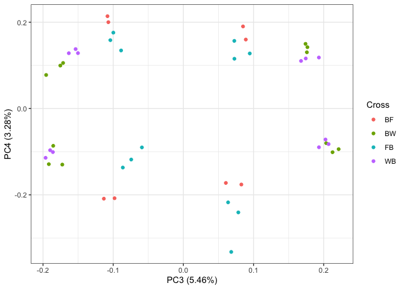
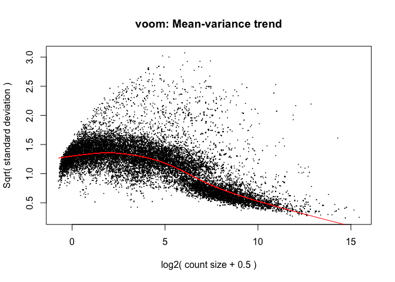
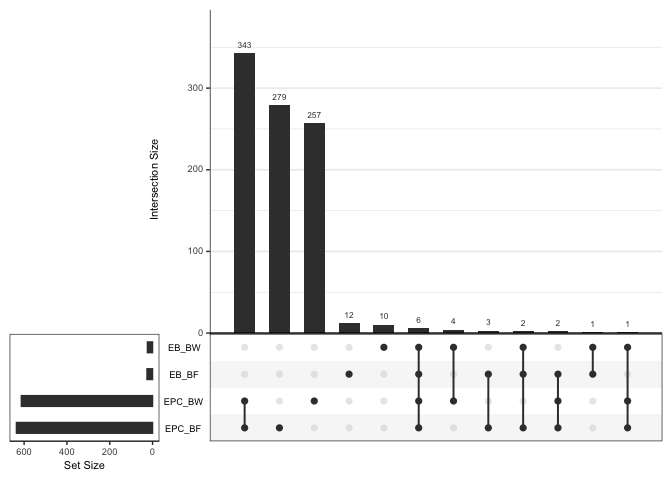

Assessing allele imbalance in the rat imprintome
================
Keegan Korthauer
25/03/2022

# Setup

## Load libraries

``` r
library(tidyverse)
library(broom)
library(Biobase)
library(ggplot2)
theme_set(theme_bw())
library(limma)
library(ggfortify)
library(edgeR)
library(pheatmap)
library(UpSetR)
```

## Read in and format data

Read in `.txt` file provided by Julien.

``` r
ase.raw <- read.delim("Book2.txt")
```

Print basic info.

``` r
str(ase.raw)
```

    ## 'data.frame':    73059 obs. of  52 variables:
    ##  $ chr                                    : chr  "chr1" "chr1" "chr1" "chr1" ...
    ##  $ start                                  : int  53395 56565 197017 237908 237908 249305 318092 390868 400255 515556 ...
    ##  $ end                                    : int  56311 60411 211255 241172 243880 269871 329799 396476 409676 519170 ...
    ##  $ strand                                 : chr  "-" "-" "-" "-" ...
    ##  $ name                                   : chr  "XR_001835498.1" "XR_589829.2" "XR_589830.2" "XM_017589816.1" ...
    ##  $ ID                                     : chr  "XR_001835498.1" "XR_589829.2" "XR_589830.2" "XM_017589816.1" ...
    ##  $ ExonLength                             : int  1182 1735 2185 1647 1870 2703 2589 1752 2037 1866 ...
    ##  $ Wistar_blood_RNA_PRJEB23955_rep1.9_RPKM: num  0 0 0.0743 0.2956 0.7811 ...
    ##  $ BW_EB_RNA_rep1_BN_F1540_q255_RPM       : num  0 0 0 0 0 0 0 0 0 0 ...
    ##  $ BW_EB_RNA_rep1_WKY_NCrl_F1540_q255_RPM : num  0 0 0 0 0 0 0 0 0 0 ...
    ##  $ BW_EB_RNA_rep2_BN_F1540_q255_RPM       : num  0 0 0 0 0 0 0 0 0 0 ...
    ##  $ BW_EB_RNA_rep2_WKY_NCrl_F1540_q255_RPM : num  0 0 0 0 0 0 0 0 0 0 ...
    ##  $ BW_EB_RNA_rep3_BN_F1540_q255_RPM       : num  0 0 0 0 0 0 0 0 0 0 ...
    ##  $ BW_EB_RNA_rep3_WKY_NCrl_F1540_q255_RPM : num  0 0 0 0 0 0 0 0 0 0 ...
    ##  $ WB_EB_RNA_rep1_BN_F1540_q255_RPM       : num  0 0 0 0 0 0 0 0 0 0 ...
    ##  $ WB_EB_RNA_rep1_WKY_NCrl_F1540_q255_RPM : num  0 0 0 0 0 0 0 0 0 0 ...
    ##  $ WB_EB_RNA_rep2_BN_F1540_q255_RPM       : num  0 0 0 0 0 0 0 0 0 0 ...
    ##  $ WB_EB_RNA_rep2_WKY_NCrl_F1540_q255_RPM : num  0 0 0 0 0 0 0 0 0 0 ...
    ##  $ WB_EB_RNA_rep3_BN_F1540_q255_RPM       : num  0 0 0 0 0 0 0 0 0 0 ...
    ##  $ WB_EB_RNA_rep3_WKY_NCrl_F1540_q255_RPM : num  0 0 0 0 0 0 0 0 0 0 ...
    ##  $ BF_EB_RNA_rep1_BN_F1540_q255_RPM       : num  0 0 0 0 0 0 0 0 0 0 ...
    ##  $ BF_EB_RNA_rep1_F334_N_F1540_q255_RPM   : num  0 0 0 0 0 0 0 0 0 0 ...
    ##  $ BF_EB_RNA_rep2_BN_F1540_q255_RPM       : num  0 0 13.1 0 0 ...
    ##  $ BF_EB_RNA_rep2_F334_N_F1540_q255_RPM   : num  0 0 0 0 0 ...
    ##  $ FB_EB_RNA_rep1_BN_F1540_q255_RPM       : num  0 0 0 0 0 0 0 0 0 0 ...
    ##  $ FB_EB_RNA_rep1_F334_N_F1540_q255_RPM   : num  0 0 0 0 0 0 0 0 0 0 ...
    ##  $ FB_EB_RNA_rep2_BN_F1540_q255_RPM       : num  0 0 0 0 0 0 0 0 0 0 ...
    ##  $ FB_EB_RNA_rep2_F334_N_F1540_q255_RPM   : num  0 0 0 0 0 0 0 0 0 0 ...
    ##  $ FB_EB_RNA_rep3_BN_F1540_q255_RPM       : num  0 0 0 0 0 0 0 0 0 0 ...
    ##  $ FB_EB_RNA_rep3_F334_N_F1540_q255_RPM   : num  0 0 0 0 0 0 0 0 0 0 ...
    ##  $ BW_EPC_RNA_rep1_BN_F1540_q255_RPM      : num  0 0 0 0 0 0 0 0 0 0 ...
    ##  $ BW_EPC_RNA_rep1_WKY_NCrl_F1540_q255_RPM: num  0 0 0 0 0 0 0 0 0 0 ...
    ##  $ BW_EPC_RNA_rep3_BN_F1540_q255_RPM      : num  0 0 0 0 0 0 0 0 0 0 ...
    ##  $ BW_EPC_RNA_rep3_WKY_NCrl_F1540_q255_RPM: num  0 0 0 0 0 0 0 0 0 0 ...
    ##  $ BW_EPC_RNA_rep4_BN_F1540_q255_RPM      : num  0 0 0 0 0 0 0 0 0 0 ...
    ##  $ BW_EPC_RNA_rep4_WKY_NCrl_F1540_q255_RPM: num  0 0 0 0 0 0 0 0 0 0 ...
    ##  $ WB_EPC_RNA_rep1_BN_F1540_q255_RPM      : num  0 0 0 0 0 0 0 0 0 0 ...
    ##  $ WB_EPC_RNA_rep1_WKY_NCrl_F1540_q255_RPM: num  0 0 0 0 0 0 0 0 0 0 ...
    ##  $ WB_EPC_RNA_rep2_BN_F1540_q255_RPM      : num  0 0 0 0 0 0 0 0 0 0 ...
    ##  $ WB_EPC_RNA_rep2_WKY_NCrl_F1540_q255_RPM: num  0 0 0 0 0 0 0 0 0 0 ...
    ##  $ WB_EPC_RNA_rep3_BN_F1540_q255_RPM      : num  0 0 0 0 0 0 0 0 0 0 ...
    ##  $ WB_EPC_RNA_rep3_WKY_NCrl_F1540_q255_RPM: num  0 0 0 0 0 0 0 0 0 0 ...
    ##  $ BF_EPC_RNA_rep1_BN_F1540_q255_RPM      : num  0 0 0 0 0 0 0 0 0 0 ...
    ##  $ BF_EPC_RNA_rep1_F334_N_F1540_q255_RPM  : num  0 0 0 0 0 0 0 0 0 0 ...
    ##  $ BF_EPC_RNA_rep2_BN_F1540_q255_RPM      : num  0 0 0 0 0 0 0 0 0 0 ...
    ##  $ BF_EPC_RNA_rep2_F334_N_F1540_q255_RPM  : num  0 0 0 0 0 0 0 0 0 0 ...
    ##  $ FB_EPC_RNA_rep1_BN_F1540_q255_RPM      : num  0 0 0 0 0 0 0 0 0 0 ...
    ##  $ FB_EPC_RNA_rep1_F334_N_F1540_q255_RPM  : num  0 0 0 0 0 0 0 0 0 0 ...
    ##  $ FB_EPC_RNA_rep2_BN_F1540_q255_RPM      : num  0 0 0 0 0 0 0 0 0 0 ...
    ##  $ FB_EPC_RNA_rep2_F334_N_F1540_q255_RPM  : num  0 0 0 0 0 0 0 0 0 0 ...
    ##  $ FB_EPC_RNA_rep3_BN_F1540_q255_RPM      : num  0 0 0 0 0 0 0 0 0 0 ...
    ##  $ FB_EPC_RNA_rep3_F334_N_F1540_q255_RPM  : num  0 0 0 0 0 ...

``` r
length(unique(ase.raw$name))
```

    ## [1] 73057

Pull out sample metadata from sample names.

``` r
pd <- data.frame(Sample = colnames(ase.raw)[-c(1:8)])
rownames(pd) <- pd$Sample
attrlist <- strsplit(pd$Sample, "_")
pd <- pd %>%
  mutate(Cross = sapply(attrlist, function(x) x[1]),
         Tissue =  sapply(attrlist, function(x) x[2]),
         Rep =  sapply(attrlist, function(x) x[4]),
         Strain = sapply(attrlist, function(x) x[5]),
         Allele = ifelse(substr(Cross, 1, 1) == substr(Strain, 1, 1),
                         "Maternal", "Paternal"),
         Rat = paste0(Rep, Cross, Tissue),
         Cross_group = ifelse(Cross %in% c("BF", "FB"), "BF/FB", "BW/WB"),
         Cross_direction = ifelse(Cross %in% c("BF", "BW"), "Forward", "Reverse"))

# change rep4 (BW EPC) to rep2 (in that cross rep2 is missing)
pd <- pd %>%
  mutate(Rep = gsub("rep4", "rep2", Rep))

str(pd)
```

    ## 'data.frame':    44 obs. of  9 variables:
    ##  $ Sample         : chr  "BW_EB_RNA_rep1_BN_F1540_q255_RPM" "BW_EB_RNA_rep1_WKY_NCrl_F1540_q255_RPM" "BW_EB_RNA_rep2_BN_F1540_q255_RPM" "BW_EB_RNA_rep2_WKY_NCrl_F1540_q255_RPM" ...
    ##  $ Cross          : chr  "BW" "BW" "BW" "BW" ...
    ##  $ Tissue         : chr  "EB" "EB" "EB" "EB" ...
    ##  $ Rep            : chr  "rep1" "rep1" "rep2" "rep2" ...
    ##  $ Strain         : chr  "BN" "WKY" "BN" "WKY" ...
    ##  $ Allele         : chr  "Maternal" "Paternal" "Maternal" "Paternal" ...
    ##  $ Rat            : chr  "rep1BWEB" "rep1BWEB" "rep2BWEB" "rep2BWEB" ...
    ##  $ Cross_group    : chr  "BW/WB" "BW/WB" "BW/WB" "BW/WB" ...
    ##  $ Cross_direction: chr  "Forward" "Forward" "Forward" "Forward" ...

``` r
table(pd$Cross, pd$Allele, pd$Rep, pd$Tissue)
```

    ## , ,  = rep1,  = EB
    ## 
    ##     
    ##      Maternal Paternal
    ##   BF        1        1
    ##   BW        1        1
    ##   FB        1        1
    ##   WB        1        1
    ## 
    ## , ,  = rep2,  = EB
    ## 
    ##     
    ##      Maternal Paternal
    ##   BF        1        1
    ##   BW        1        1
    ##   FB        1        1
    ##   WB        1        1
    ## 
    ## , ,  = rep3,  = EB
    ## 
    ##     
    ##      Maternal Paternal
    ##   BF        0        0
    ##   BW        1        1
    ##   FB        1        1
    ##   WB        1        1
    ## 
    ## , ,  = rep1,  = EPC
    ## 
    ##     
    ##      Maternal Paternal
    ##   BF        1        1
    ##   BW        1        1
    ##   FB        1        1
    ##   WB        1        1
    ## 
    ## , ,  = rep2,  = EPC
    ## 
    ##     
    ##      Maternal Paternal
    ##   BF        1        1
    ##   BW        1        1
    ##   FB        1        1
    ##   WB        1        1
    ## 
    ## , ,  = rep3,  = EPC
    ## 
    ##     
    ##      Maternal Paternal
    ##   BF        0        0
    ##   BW        1        1
    ##   FB        1        1
    ##   WB        1        1

There are 3 replicates for each cross in each tissue, except for the BF
cross, for which there are 2 replicates. So in all, there are 11 samples
for each tissue (3 reps in each FB, BW, WB, 2 reps in BF) for a total of
22 samples. Each of these has a maternal and paternal allele count, for
a total of 44 rows in our dataset.

Remove duplicate feature:

``` r
length(ase.raw$name)
```

    ## [1] 73059

``` r
length(unique(ase.raw$name))
```

    ## [1] 73057

``` r
(tab <- which(table(ase.raw$name) == 2))
```

    ## NM_001014271.1 NM_001170534.2 
    ##           7169          14497

``` r
ase.raw <- ase.raw %>%
  filter(!name %in% names(tab))
```

Remove the following features:

1.  features with max RPKMs \< 1  
2.  those that don’t satisfy: RPKM >= 0.5 in at least 5/11 reps per
    cross (total from either allele)  
3.  those not on canonical autosomes

``` r
filt1 <- ase.raw %>% 
  select(-c(1:8)) %>%
  apply(., 1, max) >= 1
sum(filt1)
```

    ## [1] 52625

``` r
filt2 <- ase.raw %>% 
  select(-c(1:4, 6:8)) %>%
  pivot_longer(names_to = "Sample",
               values_to = "RPKM",
               cols = -1) %>%
  left_join(pd) %>%
  select(-Sample, -Strain, -Rat) %>%
  group_by(name, Cross, Tissue, Rep) %>%
  summarize(sumRPKM = sum(RPKM)) %>%
  ungroup() %>%
  group_by(name, Tissue) %>%
  summarize(total = n(),
            pass = sum(sumRPKM >= 0.5) >= 5) %>%
  ungroup() %>%
  group_by(name) %>%
  summarize(pass = sum(pass) == 2) %>%
  ungroup() %>%
  left_join(ase.raw, ., by = "name") %>%
  pull(pass)
```

    ## Joining, by = "Sample"

    ## `summarise()` has grouped output by 'name', 'Cross', 'Tissue'. You can override using the `.groups` argument.

    ## `summarise()` has grouped output by 'name'. You can override using the `.groups` argument.

``` r
sum(filt2)
```

    ## [1] 29535

``` r
filt3 <- ase.raw$chr %in% paste0("chr", 1:20)
sum(filt3)
```

    ## [1] 70129

``` r
filt <- filt1 & filt2 & filt3
sum(filt)
```

    ## [1] 28979

``` r
ase <- ase.raw %>% filter(filt)
dim(ase)
```

    ## [1] 28979    52

Let’s put this metadata into a single DGEList object:

``` r
dge <- DGEList(counts = ase %>% select(-c(1:8)), 
               samples = pd,
               genes = ase %>% select(c(1:7)))
dge
```

    ## An object of class "DGEList"
    ## $counts
    ##   BW_EB_RNA_rep1_BN_F1540_q255_RPM BW_EB_RNA_rep1_WKY_NCrl_F1540_q255_RPM
    ## 1                          9.62018                                0.00000
    ## 2                          0.00000                                0.00000
    ## 3                        101.67115                              115.58870
    ## 4                         21.48668                                0.00000
    ## 5                         82.18661                               68.26907
    ##   BW_EB_RNA_rep2_BN_F1540_q255_RPM BW_EB_RNA_rep2_WKY_NCrl_F1540_q255_RPM
    ## 1                          0.00000                               3.990941
    ## 2                          0.00000                               8.459061
    ## 3                         81.94436                             185.318426
    ## 4                         24.07572                               0.000000
    ## 5                         34.31341                             104.805421
    ##   BW_EB_RNA_rep3_BN_F1540_q255_RPM BW_EB_RNA_rep3_WKY_NCrl_F1540_q255_RPM
    ## 1                          0.00000                               13.80127
    ## 2                          0.00000                               18.43286
    ## 3                         75.78985                              196.67933
    ## 4                         27.64928                                0.00000
    ## 5                         14.26909                              153.03002
    ##   WB_EB_RNA_rep1_BN_F1540_q255_RPM WB_EB_RNA_rep1_WKY_NCrl_F1540_q255_RPM
    ## 1                         0.000000                               6.549642
    ## 2                         1.058528                              19.185819
    ## 3                       120.539875                              92.091934
    ## 4                        10.122173                               0.000000
    ## 5                        25.933935                              25.933935
    ##   WB_EB_RNA_rep2_BN_F1540_q255_RPM WB_EB_RNA_rep2_WKY_NCrl_F1540_q255_RPM
    ## 1                          0.00000                               0.000000
    ## 2                          0.00000                              18.236044
    ## 3                         37.37438                              76.600846
    ## 4                         27.97141                               8.120739
    ## 5                         32.72040                              84.104239
    ##   WB_EB_RNA_rep3_BN_F1540_q255_RPM WB_EB_RNA_rep3_WKY_NCrl_F1540_q255_RPM
    ## 1                          0.00000                               0.000000
    ## 2                         10.56580                               0.000000
    ## 3                         74.58425                             130.641640
    ## 4                         19.70081                               4.622537
    ## 5                         67.43029                             128.587158
    ##   BF_EB_RNA_rep1_BN_F1540_q255_RPM BF_EB_RNA_rep1_F334_N_F1540_q255_RPM
    ## 1                          0.00000                              0.00000
    ## 2                         19.16594                              0.00000
    ## 3                         78.36315                             55.98726
    ## 4                          0.00000                              0.00000
    ## 5                         18.97711                             76.66381
    ##   BF_EB_RNA_rep2_BN_F1540_q255_RPM BF_EB_RNA_rep2_F334_N_F1540_q255_RPM
    ## 1                          0.00000                              0.00000
    ## 2                          0.00000                              0.00000
    ## 3                         44.09094                             97.89253
    ## 4                          0.00000                              0.00000
    ## 5                         19.88029                             40.21990
    ##   FB_EB_RNA_rep1_BN_F1540_q255_RPM FB_EB_RNA_rep1_F334_N_F1540_q255_RPM
    ## 1                          0.00000                             7.647652
    ## 2                          0.00000                             0.000000
    ## 3                         60.77881                            58.967611
    ## 4                          0.00000                            15.295304
    ## 5                          0.00000                            58.363857
    ##   FB_EB_RNA_rep2_BN_F1540_q255_RPM FB_EB_RNA_rep2_F334_N_F1540_q255_RPM
    ## 1                         0.000000                             0.000000
    ## 2                         0.000000                             0.000000
    ## 3                        96.138838                            74.975747
    ## 4                        13.689188                             9.755514
    ## 5                         3.618972                            22.736625
    ##   FB_EB_RNA_rep3_BN_F1540_q255_RPM FB_EB_RNA_rep3_F334_N_F1540_q255_RPM
    ## 1                          0.00000                              0.00000
    ## 2                          0.00000                              0.00000
    ## 3                         45.82017                             72.09598
    ## 4                          0.00000                              0.00000
    ## 5                         52.07915                             32.41656
    ##   BW_EPC_RNA_rep1_BN_F1540_q255_RPM BW_EPC_RNA_rep1_WKY_NCrl_F1540_q255_RPM
    ## 1                          10.50968                               47.079157
    ## 2                          37.21285                               40.108379
    ## 3                           0.00000                               30.027709
    ## 4                          69.59987                               10.456059
    ## 5                           0.00000                                5.308459
    ##   BW_EPC_RNA_rep3_BN_F1540_q255_RPM BW_EPC_RNA_rep3_WKY_NCrl_F1540_q255_RPM
    ## 1                          17.97851                                21.57422
    ## 2                          38.61686                                23.19968
    ## 3                           0.00000                                15.86050
    ## 4                          42.90221                                25.71175
    ## 5                          19.99802                                29.20897
    ##   BW_EPC_RNA_rep4_BN_F1540_q255_RPM BW_EPC_RNA_rep4_WKY_NCrl_F1540_q255_RPM
    ## 1                         35.611081                               29.326770
    ## 2                         84.064106                               80.557590
    ## 3                          0.000000                               14.572347
    ## 4                         41.030140                               17.668938
    ## 5                          4.417234                                7.240621
    ##   WB_EPC_RNA_rep1_BN_F1540_q255_RPM WB_EPC_RNA_rep1_WKY_NCrl_F1540_q255_RPM
    ## 1                           0.00000                                7.346856
    ## 2                          15.76234                               17.187190
    ## 3                           0.00000                               26.493184
    ## 4                          23.28729                               42.032885
    ## 5                           0.00000                               14.337488
    ##   WB_EPC_RNA_rep2_BN_F1540_q255_RPM WB_EPC_RNA_rep2_WKY_NCrl_F1540_q255_RPM
    ## 1                          17.78305                                 9.17231
    ## 2                          74.50170                                16.70671
    ## 3                           0.00000                                35.65975
    ## 4                          18.39144                                 0.00000
    ## 5                           0.00000                                 0.00000
    ##   WB_EPC_RNA_rep3_BN_F1540_q255_RPM WB_EPC_RNA_rep3_WKY_NCrl_F1540_q255_RPM
    ## 1                          0.000000                                28.34611
    ## 2                         27.430280                                17.85946
    ## 3                          0.000000                                 0.00000
    ## 4                         58.478215                                 0.00000
    ## 5                          4.533556                                26.83499
    ##   BF_EPC_RNA_rep1_BN_F1540_q255_RPM BF_EPC_RNA_rep1_F334_N_F1540_q255_RPM
    ## 1                          7.758451                              49.13684
    ## 2                         16.405853                              16.24422
    ## 3                          0.000000                              16.32506
    ## 4                         13.415622                               0.00000
    ## 5                          0.000000                               0.00000
    ##   BF_EPC_RNA_rep2_BN_F1540_q255_RPM BF_EPC_RNA_rep2_F334_N_F1540_q255_RPM
    ## 1                          14.00756                             34.880223
    ## 2                          13.86889                             13.938241
    ## 3                           0.00000                              6.171659
    ## 4                          17.33612                              0.000000
    ## 5                           0.00000                              0.000000
    ##   FB_EPC_RNA_rep1_BN_F1540_q255_RPM FB_EPC_RNA_rep1_F334_N_F1540_q255_RPM
    ## 1                            0.0000                              44.24749
    ## 2                            0.0000                              19.90045
    ## 3                            0.0000                              10.71562
    ## 4                           21.0668                               0.00000
    ## 5                            0.0000                               0.00000
    ##   FB_EPC_RNA_rep2_BN_F1540_q255_RPM FB_EPC_RNA_rep2_F334_N_F1540_q255_RPM
    ## 1                            0.0000                             24.722240
    ## 2                            0.0000                              9.750985
    ## 3                            0.0000                             19.895960
    ## 4                           15.7592                             52.891783
    ## 5                            0.0000                              0.000000
    ##   FB_EPC_RNA_rep3_BN_F1540_q255_RPM FB_EPC_RNA_rep3_F334_N_F1540_q255_RPM
    ## 1                          19.38482                              11.24318
    ## 2                          19.38482                               0.00000
    ## 3                           0.00000                              19.28788
    ## 4                           0.00000                               0.00000
    ## 5                           0.00000                              19.48174
    ## 28974 more rows ...
    ## 
    ## $samples
    ##                                        group lib.size norm.factors
    ## BW_EB_RNA_rep1_BN_F1540_q255_RPM           1 14719682            1
    ## BW_EB_RNA_rep1_WKY_NCrl_F1540_q255_RPM     1 13696631            1
    ## BW_EB_RNA_rep2_BN_F1540_q255_RPM           1 15475917            1
    ## BW_EB_RNA_rep2_WKY_NCrl_F1540_q255_RPM     1 14406956            1
    ## BW_EB_RNA_rep3_BN_F1540_q255_RPM           1 14127345            1
    ##                                                                        Sample
    ## BW_EB_RNA_rep1_BN_F1540_q255_RPM             BW_EB_RNA_rep1_BN_F1540_q255_RPM
    ## BW_EB_RNA_rep1_WKY_NCrl_F1540_q255_RPM BW_EB_RNA_rep1_WKY_NCrl_F1540_q255_RPM
    ## BW_EB_RNA_rep2_BN_F1540_q255_RPM             BW_EB_RNA_rep2_BN_F1540_q255_RPM
    ## BW_EB_RNA_rep2_WKY_NCrl_F1540_q255_RPM BW_EB_RNA_rep2_WKY_NCrl_F1540_q255_RPM
    ## BW_EB_RNA_rep3_BN_F1540_q255_RPM             BW_EB_RNA_rep3_BN_F1540_q255_RPM
    ##                                        Cross Tissue  Rep Strain   Allele
    ## BW_EB_RNA_rep1_BN_F1540_q255_RPM          BW     EB rep1     BN Maternal
    ## BW_EB_RNA_rep1_WKY_NCrl_F1540_q255_RPM    BW     EB rep1    WKY Paternal
    ## BW_EB_RNA_rep2_BN_F1540_q255_RPM          BW     EB rep2     BN Maternal
    ## BW_EB_RNA_rep2_WKY_NCrl_F1540_q255_RPM    BW     EB rep2    WKY Paternal
    ## BW_EB_RNA_rep3_BN_F1540_q255_RPM          BW     EB rep3     BN Maternal
    ##                                             Rat Cross_group Cross_direction
    ## BW_EB_RNA_rep1_BN_F1540_q255_RPM       rep1BWEB       BW/WB         Forward
    ## BW_EB_RNA_rep1_WKY_NCrl_F1540_q255_RPM rep1BWEB       BW/WB         Forward
    ## BW_EB_RNA_rep2_BN_F1540_q255_RPM       rep2BWEB       BW/WB         Forward
    ## BW_EB_RNA_rep2_WKY_NCrl_F1540_q255_RPM rep2BWEB       BW/WB         Forward
    ## BW_EB_RNA_rep3_BN_F1540_q255_RPM       rep3BWEB       BW/WB         Forward
    ## 39 more rows ...
    ## 
    ## $genes
    ##    chr   start     end strand           name             ID ExonLength
    ## 1 chr1 1181300 1200526      + XM_017590411.1 XM_017590411.1        781
    ## 2 chr1 1207153 1220928      + XR_001835499.1 XR_001835499.1       5555
    ## 3 chr1 1470753 1489340      - XM_008758633.2 XM_008758633.2       1932
    ## 4 chr1 1637754 1643348      + XM_017590412.1 XM_017590412.1       5594
    ## 5 chr1 1655491 1671081      - XM_008758635.2 XM_008758635.2       3729
    ## 28974 more rows ...

# EDA

## Principal components analysis

Let’s plot some PCA plots to see where major variation lies.

``` r
pca_res <- prcomp(t(dge$counts), scale. = TRUE)

autoplot(pca_res, data = dge$samples, colour = 'Tissue')
```

<!-- -->

``` r
autoplot(pca_res, data = dge$samples, colour = 'Cross')
```

<!-- -->

PC 1 is clearly Cross (BF/FB vs BW/WB). PC 2 is clearly tissue.

Let’s look at the next couple PCs.

``` r
autoplot(pca_res, data = dge$samples, colour = 'Cross', x = 3, y = 4)
```

<!-- -->

``` r
autoplot(pca_res, data = dge$samples, colour = 'Strain', x = 3, y = 4)
```

<!-- -->

``` r
autoplot(pca_res, data = dge$samples, colour = 'Tissue', x = 3, y = 4)
```

<!-- -->

PC 3 looks like strain effects (which strain is the allele from), and PC
4 looks like interaction between cross and tissue.

## Sample-sample correlation heatmap

Here we’ll look at a sample-sample correlation heatmap, which will
further let us look at major sources of variation and spot any potential
outlier samples.

``` r
# Set up color scheme for heatmaps 
bcols<-colorRampPalette(c("#000000" ,"#800000" ,"#FF8000" ,"#FFFF00", "#FFFFFF"))(20)

cc <- data.frame(cor(dge$counts), 
                 row.names = colnames(dge))
range(cc, na.rm=T)
```

    ## [1] 0.205153 1.000000

``` r
annot_df <- dge$samples %>%
  select(Cross, Tissue, Allele, Strain)
pheatmap(cc, color = bcols, 
         border_color = NA, 
         show_rownames = FALSE, 
         show_colnames = FALSE,
         annotation_col = annot_df, 
         main="Sample-Sample Correlation")
```

<!-- -->

A few observations:

-   As expected, tissue is the major source of variation  
-   Cross is the next major source of variation (BF/FB vs BW/WB)  
-   Within a tissue and reciprocal cross, expression is more similar for
    alleles coming from the same strain than from the same type of
    allele (mat/pat)  
-   Within a tissue, reciprocal cross and maternal strain, mat/pat
    alleles are generally more similar to each other than to the
    opposite allele within the same rat

## Allelic expression proportions

Here we want to calculate allelic expression proportions
(Maternal/(Maternal + Paternal)) for each rep.

``` r
ase.long <- pivot_longer(data.frame(dge$counts) %>% 
                           mutate(gene = dge$genes$name),
                         cols = -gene,
                         names_to = "Sample",
                         values_to = "RPKM") %>%
  left_join(pd) %>%
  select(-Sample, -Strain) %>%
  pivot_wider(names_from = Allele,
              values_from = "RPKM") %>%
  mutate(prop = Maternal / (Maternal + Paternal)) 
```

    ## Joining, by = "Sample"

``` r
ase.long
```

    ## # A tibble: 637,538 × 10
    ##    gene   Cross Tissue Rep   Rat   Cross_group Cross_direction Maternal Paternal
    ##    <chr>  <chr> <chr>  <chr> <chr> <chr>       <chr>              <dbl>    <dbl>
    ##  1 XM_01… BW    EB     rep1  rep1… BW/WB       Forward             9.62     0   
    ##  2 XM_01… BW    EB     rep2  rep2… BW/WB       Forward             0        3.99
    ##  3 XM_01… BW    EB     rep3  rep3… BW/WB       Forward             0       13.8 
    ##  4 XM_01… WB    EB     rep1  rep1… BW/WB       Reverse             6.55     0   
    ##  5 XM_01… WB    EB     rep2  rep2… BW/WB       Reverse             0        0   
    ##  6 XM_01… WB    EB     rep3  rep3… BW/WB       Reverse             0        0   
    ##  7 XM_01… BF    EB     rep1  rep1… BF/FB       Forward             0        0   
    ##  8 XM_01… BF    EB     rep2  rep2… BF/FB       Forward             0        0   
    ##  9 XM_01… FB    EB     rep1  rep1… BF/FB       Reverse             7.65     0   
    ## 10 XM_01… FB    EB     rep2  rep2… BF/FB       Reverse             0        0   
    ## # … with 637,528 more rows, and 1 more variable: prop <dbl>

Let’s visualize a histogram of maternal allelic proportions per gene.

``` r
ase.long %>% 
  group_by(gene, Tissue, Cross) %>%
  summarize(meanprop = mean(prop, na.rm = TRUE),
            n = sum(!is.na(prop))) %>%
  filter(n > 1) %>%
  ggplot() +
  geom_histogram(aes(meanprop)) +
  facet_grid(Cross ~ Tissue)
```

    ## `summarise()` has grouped output by 'gene', 'Tissue'. You can override using the `.groups` argument.

    ## `stat_bin()` using `bins = 30`. Pick better value with `binwidth`.

<!-- -->

As we expect, most values are close to 0.5.

### Scatterplots of maternal allele proportions by forward/reverse cross

``` r
ase.long %>% 
  group_by(gene, Tissue, Cross, Cross_group, Cross_direction) %>%
  summarize(meanprop = mean(prop, na.rm = TRUE),
            n = sum(!is.na(prop))) %>%
  filter(n > 1) %>%
  pivot_wider(id_cols = c(gene, Tissue, Cross_group), 
              names_from = Cross_direction, values_from = meanprop) %>%
  ggplot() +
  geom_point(aes(x = Forward, y = Reverse), alpha = 0.2, size = 0.5) +
  facet_grid(Cross_group ~ Tissue)
```

    ## `summarise()` has grouped output by 'gene', 'Tissue', 'Cross', 'Cross_group'. You can override using the `.groups` argument.

    ## Warning: Removed 7499 rows containing missing values (geom_point).

<!-- -->

# Limma voom

## Test within tissue

Here we’ll try out using limma voom to estimate allele-specific effects
within each tissue (EB and EPC).

We’ll build one model to represent the entire dataset. Our model here
includes blocking effects for each rat, so that we can estimate maternal
vs paternal allele effects. We’ll include terms to do so separately in
each allele. Note that there’s no need to include separate terms for
cross, due to the presence of the blocking term for rat (and since we
are not interested in looking at differential allele-specific expression
between the crosses).

``` r
mm <- model.matrix(~ 0 + Rat + Tissue:Allele,
                   data = dge$samples)

# drop redundant terms to get to full rank
mm <- mm[,!grepl("AlleleMaternal", colnames(mm))]
colnames(mm)
```

    ##  [1] "Ratrep1BFEB"              "Ratrep1BFEPC"            
    ##  [3] "Ratrep1BWEB"              "Ratrep1BWEPC"            
    ##  [5] "Ratrep1FBEB"              "Ratrep1FBEPC"            
    ##  [7] "Ratrep1WBEB"              "Ratrep1WBEPC"            
    ##  [9] "Ratrep2BFEB"              "Ratrep2BFEPC"            
    ## [11] "Ratrep2BWEB"              "Ratrep2FBEB"             
    ## [13] "Ratrep2FBEPC"             "Ratrep2WBEB"             
    ## [15] "Ratrep2WBEPC"             "Ratrep3BWEB"             
    ## [17] "Ratrep3BWEPC"             "Ratrep3FBEB"             
    ## [19] "Ratrep3FBEPC"             "Ratrep3WBEB"             
    ## [21] "Ratrep3WBEPC"             "Ratrep4BWEPC"            
    ## [23] "TissueEB:AllelePaternal"  "TissueEPC:AllelePaternal"

``` r
# don't normalize for library size (diff is within sample)
y <- voom(dge, mm, plot = TRUE, 
          normalize.method = "none", 
          lib.size = rep(1, ncol(dge)))
```

<!-- -->

``` r
fit <- lmFit(y, mm)
fit <- eBayes(fit)
```

First we’ll pull out the results for significant allele effects in EB:

``` r
# pull out test for EB
res_EB <- topTable(fit, coef = "TissueEB:AllelePaternal",
                   n = Inf, sort.by = "P")
head(res_EB)
```

    ##        chr     start       end strand           name             ID ExonLength
    ## 1958  chr1 194953269 194956281      .   MSTRG.1000.1   MSTRG.1000.1       3012
    ## 12470 chr6 133658936 133691130      +    NR_131064.1    NR_131064.1       1890
    ## 1959  chr1 195032372 195074327      - XR_001835978.1 XR_001835978.1      13741
    ## 7708  chr4  29795523  29804517      + XM_008762737.1 XM_008762737.1       2403
    ## 12471 chr6 133710206 133721191      - XM_017594511.1 XM_017594511.1       9383
    ## 7707  chr4  29795452  29804517      +   MSTRG.8729.1   MSTRG.8729.1       2603
    ##           logFC  AveExpr         t      P.Value    adj.P.Val         B
    ## 1958   3.589010 22.15630  18.23954 5.046751e-15 1.462498e-10 21.312747
    ## 12470 -7.517986 24.26449 -12.52746 1.173670e-11 1.700589e-07 11.260313
    ## 1959   2.916802 26.94109  11.89294 3.278155e-11 3.166589e-07 15.819982
    ## 7708   6.797961 25.86902  11.23891 9.866489e-11 7.148024e-07 10.070521
    ## 12471 -7.028349 22.61760 -10.93358 1.676472e-10 8.240909e-07  8.214709
    ## 7707   6.627709 25.92802  10.92354 1.706251e-10 8.240909e-07  9.877595

``` r
sum(res_EB$adj.P.Val < 0.05)
```

    ## [1] 30

There are 30 significant hits in EB

Let’s pull out the results for significant allele effects in EPC:

``` r
# pull out test for EPC
res_EPC <- topTable(fit, coef = "TissueEPC:AllelePaternal",
                   n = Inf, sort.by = "P")
head(res_EPC)
```

    ##         chr     start       end strand           name             ID ExonLength
    ## 2384   chr1 215744403 215747080      -    NR_027324.1    NR_027324.1       2325
    ## 2569   chr1 221149217 221158856      .   MSTRG.1315.1   MSTRG.1315.1       9639
    ## 2385   chr1 215745980 215747080      -    NR_032754.1    NR_032754.1       1100
    ## 27447 chr19  30794289  30903819      + NM_001108444.1 NM_001108444.1       4176
    ## 26401 chr17  71719011  71903098      - XM_006254213.3 XM_006254213.3       8137
    ## 26400 chr17  71719011  71901157      - XM_006254214.3 XM_006254214.3       9560
    ##            logFC  AveExpr         t      P.Value    adj.P.Val        B
    ## 2384  -6.3737354 29.31165 -45.92023 7.770292e-24 2.251753e-19 44.73223
    ## 2569  -0.8067648 24.57654 -37.54857 6.972284e-22 1.010249e-17 39.41602
    ## 2385  -6.2953871 22.77100 -22.93626 3.658389e-17 3.533882e-13 29.41401
    ## 27447  5.7494323 28.29291  17.95027 7.085186e-15 5.133040e-11 24.10500
    ## 26401  6.3531335 27.18091  16.22576 5.944003e-14 1.882960e-10 22.00106
    ## 26400  6.3493591 27.18164  16.22070 5.982884e-14 1.882960e-10 21.99430

``` r
sum(res_EPC$adj.P.Val < 0.05)
```

    ## [1] 755

There are 755 significant hits in EPC.

Look for overlap between the two:

``` r
ix <- which((res_EB %>% filter(adj.P.Val < 0.05) %>% pull(name)) %in% 
            (res_EPC %>% filter(adj.P.Val < 0.05) %>% pull(name)))
length(ix)
```

    ## [1] 19

``` r
res_EB %>%
  filter(adj.P.Val < 0.05) %>%
  slice(ix) %>%
  pull(name)
```

    ##  [1] "MSTRG.1000.1"   "NR_131064.1"    "XM_008762737.1" "XM_017594511.1"
    ##  [5] "MSTRG.8729.1"   "MSTRG.8729.2"   "NR_027324.1"    "XM_008770347.2"
    ##  [9] "XM_008770348.2" "MSTRG.4373.2"   "XM_017596813.1" "MSTRG.12748.1" 
    ## [13] "MSTRG.1218.1"   "MSTRG.10785.1"  "NM_001009617.1" "MSTRG.8805.1"  
    ## [17] "NM_001109093.1" "XM_017599333.1" "NM_001017504.1"

We see that 63.3% of the significant hits in EB are also significant in
EPC.

## Test within cross and tissue

Here we’ll try out using limma voom to estimate allele-specific effects
within each tissue (EB and EPC) and cross (BF/FB and WB/BW). The
difference between the previous model is that now we’ll look at effects
in each cross group instead of averaged over both.

``` r
mm <- model.matrix(~ 0 + Rat + Tissue:Cross_group:Allele,
                   data = dge$samples)

# drop redundant terms to get to full rank
mm <- mm[,!grepl("AlleleMaternal", colnames(mm))]
colnames(mm)
```

    ##  [1] "Ratrep1BFEB"                              
    ##  [2] "Ratrep1BFEPC"                             
    ##  [3] "Ratrep1BWEB"                              
    ##  [4] "Ratrep1BWEPC"                             
    ##  [5] "Ratrep1FBEB"                              
    ##  [6] "Ratrep1FBEPC"                             
    ##  [7] "Ratrep1WBEB"                              
    ##  [8] "Ratrep1WBEPC"                             
    ##  [9] "Ratrep2BFEB"                              
    ## [10] "Ratrep2BFEPC"                             
    ## [11] "Ratrep2BWEB"                              
    ## [12] "Ratrep2FBEB"                              
    ## [13] "Ratrep2FBEPC"                             
    ## [14] "Ratrep2WBEB"                              
    ## [15] "Ratrep2WBEPC"                             
    ## [16] "Ratrep3BWEB"                              
    ## [17] "Ratrep3BWEPC"                             
    ## [18] "Ratrep3FBEB"                              
    ## [19] "Ratrep3FBEPC"                             
    ## [20] "Ratrep3WBEB"                              
    ## [21] "Ratrep3WBEPC"                             
    ## [22] "Ratrep4BWEPC"                             
    ## [23] "TissueEB:Cross_groupBF/FB:AllelePaternal" 
    ## [24] "TissueEPC:Cross_groupBF/FB:AllelePaternal"
    ## [25] "TissueEB:Cross_groupBW/WB:AllelePaternal" 
    ## [26] "TissueEPC:Cross_groupBW/WB:AllelePaternal"

``` r
# don't normalize for library size (diff is within sample)
y <- voom(dge, mm, plot = TRUE, 
          normalize.method = "none", 
          lib.size = rep(1, ncol(dge)))
```

<!-- -->

``` r
fit <- lmFit(y, mm)
fit <- eBayes(fit)
```

### EB

First we’ll pull out the results for significant allele effects in EB
for BF/FB:

``` r
# pull out test in EB for BF/FB
res_EB_BF <- topTable(fit, coef = "TissueEB:Cross_groupBF/FB:AllelePaternal",
                   n = Inf, sort.by = "P")
head(res_EB_BF)
```

    ##       chr     start       end strand           name             ID ExonLength
    ## 1961 chr1 195052255 195097069      -   MSTRG.1001.3   MSTRG.1001.3      23689
    ## 1960 chr1 195052255 195097069      -   MSTRG.1001.2   MSTRG.1001.2      21402
    ## 1959 chr1 195032372 195074327      - XR_001835978.1 XR_001835978.1      13741
    ## 1962 chr1 195074327 195096595      -    NM_031117.2    NM_031117.2       1580
    ## 1964 chr1 195074327 195097069      - NM_001270712.1 NM_001270712.1       1844
    ## 1963 chr1 195074327 195097069      -    NM_130738.2    NM_130738.2       1709
    ##         logFC  AveExpr        t      P.Value    adj.P.Val        B
    ## 1961 4.838854 27.80701 36.26427 3.682053e-20 1.067022e-15 34.74976
    ## 1960 4.836743 27.74668 33.90884 1.438914e-19 2.084915e-15 33.48571
    ## 1959 4.290050 26.94109 23.71183 1.920345e-16 1.854990e-12 27.33455
    ## 1962 8.341238 25.38895 14.30704 3.558272e-12 2.577879e-08 15.42225
    ## 1964 8.095436 25.53191 13.70041 8.015479e-12 4.372660e-08 14.87490
    ## 1963 8.340505 25.45050 13.61128 9.053438e-12 4.372660e-08 14.79293

``` r
sum(res_EB_BF$adj.P.Val < 0.05)
```

    ## [1] 15

There are 15 significant hits in EB for BF/FB.

Next, we’ll pull out the results for significant allele effects in EB
for BW/WB:

``` r
# pull out test in EB for BW/WB
res_EB_BW <- topTable(fit, coef = "TissueEB:Cross_groupBW/WB:AllelePaternal",
                   n = Inf, sort.by = "P")
head(res_EB_BW)
```

    ##         chr     start       end strand           name             ID ExonLength
    ## 1961   chr1 195052255 195097069      -   MSTRG.1001.3   MSTRG.1001.3      23689
    ## 1960   chr1 195052255 195097069      -   MSTRG.1001.2   MSTRG.1001.2      21402
    ## 1958   chr1 194953269 194956281      .   MSTRG.1000.1   MSTRG.1000.1       3012
    ## 1959   chr1 195032372 195074327      - XR_001835978.1 XR_001835978.1      13741
    ## 23756 chr14  92021851  92077028      - XM_008770347.2 XM_008770347.2       5017
    ## 23757 chr14  92021851  92077028      - XM_008770348.2 XM_008770348.2       4852
    ##           logFC  AveExpr         t      P.Value    adj.P.Val        B
    ## 1961   1.687195 27.80701  26.14810 2.719495e-17 7.880824e-13 29.64885
    ## 1960   1.646770 27.74668  24.80777 7.795495e-17 1.129528e-12 28.63875
    ## 1958   3.655154 22.15630  21.08990 1.963299e-15 1.896481e-11 22.19642
    ## 1959   2.059267 26.94109  19.59048 8.383489e-15 6.073628e-11 23.97368
    ## 23756 -8.781861 22.21291 -16.26003 3.123918e-13 1.508800e-09 13.41135
    ## 23757 -8.781861 22.21291 -16.26003 3.123918e-13 1.508800e-09 13.41135

``` r
sum(res_EB_BW$adj.P.Val < 0.05)
```

    ## [1] 32

There are 32 significant hits in EB for BW/WB.

How much overlap between the crosses in EB?

``` r
ix_EB <- which((res_EB_BF %>% filter(adj.P.Val < 0.05) %>% pull(name)) %in% 
               (res_EB_BW %>% filter(adj.P.Val < 0.05) %>% pull(name)))
length(ix_EB)
```

    ## [1] 9

``` r
res_EB_BF %>% 
  filter(adj.P.Val < 0.05) %>%
  slice(ix_EB) %>%
  pull(name)
```

    ## [1] "MSTRG.1001.3"   "MSTRG.1001.2"   "XR_001835978.1" "XM_017594511.1"
    ## [5] "NR_131064.1"    "XM_008762737.1" "NR_027324.1"    "MSTRG.8729.1"  
    ## [9] "MSTRG.8729.2"

We see that 60% of the significant EB hits in BF/FB are also significant
in BW/WB.

### EPC

First we’ll pull out the results for significant allele effects in EPC
for BF/FB:

``` r
# pull out test in EPC for BF/FB
res_EPC_BF <- topTable(fit, coef = "TissueEPC:Cross_groupBF/FB:AllelePaternal",
                   n = Inf, sort.by = "P")
head(res_EPC_BF)
```

    ##         chr     start       end strand           name             ID ExonLength
    ## 2569   chr1 221149217 221158856      .   MSTRG.1315.1   MSTRG.1315.1       9639
    ## 2384   chr1 215744403 215747080      -    NR_027324.1    NR_027324.1       2325
    ## 27447 chr19  30794289  30903819      + NM_001108444.1 NM_001108444.1       4176
    ## 2413   chr1 216254910 216256610      +   MSTRG.1216.2   MSTRG.1216.2       1590
    ## 2409   chr1 216253785 216256610      + XM_008760149.1 XM_008760149.1       2401
    ## 2411   chr1 216254910 216256610      + NM_001013194.2 NM_001013194.2       1451
    ##            logFC  AveExpr         t      P.Value    adj.P.Val        B
    ## 2569  -0.8084066 24.57654 -34.76921 8.656188e-20 2.309877e-15 34.62518
    ## 2384  -6.0799673 29.31165 -33.73788 1.594173e-19 2.309877e-15 34.92249
    ## 27447  5.0473714 28.29291  13.30019 1.391968e-11 1.344594e-07 16.72206
    ## 2413  -9.9550430 24.85541 -11.97821 9.512769e-11 6.891763e-07 13.00964
    ## 2409  -9.5960894 24.47558 -11.57716 1.760074e-10 7.536940e-07 12.54074
    ## 2411  -9.4995056 24.45847 -11.49370 2.004522e-10 7.536940e-07 12.43898

``` r
sum(res_EPC_BF$adj.P.Val < 0.05)
```

    ## [1] 253

There are 253 significant hits in EPC for BF/FB.

Next, we’ll pull out the results for significant allele effects in EPC
for BW/WB:

``` r
# pull out test in EPC for BW/WB
res_EPC_BW <- topTable(fit, coef = "TissueEPC:Cross_groupBW/WB:AllelePaternal",
                   n = Inf, sort.by = "P")
head(res_EPC_BW)
```

    ##         chr     start       end strand           name             ID ExonLength
    ## 2384   chr1 215744403 215747080      -    NR_027324.1    NR_027324.1       2325
    ## 2385   chr1 215745980 215747080      -    NR_032754.1    NR_032754.1       1100
    ## 26407 chr17  71723619  71899037      - NM_001107364.1 NM_001107364.1       3674
    ## 2402   chr1 216154001 216156583      -    NM_031503.2    NM_031503.2       1746
    ## 2403   chr1 216154001 216156583      -   MSTRG.1214.1   MSTRG.1214.1       1750
    ## 7708   chr4  29795523  29804517      + XM_008762737.1 XM_008762737.1       2403
    ##           logFC  AveExpr         t      P.Value    adj.P.Val        B
    ## 2384  -6.633671 29.31165 -35.77395 4.854903e-20 1.406902e-15 36.04826
    ## 2385  -6.431954 22.77100 -28.74294 4.062626e-18 5.886542e-14 30.83508
    ## 26407  9.795986 23.82892  18.65909 2.174598e-14 2.100589e-10 21.94418
    ## 2402  -7.956003 21.49576 -16.86806 1.541366e-13 8.933448e-10 20.49736
    ## 2403  -7.956003 21.49576 -16.86806 1.541366e-13 8.933448e-10 20.49736
    ## 7708   8.459418 25.86902  14.94077 1.569447e-12 7.580166e-09 18.32147

``` r
sum(res_EPC_BW$adj.P.Val < 0.05)
```

    ## [1] 417

There are 417 significant hits in EPC for BW/WB.

How much overlap between the crosses in EPC?

``` r
ix_EPC <- which((res_EPC_BF %>% filter(adj.P.Val < 0.05) %>% pull(name)) %in% 
               (res_EPC_BW %>% filter(adj.P.Val < 0.05) %>% pull(name)))
length(ix_EPC)
```

    ## [1] 127

``` r
res_EPC_BF %>% 
  filter(adj.P.Val < 0.05) %>%
  slice(ix_EPC) %>%
  pull(name)
```

    ##   [1] "NR_027324.1"    "NM_001108444.1" "MSTRG.1216.2"   "XM_008760149.1"
    ##   [5] "NM_001013194.2" "NM_001310046.1" "NM_001310047.1" "XM_008762737.1"
    ##   [9] "MSTRG.8729.1"   "MSTRG.8729.2"   "NM_133572.1"    "XM_006235003.1"
    ##  [13] "NM_012758.1"    "NM_001276721.1" "NM_001037096.1" "NM_012886.2"   
    ##  [17] "XM_006254213.3" "XM_006254212.3" "XM_006254216.3" "XM_006254210.3"
    ##  [21] "XM_006254211.3" "XM_006254215.3" "XM_006254214.3" "MSTRG.5575.3"  
    ##  [25] "MSTRG.5575.2"   "MSTRG.5575.1"   "MSTRG.5575.4"   "XM_006241162.3"
    ##  [29] "NM_012512.2"    "NM_013087.2"    "NM_001008831.3" "XM_017597720.1"
    ##  [33] "XM_001063315.6" "NM_053663.1"    "XM_017600869.1" "XM_006256061.3"
    ##  [37] "XM_017600867.1" "NM_017196.3"    "XM_017591369.1" "XM_017594511.1"
    ##  [41] "NM_001170558.1" "MSTRG.5974.1"   "XM_017600872.1" "XM_008772099.2"
    ##  [45] "XM_017600868.1" "XM_017600870.1" "XM_017600866.1" "XM_017600873.1"
    ##  [49] "XM_008772100.2" "XM_017600871.1" "NM_001191695.1" "NM_001008884.2"
    ##  [53] "NM_031140.1"    "XM_006246382.3" "NM_001008765.1" "XM_017591755.1"
    ##  [57] "NM_022205.3"    "XM_006230269.3" "NM_001033998.2" "XM_006235066.2"
    ##  [61] "NM_001004084.2" "XM_017591705.1" "NM_016994.2"    "NM_130411.2"   
    ##  [65] "XM_017588709.1" "NM_019337.1"    "NR_131064.1"    "XM_006246770.3"
    ##  [69] "XM_017597454.1" "NM_138881.1"    "XM_017591704.1" "XM_006230530.2"
    ##  [73] "NM_001007602.1" "XM_006230326.3" "NM_001106314.1" "NM_001191659.1"
    ##  [77] "XM_017591706.1" "NM_001107737.1" "NM_053313.1"    "XM_006256063.3"
    ##  [81] "XM_006256062.2" "XM_006236954.3" "XM_006236956.2" "MSTRG.2715.1"  
    ##  [85] "NM_001047878.1" "NM_001009617.1" "XM_008765663.2" "XM_017598310.1"
    ##  [89] "NM_001107364.1" "XM_006232518.3" "XM_006256065.2" "XM_017598309.1"
    ##  [93] "MSTRG.3132.6"   "XM_017597823.1" "XM_006230325.3" "NM_017020.3"   
    ##  [97] "XM_008761127.2" "XM_017591011.1" "XM_017593115.1" "XM_006237924.3"
    ## [101] "XM_008768951.2" "NM_080479.2"    "XM_008768952.2" "NM_001271109.1"
    ## [105] "NM_001107115.1" "NM_001271110.1" "MSTRG.1218.1"   "NM_001012093.1"
    ## [109] "NM_001017504.1" "XM_008761362.2" "XR_001836467.1" "XM_006234532.3"
    ## [113] "NM_001005892.2" "XM_008766055.2" "XM_008761107.2" "NM_001005539.1"
    ## [117] "XR_593071.1"    "XR_593072.1"    "NM_019169.2"    "XM_008763279.2"
    ## [121] "NM_053889.1"    "NM_001077671.1" "NM_001106685.1" "XM_006236955.3"
    ## [125] "XM_008769494.2" "NM_053519.1"    "NM_031574.1"

We see that 50.2% of the significant EPC hits in BF/FB are also
significant in BW/WB.

### Overlap between crosses and tissues

Any hits across all comparisons (in each cross and tissue)?

``` r
ix_all <- which((res_EB_BF %>% filter(adj.P.Val < 0.05) %>% slice(ix_EB) %>% pull(name)) %in% 
                (res_EPC_BF %>% filter(adj.P.Val < 0.05) %>% slice(ix_EPC) %>% pull(name)))
length(ix_all)
```

    ## [1] 6

``` r
res_EB_BF %>% 
  filter(adj.P.Val < 0.05) %>% 
  slice(ix_EB) %>% 
  slice(ix_all) %>% 
  pull(name)
```

    ## [1] "XM_017594511.1" "NR_131064.1"    "XM_008762737.1" "NR_027324.1"   
    ## [5] "MSTRG.8729.1"   "MSTRG.8729.2"

UpSet Plot to visualize overlaps between four lists of hits.

``` r
listInput <- list(
  EB_BF = res_EB_BF %>% filter(adj.P.Val < 0.05) %>% pull(name),
  EB_BW = res_EB_BW %>% filter(adj.P.Val < 0.05) %>% pull(name),
  EPC_BF = res_EPC_BF %>% filter(adj.P.Val < 0.05) %>% pull(name),
  EPC_BW = res_EPC_BW %>% filter(adj.P.Val < 0.05) %>% pull(name)
)
upset(fromList(listInput), order.by = "freq")
```

<!-- -->
