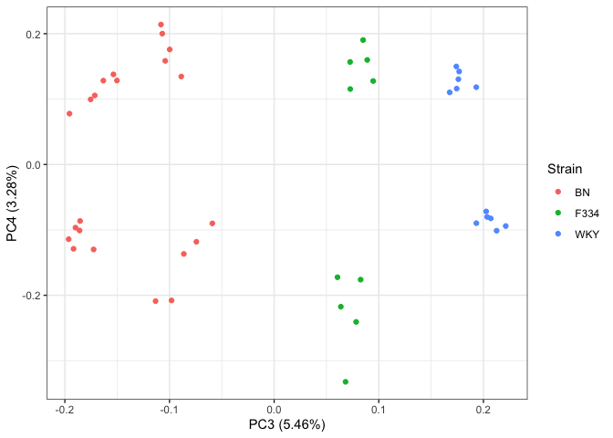

Assessing allele imbalance in the rat imprintome
================
Keegan Korthauer
25/03/2022

# Setup

## Load libraries

``` r
library(tidyverse)
library(broom)
library(Biobase)
library(ggplot2)
theme_set(theme_bw())
library(limma)
library(ggfortify)
library(edgeR)
library(pheatmap)
```

## Read in and format data

Read in `.txt` file provided by Julien.

``` r
ase.raw <- read.delim("Book2.txt")
```

Print basic info.

``` r
str(ase.raw)
```

    ## 'data.frame':    73059 obs. of  52 variables:
    ##  $ chr                                    : chr  "chr1" "chr1" "chr1" "chr1" ...
    ##  $ start                                  : int  53395 56565 197017 237908 237908 249305 318092 390868 400255 515556 ...
    ##  $ end                                    : int  56311 60411 211255 241172 243880 269871 329799 396476 409676 519170 ...
    ##  $ strand                                 : chr  "-" "-" "-" "-" ...
    ##  $ name                                   : chr  "XR_001835498.1" "XR_589829.2" "XR_589830.2" "XM_017589816.1" ...
    ##  $ ID                                     : chr  "XR_001835498.1" "XR_589829.2" "XR_589830.2" "XM_017589816.1" ...
    ##  $ ExonLength                             : int  1182 1735 2185 1647 1870 2703 2589 1752 2037 1866 ...
    ##  $ Wistar_blood_RNA_PRJEB23955_rep1.9_RPKM: num  0 0 0.0743 0.2956 0.7811 ...
    ##  $ BW_EB_RNA_rep1_BN_F1540_q255_RPM       : num  0 0 0 0 0 0 0 0 0 0 ...
    ##  $ BW_EB_RNA_rep1_WKY_NCrl_F1540_q255_RPM : num  0 0 0 0 0 0 0 0 0 0 ...
    ##  $ BW_EB_RNA_rep2_BN_F1540_q255_RPM       : num  0 0 0 0 0 0 0 0 0 0 ...
    ##  $ BW_EB_RNA_rep2_WKY_NCrl_F1540_q255_RPM : num  0 0 0 0 0 0 0 0 0 0 ...
    ##  $ BW_EB_RNA_rep3_BN_F1540_q255_RPM       : num  0 0 0 0 0 0 0 0 0 0 ...
    ##  $ BW_EB_RNA_rep3_WKY_NCrl_F1540_q255_RPM : num  0 0 0 0 0 0 0 0 0 0 ...
    ##  $ WB_EB_RNA_rep1_BN_F1540_q255_RPM       : num  0 0 0 0 0 0 0 0 0 0 ...
    ##  $ WB_EB_RNA_rep1_WKY_NCrl_F1540_q255_RPM : num  0 0 0 0 0 0 0 0 0 0 ...
    ##  $ WB_EB_RNA_rep2_BN_F1540_q255_RPM       : num  0 0 0 0 0 0 0 0 0 0 ...
    ##  $ WB_EB_RNA_rep2_WKY_NCrl_F1540_q255_RPM : num  0 0 0 0 0 0 0 0 0 0 ...
    ##  $ WB_EB_RNA_rep3_BN_F1540_q255_RPM       : num  0 0 0 0 0 0 0 0 0 0 ...
    ##  $ WB_EB_RNA_rep3_WKY_NCrl_F1540_q255_RPM : num  0 0 0 0 0 0 0 0 0 0 ...
    ##  $ BF_EB_RNA_rep1_BN_F1540_q255_RPM       : num  0 0 0 0 0 0 0 0 0 0 ...
    ##  $ BF_EB_RNA_rep1_F334_N_F1540_q255_RPM   : num  0 0 0 0 0 0 0 0 0 0 ...
    ##  $ BF_EB_RNA_rep2_BN_F1540_q255_RPM       : num  0 0 13.1 0 0 ...
    ##  $ BF_EB_RNA_rep2_F334_N_F1540_q255_RPM   : num  0 0 0 0 0 ...
    ##  $ FB_EB_RNA_rep1_BN_F1540_q255_RPM       : num  0 0 0 0 0 0 0 0 0 0 ...
    ##  $ FB_EB_RNA_rep1_F334_N_F1540_q255_RPM   : num  0 0 0 0 0 0 0 0 0 0 ...
    ##  $ FB_EB_RNA_rep2_BN_F1540_q255_RPM       : num  0 0 0 0 0 0 0 0 0 0 ...
    ##  $ FB_EB_RNA_rep2_F334_N_F1540_q255_RPM   : num  0 0 0 0 0 0 0 0 0 0 ...
    ##  $ FB_EB_RNA_rep3_BN_F1540_q255_RPM       : num  0 0 0 0 0 0 0 0 0 0 ...
    ##  $ FB_EB_RNA_rep3_F334_N_F1540_q255_RPM   : num  0 0 0 0 0 0 0 0 0 0 ...
    ##  $ BW_EPC_RNA_rep1_BN_F1540_q255_RPM      : num  0 0 0 0 0 0 0 0 0 0 ...
    ##  $ BW_EPC_RNA_rep1_WKY_NCrl_F1540_q255_RPM: num  0 0 0 0 0 0 0 0 0 0 ...
    ##  $ BW_EPC_RNA_rep3_BN_F1540_q255_RPM      : num  0 0 0 0 0 0 0 0 0 0 ...
    ##  $ BW_EPC_RNA_rep3_WKY_NCrl_F1540_q255_RPM: num  0 0 0 0 0 0 0 0 0 0 ...
    ##  $ BW_EPC_RNA_rep4_BN_F1540_q255_RPM      : num  0 0 0 0 0 0 0 0 0 0 ...
    ##  $ BW_EPC_RNA_rep4_WKY_NCrl_F1540_q255_RPM: num  0 0 0 0 0 0 0 0 0 0 ...
    ##  $ WB_EPC_RNA_rep1_BN_F1540_q255_RPM      : num  0 0 0 0 0 0 0 0 0 0 ...
    ##  $ WB_EPC_RNA_rep1_WKY_NCrl_F1540_q255_RPM: num  0 0 0 0 0 0 0 0 0 0 ...
    ##  $ WB_EPC_RNA_rep2_BN_F1540_q255_RPM      : num  0 0 0 0 0 0 0 0 0 0 ...
    ##  $ WB_EPC_RNA_rep2_WKY_NCrl_F1540_q255_RPM: num  0 0 0 0 0 0 0 0 0 0 ...
    ##  $ WB_EPC_RNA_rep3_BN_F1540_q255_RPM      : num  0 0 0 0 0 0 0 0 0 0 ...
    ##  $ WB_EPC_RNA_rep3_WKY_NCrl_F1540_q255_RPM: num  0 0 0 0 0 0 0 0 0 0 ...
    ##  $ BF_EPC_RNA_rep1_BN_F1540_q255_RPM      : num  0 0 0 0 0 0 0 0 0 0 ...
    ##  $ BF_EPC_RNA_rep1_F334_N_F1540_q255_RPM  : num  0 0 0 0 0 0 0 0 0 0 ...
    ##  $ BF_EPC_RNA_rep2_BN_F1540_q255_RPM      : num  0 0 0 0 0 0 0 0 0 0 ...
    ##  $ BF_EPC_RNA_rep2_F334_N_F1540_q255_RPM  : num  0 0 0 0 0 0 0 0 0 0 ...
    ##  $ FB_EPC_RNA_rep1_BN_F1540_q255_RPM      : num  0 0 0 0 0 0 0 0 0 0 ...
    ##  $ FB_EPC_RNA_rep1_F334_N_F1540_q255_RPM  : num  0 0 0 0 0 0 0 0 0 0 ...
    ##  $ FB_EPC_RNA_rep2_BN_F1540_q255_RPM      : num  0 0 0 0 0 0 0 0 0 0 ...
    ##  $ FB_EPC_RNA_rep2_F334_N_F1540_q255_RPM  : num  0 0 0 0 0 0 0 0 0 0 ...
    ##  $ FB_EPC_RNA_rep3_BN_F1540_q255_RPM      : num  0 0 0 0 0 0 0 0 0 0 ...
    ##  $ FB_EPC_RNA_rep3_F334_N_F1540_q255_RPM  : num  0 0 0 0 0 ...

``` r
length(unique(ase.raw$name))
```

    ## [1] 73057

Pull out sample metadata from sample names.

``` r
pd <- data.frame(Sample = colnames(ase.raw)[-c(1:8)])
rownames(pd) <- pd$Sample
attrlist <- strsplit(pd$Sample, "_")
pd <- pd %>%
  mutate(Cross = sapply(attrlist, function(x) x[1]),
         Tissue =  sapply(attrlist, function(x) x[2]),
         Rep =  sapply(attrlist, function(x) x[4]),
         Strain = sapply(attrlist, function(x) x[5]),
         Allele = ifelse(substr(Cross, 1, 1) == substr(Strain, 1, 1),
                         "Maternal", "Paternal"),
         Rat = paste0(Rep, Cross, Tissue))

# change rep4 (BW EPC) to rep2 (in that cross rep2 is missing)
pd <- pd %>%
  mutate(Rep = gsub("rep4", "rep2", Rep))

str(pd)
```

    ## 'data.frame':    44 obs. of  7 variables:
    ##  $ Sample: chr  "BW_EB_RNA_rep1_BN_F1540_q255_RPM" "BW_EB_RNA_rep1_WKY_NCrl_F1540_q255_RPM" "BW_EB_RNA_rep2_BN_F1540_q255_RPM" "BW_EB_RNA_rep2_WKY_NCrl_F1540_q255_RPM" ...
    ##  $ Cross : chr  "BW" "BW" "BW" "BW" ...
    ##  $ Tissue: chr  "EB" "EB" "EB" "EB" ...
    ##  $ Rep   : chr  "rep1" "rep1" "rep2" "rep2" ...
    ##  $ Strain: chr  "BN" "WKY" "BN" "WKY" ...
    ##  $ Allele: chr  "Maternal" "Paternal" "Maternal" "Paternal" ...
    ##  $ Rat   : chr  "rep1BWEB" "rep1BWEB" "rep2BWEB" "rep2BWEB" ...

``` r
table(pd$Cross, pd$Allele, pd$Rep, pd$Tissue)
```

    ## , ,  = rep1,  = EB
    ## 
    ##     
    ##      Maternal Paternal
    ##   BF        1        1
    ##   BW        1        1
    ##   FB        1        1
    ##   WB        1        1
    ## 
    ## , ,  = rep2,  = EB
    ## 
    ##     
    ##      Maternal Paternal
    ##   BF        1        1
    ##   BW        1        1
    ##   FB        1        1
    ##   WB        1        1
    ## 
    ## , ,  = rep3,  = EB
    ## 
    ##     
    ##      Maternal Paternal
    ##   BF        0        0
    ##   BW        1        1
    ##   FB        1        1
    ##   WB        1        1
    ## 
    ## , ,  = rep1,  = EPC
    ## 
    ##     
    ##      Maternal Paternal
    ##   BF        1        1
    ##   BW        1        1
    ##   FB        1        1
    ##   WB        1        1
    ## 
    ## , ,  = rep2,  = EPC
    ## 
    ##     
    ##      Maternal Paternal
    ##   BF        1        1
    ##   BW        1        1
    ##   FB        1        1
    ##   WB        1        1
    ## 
    ## , ,  = rep3,  = EPC
    ## 
    ##     
    ##      Maternal Paternal
    ##   BF        0        0
    ##   BW        1        1
    ##   FB        1        1
    ##   WB        1        1

There are 3 replicates for each cross in each tissue, except for the BF
cross, for which there are 2 replicates. So in all, there are 11 samples
for each tissue (3 reps in each FB, BW, WB, 2 reps in BF) for a total of
22 samples. Each of these has a maternal and paternal allele count, for
a total of 44 rows in our dataset.

Remove duplicate feature:

``` r
length(ase.raw$name)
```

    ## [1] 73059

``` r
length(unique(ase.raw$name))
```

    ## [1] 73057

``` r
(tab <- which(table(ase.raw$name) == 2))
```

    ## NM_001014271.1 NM_001170534.2 
    ##           7169          14497

``` r
ase.raw <- ase.raw %>%
  filter(!name %in% names(tab))
```

Remove the following features: 1. features with max RPKMs \< 1 2. those
that don’t satisfy: RPKM \>= 0.5 in at least 5/11 reps per cross (total
from either allele) 3. those not on canonical autosomes

``` r
filt1 <- ase.raw %>% 
  select(-c(1:8)) %>%
  apply(., 1, max) >= 1
sum(filt1)
```

    ## [1] 52625

``` r
filt2 <- ase.raw %>% 
  select(-c(1:4, 6:8)) %>%
  pivot_longer(names_to = "Sample",
               values_to = "RPKM",
               cols = -1) %>%
  left_join(pd) %>%
  select(-Sample, -Strain, -Rat) %>%
  group_by(name, Cross, Tissue, Rep) %>%
  summarize(sumRPKM = sum(RPKM)) %>%
  ungroup() %>%
  group_by(name, Tissue) %>%
  summarize(total = n(),
            pass = sum(sumRPKM >= 0.5) >= 5) %>%
  ungroup() %>%
  group_by(name) %>%
  summarize(pass = sum(pass) == 2) %>%
  ungroup() %>%
  pull(pass)
```

    ## Joining, by = "Sample"

    ## `summarise()` has grouped output by 'name', 'Cross', 'Tissue'. You can override using the `.groups` argument.

    ## `summarise()` has grouped output by 'name'. You can override using the `.groups` argument.

``` r
sum(filt2)
```

    ## [1] 29535

``` r
filt3 <- ase.raw$chr %in% paste0("chr", 1:20)
sum(filt3)
```

    ## [1] 70129

``` r
filt <- filt1 & filt2 & filt3
sum(filt)
```

    ## [1] 21295

``` r
ase <- ase.raw %>% filter(filt)
dim(ase)
```

    ## [1] 21295    52

Let’s put this metadata into a single DGEList object:

``` r
dge <- DGEList(counts = ase %>% select(-c(1:8)), 
               samples = pd,
               genes = ase %>% select(c(1:7)))
dge
```

    ## An object of class "DGEList"
    ## $counts
    ##   BW_EB_RNA_rep1_BN_F1540_q255_RPM BW_EB_RNA_rep1_WKY_NCrl_F1540_q255_RPM
    ## 1                          0.00000                                0.00000
    ## 2                          0.00000                                0.00000
    ## 3                          0.00000                               50.15189
    ## 4                          9.62018                                0.00000
    ## 5                          0.00000                                0.00000
    ##   BW_EB_RNA_rep2_BN_F1540_q255_RPM BW_EB_RNA_rep2_WKY_NCrl_F1540_q255_RPM
    ## 1                                0                               0.000000
    ## 2                                0                               0.000000
    ## 3                                0                             130.226003
    ## 4                                0                               3.990941
    ## 5                                0                               8.459061
    ##   BW_EB_RNA_rep3_BN_F1540_q255_RPM BW_EB_RNA_rep3_WKY_NCrl_F1540_q255_RPM
    ## 1                                0                                0.00000
    ## 2                                0                                0.00000
    ## 3                                0                               68.44488
    ## 4                                0                               13.80127
    ## 5                                0                               18.43286
    ##   WB_EB_RNA_rep1_BN_F1540_q255_RPM WB_EB_RNA_rep1_WKY_NCrl_F1540_q255_RPM
    ## 1                         0.000000                               0.000000
    ## 2                         0.000000                               0.000000
    ## 3                         0.000000                              53.918769
    ## 4                         0.000000                               6.549642
    ## 5                         1.058528                              19.185819
    ##   WB_EB_RNA_rep2_BN_F1540_q255_RPM WB_EB_RNA_rep2_WKY_NCrl_F1540_q255_RPM
    ## 1                                0                                0.00000
    ## 2                                0                                0.00000
    ## 3                                0                               90.23038
    ## 4                                0                                0.00000
    ## 5                                0                               18.23604
    ##   WB_EB_RNA_rep3_BN_F1540_q255_RPM WB_EB_RNA_rep3_WKY_NCrl_F1540_q255_RPM
    ## 1                           0.0000                                0.00000
    ## 2                           0.0000                                0.00000
    ## 3                           0.0000                               61.15688
    ## 4                           0.0000                                0.00000
    ## 5                          10.5658                                0.00000
    ##   BF_EB_RNA_rep1_BN_F1540_q255_RPM BF_EB_RNA_rep1_F334_N_F1540_q255_RPM
    ## 1                          0.00000                              0.00000
    ## 2                          0.00000                              0.00000
    ## 3                          0.00000                             27.66315
    ## 4                          0.00000                              0.00000
    ## 5                         19.16594                              0.00000
    ##   BF_EB_RNA_rep2_BN_F1540_q255_RPM BF_EB_RNA_rep2_F334_N_F1540_q255_RPM
    ## 1                         13.05669                             0.000000
    ## 2                          0.00000                             6.495538
    ## 3                          0.00000                            62.987115
    ## 4                          0.00000                             0.000000
    ## 5                          0.00000                             0.000000
    ##   FB_EB_RNA_rep1_BN_F1540_q255_RPM FB_EB_RNA_rep1_F334_N_F1540_q255_RPM
    ## 1                                0                             0.000000
    ## 2                                0                             0.000000
    ## 3                                0                            20.427281
    ## 4                                0                             7.647652
    ## 5                                0                             0.000000
    ##   FB_EB_RNA_rep2_BN_F1540_q255_RPM FB_EB_RNA_rep2_F334_N_F1540_q255_RPM
    ## 1                                0                               0.0000
    ## 2                                0                               0.0000
    ## 3                                0                              38.4713
    ## 4                                0                               0.0000
    ## 5                                0                               0.0000
    ##   FB_EB_RNA_rep3_BN_F1540_q255_RPM FB_EB_RNA_rep3_F334_N_F1540_q255_RPM
    ## 1                                0                              0.00000
    ## 2                                0                              0.00000
    ## 3                                0                             17.71398
    ## 4                                0                              0.00000
    ## 5                                0                              0.00000
    ##   BW_EPC_RNA_rep1_BN_F1540_q255_RPM BW_EPC_RNA_rep1_WKY_NCrl_F1540_q255_RPM
    ## 1                           0.00000                                 0.00000
    ## 2                           0.00000                                 0.00000
    ## 3                           0.00000                                 0.00000
    ## 4                          10.50968                                47.07916
    ## 5                          37.21285                                40.10838
    ##   BW_EPC_RNA_rep3_BN_F1540_q255_RPM BW_EPC_RNA_rep3_WKY_NCrl_F1540_q255_RPM
    ## 1                           0.00000                                 0.00000
    ## 2                           0.00000                                 0.00000
    ## 3                           0.00000                                 0.00000
    ## 4                          17.97851                                21.57422
    ## 5                          38.61686                                23.19968
    ##   BW_EPC_RNA_rep4_BN_F1540_q255_RPM BW_EPC_RNA_rep4_WKY_NCrl_F1540_q255_RPM
    ## 1                           0.00000                                 0.00000
    ## 2                           0.00000                                 0.00000
    ## 3                           0.00000                                 0.00000
    ## 4                          35.61108                                29.32677
    ## 5                          84.06411                                80.55759
    ##   WB_EPC_RNA_rep1_BN_F1540_q255_RPM WB_EPC_RNA_rep1_WKY_NCrl_F1540_q255_RPM
    ## 1                           0.00000                                0.000000
    ## 2                           0.00000                                0.000000
    ## 3                           0.00000                                8.771700
    ## 4                           0.00000                                7.346856
    ## 5                          15.76234                               17.187190
    ##   WB_EPC_RNA_rep2_BN_F1540_q255_RPM WB_EPC_RNA_rep2_WKY_NCrl_F1540_q255_RPM
    ## 1                           0.00000                                 0.00000
    ## 2                           0.00000                                 0.00000
    ## 3                           0.00000                                 0.00000
    ## 4                          17.78305                                 9.17231
    ## 5                          74.50170                                16.70671
    ##   WB_EPC_RNA_rep3_BN_F1540_q255_RPM WB_EPC_RNA_rep3_WKY_NCrl_F1540_q255_RPM
    ## 1                           0.00000                                 0.00000
    ## 2                           0.00000                                 0.00000
    ## 3                           0.00000                                 0.00000
    ## 4                           0.00000                                28.34611
    ## 5                          27.43028                                17.85946
    ##   BF_EPC_RNA_rep1_BN_F1540_q255_RPM BF_EPC_RNA_rep1_F334_N_F1540_q255_RPM
    ## 1                          0.000000                               0.00000
    ## 2                          0.000000                               0.00000
    ## 3                          7.273532                               0.00000
    ## 4                          7.758451                              49.13684
    ## 5                         16.405853                              16.24422
    ##   BF_EPC_RNA_rep2_BN_F1540_q255_RPM BF_EPC_RNA_rep2_F334_N_F1540_q255_RPM
    ## 1                           0.00000                               0.00000
    ## 2                           0.00000                               0.00000
    ## 3                           0.00000                               0.00000
    ## 4                          14.00756                              34.88022
    ## 5                          13.86889                              13.93824
    ##   FB_EPC_RNA_rep1_BN_F1540_q255_RPM FB_EPC_RNA_rep1_F334_N_F1540_q255_RPM
    ## 1                                 0                               0.00000
    ## 2                                 0                               0.00000
    ## 3                                 0                               0.00000
    ## 4                                 0                              44.24749
    ## 5                                 0                              19.90045
    ##   FB_EPC_RNA_rep2_BN_F1540_q255_RPM FB_EPC_RNA_rep2_F334_N_F1540_q255_RPM
    ## 1                                 0                              0.000000
    ## 2                                 0                              0.000000
    ## 3                                 0                              0.000000
    ## 4                                 0                             24.722240
    ## 5                                 0                              9.750985
    ##   FB_EPC_RNA_rep3_BN_F1540_q255_RPM FB_EPC_RNA_rep3_F334_N_F1540_q255_RPM
    ## 1                           0.00000                              0.000000
    ## 2                           0.00000                              8.820093
    ## 3                           0.00000                              0.000000
    ## 4                          19.38482                             11.243185
    ## 5                          19.38482                              0.000000
    ## 21290 more rows ...
    ## 
    ## $samples
    ##                                        group lib.size norm.factors
    ## BW_EB_RNA_rep1_BN_F1540_q255_RPM           1  5826450            1
    ## BW_EB_RNA_rep1_WKY_NCrl_F1540_q255_RPM     1  5564233            1
    ## BW_EB_RNA_rep2_BN_F1540_q255_RPM           1  6098653            1
    ## BW_EB_RNA_rep2_WKY_NCrl_F1540_q255_RPM     1  5825509            1
    ## BW_EB_RNA_rep3_BN_F1540_q255_RPM           1  5569445            1
    ##                                                                        Sample
    ## BW_EB_RNA_rep1_BN_F1540_q255_RPM             BW_EB_RNA_rep1_BN_F1540_q255_RPM
    ## BW_EB_RNA_rep1_WKY_NCrl_F1540_q255_RPM BW_EB_RNA_rep1_WKY_NCrl_F1540_q255_RPM
    ## BW_EB_RNA_rep2_BN_F1540_q255_RPM             BW_EB_RNA_rep2_BN_F1540_q255_RPM
    ## BW_EB_RNA_rep2_WKY_NCrl_F1540_q255_RPM BW_EB_RNA_rep2_WKY_NCrl_F1540_q255_RPM
    ## BW_EB_RNA_rep3_BN_F1540_q255_RPM             BW_EB_RNA_rep3_BN_F1540_q255_RPM
    ##                                        Cross Tissue  Rep Strain   Allele
    ## BW_EB_RNA_rep1_BN_F1540_q255_RPM          BW     EB rep1     BN Maternal
    ## BW_EB_RNA_rep1_WKY_NCrl_F1540_q255_RPM    BW     EB rep1    WKY Paternal
    ## BW_EB_RNA_rep2_BN_F1540_q255_RPM          BW     EB rep2     BN Maternal
    ## BW_EB_RNA_rep2_WKY_NCrl_F1540_q255_RPM    BW     EB rep2    WKY Paternal
    ## BW_EB_RNA_rep3_BN_F1540_q255_RPM          BW     EB rep3     BN Maternal
    ##                                             Rat
    ## BW_EB_RNA_rep1_BN_F1540_q255_RPM       rep1BWEB
    ## BW_EB_RNA_rep1_WKY_NCrl_F1540_q255_RPM rep1BWEB
    ## BW_EB_RNA_rep2_BN_F1540_q255_RPM       rep2BWEB
    ## BW_EB_RNA_rep2_WKY_NCrl_F1540_q255_RPM rep2BWEB
    ## BW_EB_RNA_rep3_BN_F1540_q255_RPM       rep3BWEB
    ## 39 more rows ...
    ## 
    ## $genes
    ##    chr   start     end strand           name             ID ExonLength
    ## 1 chr1  197017  211255      -    XR_589830.2    XR_589830.2       2185
    ## 2 chr1  249305  269871      - XM_017589810.1 XM_017589810.1       2703
    ## 3 chr1 1101665 1120340      - XM_006227600.3 XM_006227600.3       4899
    ## 4 chr1 1181300 1200526      + XM_017590411.1 XM_017590411.1        781
    ## 5 chr1 1207153 1220928      + XR_001835499.1 XR_001835499.1       5555
    ## 21290 more rows ...

# EDA

## Principal components analysis

Let’s plot some PCA plots to see where major variation lies.

``` r
pca_res <- prcomp(t(dge$counts), scale. = TRUE)

autoplot(pca_res, data = dge$samples, colour = 'Tissue')
```

<!-- -->

``` r
autoplot(pca_res, data = dge$samples, colour = 'Cross')
```

<!-- -->
PC 1 is clearly Cross (BF/FB vs BW/WB). PC 2 is clearly tissue.

``` r
autoplot(pca_res, data = dge$samples, colour = 'Cross', x = 3, y = 4)
```

<!-- -->

``` r
autoplot(pca_res, data = dge$samples, colour = 'Strain', x = 3, y = 4)
```

<!-- -->

``` r
autoplot(pca_res, data = dge$samples, colour = 'Tissue', x = 3, y = 4)
```

<!-- -->
PC 3 looks like strain effects (which strain is the allele from), and PC
4 looks like interaction between cross and tissue.

## Sample-sample correlation heatmap

Here we’ll look at a sample-sample correlation heatmap, which will
further let us look at major sources of variation and spot any potential
outlier samples.

``` r
# Set up color scheme for heatmaps 
bcols<-colorRampPalette(c("#000000" ,"#800000" ,"#FF8000" ,"#FFFF00", "#FFFFFF"))(20)

cc <- data.frame(cor(dge$counts), 
                 row.names = colnames(dge))
range(cc, na.rm=T)
```

    ## [1] 0.1840981 1.0000000

``` r
annot_df <- dge$samples %>%
  select(Cross, Tissue, Allele, Strain)
pheatmap(cc, color = bcols, 
         border_color = NA, 
         show_rownames = FALSE, 
         show_colnames = FALSE,
         annotation_col = annot_df, 
         main="Sample-Sample Correlation")
```

<!-- -->

A few observations:

-   As expected, tissue is the major source of variation  
-   Cross is the next major source of variation (BF/FB vs BW/WB)  
-   Within a tissue and reciprocal cross, expression is more similar for
    alleles coming from the same strain than from the same type of
    allele (mat/pat)  
-   Within a tissue, reciprocal cross and maternal strain, mat/pat
    alleles are generally more similar to each other than to the
    opposite allele within the same rat  
-   EB samples look more heterogeneous - in particular, measurements
    from the BN allele in the BF/FB cross look quite different than
    those from the other strain in the same cross, as well as the same
    strain in the other cross

## Allelic expression proportions

Here we want to calculate allelic expression proportions
(Maternal/(Maternal + Paternal)) for each rep.

``` r
ase.long <- pivot_longer(data.frame(dge$counts) %>% 
                           mutate(gene = dge$genes$name),
                         cols = -gene,
                         names_to = "Sample",
                         values_to = "RPKM") %>%
  left_join(pd) %>%
  select(-Sample, -Strain) %>%
  pivot_wider(names_from = Allele,
              values_from = "RPKM") %>%
  mutate(prop = Maternal / (Maternal + Paternal)) 
```

    ## Joining, by = "Sample"

``` r
ase.long
```

    ## # A tibble: 468,490 × 8
    ##    gene        Cross Tissue Rep   Rat      Maternal Paternal  prop
    ##    <chr>       <chr> <chr>  <chr> <chr>       <dbl>    <dbl> <dbl>
    ##  1 XR_589830.2 BW    EB     rep1  rep1BWEB      0          0   NaN
    ##  2 XR_589830.2 BW    EB     rep2  rep2BWEB      0          0   NaN
    ##  3 XR_589830.2 BW    EB     rep3  rep3BWEB      0          0   NaN
    ##  4 XR_589830.2 WB    EB     rep1  rep1WBEB      0          0   NaN
    ##  5 XR_589830.2 WB    EB     rep2  rep2WBEB      0          0   NaN
    ##  6 XR_589830.2 WB    EB     rep3  rep3WBEB      0          0   NaN
    ##  7 XR_589830.2 BF    EB     rep1  rep1BFEB      0          0   NaN
    ##  8 XR_589830.2 BF    EB     rep2  rep2BFEB     13.1        0     1
    ##  9 XR_589830.2 FB    EB     rep1  rep1FBEB      0          0   NaN
    ## 10 XR_589830.2 FB    EB     rep2  rep2FBEB      0          0   NaN
    ## # … with 468,480 more rows

Let’s visualize a histogram of allelic proportions per gene.

``` r
ase.long %>% 
  group_by(gene, Tissue, Cross) %>%
  summarize(prop = mean(prop)) %>%
  ggplot() +
  geom_histogram(aes(prop)) +
  facet_grid(Cross ~ Tissue)
```

    ## `summarise()` has grouped output by 'gene', 'Tissue'. You can override using the `.groups` argument.

    ## `stat_bin()` using `bins = 30`. Pick better value with `binwidth`.

    ## Warning: Removed 90182 rows containing non-finite values (stat_bin).

<!-- -->

As we expect, most values are close to 0.5.

# Limma voom

Here we’ll try out using limma voom to estimate allele-specific effects
within each tissue (EB and EPC).

We’ll build one model to represent the entire dataset. Our model here
includes blocking effects for each rat, so that we can estimate maternal
vs paternal allele effects. We’ll include terms to do so separately in
each allele. Note that there’s no need to include separate terms for
cross, due to the presence of the blocking term for rat (and since we
are not interested in looking at differential allele-specific expression
between the crosses).

``` r
mm <- model.matrix(~ 0 + Rat + Tissue:Allele,
                   data = dge$samples)

# drop redundant terms to get to full rank
mm <- mm[,!grepl("AlleleMaternal", colnames(mm))]
colnames(mm)
```

    ##  [1] "Ratrep1BFEB"              "Ratrep1BFEPC"            
    ##  [3] "Ratrep1BWEB"              "Ratrep1BWEPC"            
    ##  [5] "Ratrep1FBEB"              "Ratrep1FBEPC"            
    ##  [7] "Ratrep1WBEB"              "Ratrep1WBEPC"            
    ##  [9] "Ratrep2BFEB"              "Ratrep2BFEPC"            
    ## [11] "Ratrep2BWEB"              "Ratrep2FBEB"             
    ## [13] "Ratrep2FBEPC"             "Ratrep2WBEB"             
    ## [15] "Ratrep2WBEPC"             "Ratrep3BWEB"             
    ## [17] "Ratrep3BWEPC"             "Ratrep3FBEB"             
    ## [19] "Ratrep3FBEPC"             "Ratrep3WBEB"             
    ## [21] "Ratrep3WBEPC"             "Ratrep4BWEPC"            
    ## [23] "TissueEB:AllelePaternal"  "TissueEPC:AllelePaternal"

``` r
# don't normalize for library size (diff is within sample)
y <- voom(dge, mm, plot = TRUE, 
          normalize.method = "none", 
          lib.size = rep(1, ncol(dge)))
```

<!-- -->

``` r
fit <- lmFit(y, mm)
fit <- eBayes(fit)
```

First we’ll pull out the results for significant allele effects in EB:

``` r
# pull out test for EB
res_EB <- topTable(fit, coef = "TissueEB:AllelePaternal",
                   n = Inf, sort.by = "P")
head(res_EB)
```

    ##        chr     start       end strand           name             ID ExonLength
    ## 10609 chr6 133710206 133721191      - XM_017594511.1 XM_017594511.1       9383
    ## 6491  chr4  29795452  29804517      +   MSTRG.8729.1   MSTRG.8729.1       2603
    ## 6490  chr4  29795452  29804517      +   MSTRG.8729.2   MSTRG.8729.2       2614
    ## 10606 chr6 133658936 133691130      +    NR_131064.1    NR_131064.1       1890
    ## 1741  chr1 195032372 195074327      - XR_001835978.1 XR_001835978.1      13741
    ## 2104  chr1 215744403 215747080      -    NR_027324.1    NR_027324.1       2325
    ##           logFC  AveExpr         t      P.Value    adj.P.Val         B
    ## 10609 -8.065669 22.61760 -15.15719 3.790335e-13 8.071518e-09  6.148534
    ## 6491   7.002900 25.92802  12.33490 2.249831e-11 2.090050e-07  5.063862
    ## 6490   6.971215 25.95730  12.02797 3.661187e-11 2.090050e-07  4.972027
    ## 10606 -7.978080 24.26449 -11.98444 3.925899e-11 2.090050e-07  4.019546
    ## 1741   2.899307 26.94109  11.75077 5.729352e-11 2.440131e-07 14.805348
    ## 2104  -4.765764 29.31165 -10.44182 5.297875e-10 1.880304e-06  6.943702

``` r
sum(res_EB$adj.P.Val < 0.05)
```

    ## [1] 20

There are 20 significant hits in EB.

First we’ll pull out the results for significant allele effects in EPC:

``` r
# pull out test for EPC
res_EPC <- topTable(fit, coef = "TissueEPC:AllelePaternal",
                   n = Inf, sort.by = "P")
head(res_EPC)
```

    ##         chr     start       end strand           name             ID ExonLength
    ## 8486   chr5 138154676 138182897      +    NM_138827.1    NM_138827.1       2573
    ## 2104   chr1 215744403 215747080      -    NR_027324.1    NR_027324.1       2325
    ## 12602  chr7 145068289 145113507      + NM_001108119.1 NM_001108119.1       4623
    ## 7096   chr4 156271086 156276243      - NM_001005897.1 NM_001005897.1        724
    ## 19269 chr14  44889401  44918377      + NM_001025138.1 NM_001025138.1       1508
    ## 2124   chr1 216254910 216256610      +   MSTRG.1216.2   MSTRG.1216.2       1590
    ##            logFC  AveExpr          t      P.Value    adj.P.Val        B
    ## 8486  -0.5072683 32.23595 -437.23514 6.096167e-45 1.298179e-40 86.70833
    ## 2104  -6.3670389 29.31165  -44.61762 4.018744e-23 4.278958e-19 43.13713
    ## 12602 -6.8221612 19.63528  -41.56703 1.883826e-22 1.337203e-18 38.57932
    ## 7096  -6.2779988 19.56232  -35.22354 6.903255e-21 3.675120e-17 35.42805
    ## 19269 -6.7371842 19.62707  -33.08036 2.690498e-20 1.145883e-16 34.78949
    ## 2124  -9.5158206 24.85541  -30.15732 1.985477e-19 7.046790e-16 33.75452

``` r
sum(res_EPC$adj.P.Val < 0.05)
```

    ## [1] 445

There are 445 significant hits in EB.

Look for overlap between the two:

``` r
ix <- which(res_EB[res_EB$adj.P.Val < 0.05,]$name %in% res_EPC[res_EPC$adj.P.Val < 0.05,]$name)
length(ix)
```

    ## [1] 15

``` r
res_EB[res_EB$adj.P.Val < 0.05,]$name[ix]
```

    ##  [1] "XM_017594511.1" "MSTRG.8729.1"   "MSTRG.8729.2"   "NR_131064.1"   
    ##  [5] "NR_027324.1"    "MSTRG.1218.1"   "NM_001009617.1" "MSTRG.10785.1" 
    ##  [9] "XM_008770347.2" "MSTRG.8805.1"   "NM_001017504.1" "NM_131911.2"   
    ## [13] "XM_017596813.1" "MSTRG.12748.1"  "XM_008763695.1"

We see that 75% of the significant hits in EB are also significant in
EPC.
