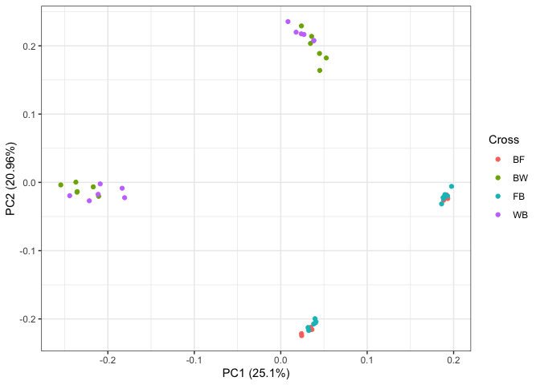
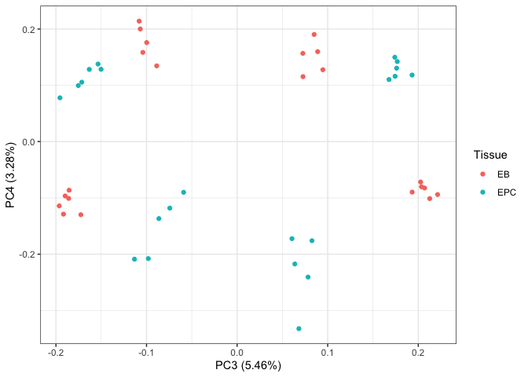
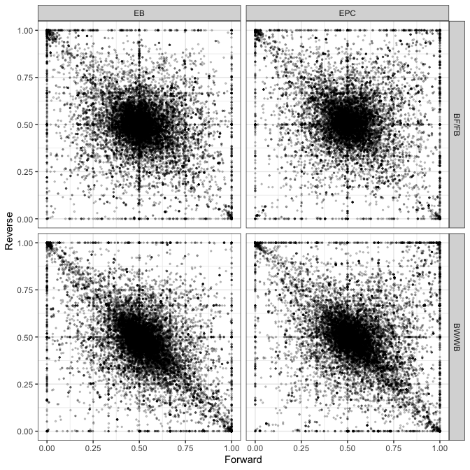

Assessing allele imbalance in the rat imprintome
================
Keegan Korthauer
25/03/2022

# Setup

## Load libraries

``` r
library(tidyverse)
library(broom)
library(Biobase)
library(ggplot2)
theme_set(theme_bw())
library(limma)
library(ggfortify)
library(edgeR)
library(pheatmap)
library(UpSetR)
```

## Read in and format data

Read in `.txt` file provided by Julien.

``` r
ase.raw <- read.delim("Book2.txt")
```

Print basic info.

``` r
str(ase.raw)
```

    ## 'data.frame':    73059 obs. of  52 variables:
    ##  $ chr                                    : chr  "chr1" "chr1" "chr1" "chr1" ...
    ##  $ start                                  : int  53395 56565 197017 237908 237908 249305 318092 390868 400255 515556 ...
    ##  $ end                                    : int  56311 60411 211255 241172 243880 269871 329799 396476 409676 519170 ...
    ##  $ strand                                 : chr  "-" "-" "-" "-" ...
    ##  $ name                                   : chr  "XR_001835498.1" "XR_589829.2" "XR_589830.2" "XM_017589816.1" ...
    ##  $ ID                                     : chr  "XR_001835498.1" "XR_589829.2" "XR_589830.2" "XM_017589816.1" ...
    ##  $ ExonLength                             : int  1182 1735 2185 1647 1870 2703 2589 1752 2037 1866 ...
    ##  $ Wistar_blood_RNA_PRJEB23955_rep1.9_RPKM: num  0 0 0.0743 0.2956 0.7811 ...
    ##  $ BW_EB_RNA_rep1_BN_F1540_q255_RPM       : num  0 0 0 0 0 0 0 0 0 0 ...
    ##  $ BW_EB_RNA_rep1_WKY_NCrl_F1540_q255_RPM : num  0 0 0 0 0 0 0 0 0 0 ...
    ##  $ BW_EB_RNA_rep2_BN_F1540_q255_RPM       : num  0 0 0 0 0 0 0 0 0 0 ...
    ##  $ BW_EB_RNA_rep2_WKY_NCrl_F1540_q255_RPM : num  0 0 0 0 0 0 0 0 0 0 ...
    ##  $ BW_EB_RNA_rep3_BN_F1540_q255_RPM       : num  0 0 0 0 0 0 0 0 0 0 ...
    ##  $ BW_EB_RNA_rep3_WKY_NCrl_F1540_q255_RPM : num  0 0 0 0 0 0 0 0 0 0 ...
    ##  $ WB_EB_RNA_rep1_BN_F1540_q255_RPM       : num  0 0 0 0 0 0 0 0 0 0 ...
    ##  $ WB_EB_RNA_rep1_WKY_NCrl_F1540_q255_RPM : num  0 0 0 0 0 0 0 0 0 0 ...
    ##  $ WB_EB_RNA_rep2_BN_F1540_q255_RPM       : num  0 0 0 0 0 0 0 0 0 0 ...
    ##  $ WB_EB_RNA_rep2_WKY_NCrl_F1540_q255_RPM : num  0 0 0 0 0 0 0 0 0 0 ...
    ##  $ WB_EB_RNA_rep3_BN_F1540_q255_RPM       : num  0 0 0 0 0 0 0 0 0 0 ...
    ##  $ WB_EB_RNA_rep3_WKY_NCrl_F1540_q255_RPM : num  0 0 0 0 0 0 0 0 0 0 ...
    ##  $ BF_EB_RNA_rep1_BN_F1540_q255_RPM       : num  0 0 0 0 0 0 0 0 0 0 ...
    ##  $ BF_EB_RNA_rep1_F334_N_F1540_q255_RPM   : num  0 0 0 0 0 0 0 0 0 0 ...
    ##  $ BF_EB_RNA_rep2_BN_F1540_q255_RPM       : num  0 0 13.1 0 0 ...
    ##  $ BF_EB_RNA_rep2_F334_N_F1540_q255_RPM   : num  0 0 0 0 0 ...
    ##  $ FB_EB_RNA_rep1_BN_F1540_q255_RPM       : num  0 0 0 0 0 0 0 0 0 0 ...
    ##  $ FB_EB_RNA_rep1_F334_N_F1540_q255_RPM   : num  0 0 0 0 0 0 0 0 0 0 ...
    ##  $ FB_EB_RNA_rep2_BN_F1540_q255_RPM       : num  0 0 0 0 0 0 0 0 0 0 ...
    ##  $ FB_EB_RNA_rep2_F334_N_F1540_q255_RPM   : num  0 0 0 0 0 0 0 0 0 0 ...
    ##  $ FB_EB_RNA_rep3_BN_F1540_q255_RPM       : num  0 0 0 0 0 0 0 0 0 0 ...
    ##  $ FB_EB_RNA_rep3_F334_N_F1540_q255_RPM   : num  0 0 0 0 0 0 0 0 0 0 ...
    ##  $ BW_EPC_RNA_rep1_BN_F1540_q255_RPM      : num  0 0 0 0 0 0 0 0 0 0 ...
    ##  $ BW_EPC_RNA_rep1_WKY_NCrl_F1540_q255_RPM: num  0 0 0 0 0 0 0 0 0 0 ...
    ##  $ BW_EPC_RNA_rep3_BN_F1540_q255_RPM      : num  0 0 0 0 0 0 0 0 0 0 ...
    ##  $ BW_EPC_RNA_rep3_WKY_NCrl_F1540_q255_RPM: num  0 0 0 0 0 0 0 0 0 0 ...
    ##  $ BW_EPC_RNA_rep4_BN_F1540_q255_RPM      : num  0 0 0 0 0 0 0 0 0 0 ...
    ##  $ BW_EPC_RNA_rep4_WKY_NCrl_F1540_q255_RPM: num  0 0 0 0 0 0 0 0 0 0 ...
    ##  $ WB_EPC_RNA_rep1_BN_F1540_q255_RPM      : num  0 0 0 0 0 0 0 0 0 0 ...
    ##  $ WB_EPC_RNA_rep1_WKY_NCrl_F1540_q255_RPM: num  0 0 0 0 0 0 0 0 0 0 ...
    ##  $ WB_EPC_RNA_rep2_BN_F1540_q255_RPM      : num  0 0 0 0 0 0 0 0 0 0 ...
    ##  $ WB_EPC_RNA_rep2_WKY_NCrl_F1540_q255_RPM: num  0 0 0 0 0 0 0 0 0 0 ...
    ##  $ WB_EPC_RNA_rep3_BN_F1540_q255_RPM      : num  0 0 0 0 0 0 0 0 0 0 ...
    ##  $ WB_EPC_RNA_rep3_WKY_NCrl_F1540_q255_RPM: num  0 0 0 0 0 0 0 0 0 0 ...
    ##  $ BF_EPC_RNA_rep1_BN_F1540_q255_RPM      : num  0 0 0 0 0 0 0 0 0 0 ...
    ##  $ BF_EPC_RNA_rep1_F334_N_F1540_q255_RPM  : num  0 0 0 0 0 0 0 0 0 0 ...
    ##  $ BF_EPC_RNA_rep2_BN_F1540_q255_RPM      : num  0 0 0 0 0 0 0 0 0 0 ...
    ##  $ BF_EPC_RNA_rep2_F334_N_F1540_q255_RPM  : num  0 0 0 0 0 0 0 0 0 0 ...
    ##  $ FB_EPC_RNA_rep1_BN_F1540_q255_RPM      : num  0 0 0 0 0 0 0 0 0 0 ...
    ##  $ FB_EPC_RNA_rep1_F334_N_F1540_q255_RPM  : num  0 0 0 0 0 0 0 0 0 0 ...
    ##  $ FB_EPC_RNA_rep2_BN_F1540_q255_RPM      : num  0 0 0 0 0 0 0 0 0 0 ...
    ##  $ FB_EPC_RNA_rep2_F334_N_F1540_q255_RPM  : num  0 0 0 0 0 0 0 0 0 0 ...
    ##  $ FB_EPC_RNA_rep3_BN_F1540_q255_RPM      : num  0 0 0 0 0 0 0 0 0 0 ...
    ##  $ FB_EPC_RNA_rep3_F334_N_F1540_q255_RPM  : num  0 0 0 0 0 ...

``` r
length(unique(ase.raw$name))
```

    ## [1] 73057

Pull out sample metadata from sample names.

``` r
pd <- data.frame(Sample = colnames(ase.raw)[-c(1:8)])
rownames(pd) <- pd$Sample
attrlist <- strsplit(pd$Sample, "_")
pd <- pd %>%
  mutate(Cross = sapply(attrlist, function(x) x[1]),
         Tissue =  sapply(attrlist, function(x) x[2]),
         Rep =  sapply(attrlist, function(x) x[4]),
         Strain = sapply(attrlist, function(x) x[5]),
         Allele = ifelse(substr(Cross, 1, 1) == substr(Strain, 1, 1),
                         "Maternal", "Paternal"),
         Rat = paste0(Rep, Cross, Tissue),
         Cross_group = ifelse(Cross %in% c("BF", "FB"), "BF/FB", "BW/WB"),
         Cross_direction = ifelse(Cross %in% c("BF", "BW"), "Forward", "Reverse"))

# change rep4 (BW EPC) to rep2 (in that cross rep2 is missing)
pd <- pd %>%
  mutate(Rep = gsub("rep4", "rep2", Rep))

str(pd)
```

    ## 'data.frame':    44 obs. of  9 variables:
    ##  $ Sample         : chr  "BW_EB_RNA_rep1_BN_F1540_q255_RPM" "BW_EB_RNA_rep1_WKY_NCrl_F1540_q255_RPM" "BW_EB_RNA_rep2_BN_F1540_q255_RPM" "BW_EB_RNA_rep2_WKY_NCrl_F1540_q255_RPM" ...
    ##  $ Cross          : chr  "BW" "BW" "BW" "BW" ...
    ##  $ Tissue         : chr  "EB" "EB" "EB" "EB" ...
    ##  $ Rep            : chr  "rep1" "rep1" "rep2" "rep2" ...
    ##  $ Strain         : chr  "BN" "WKY" "BN" "WKY" ...
    ##  $ Allele         : chr  "Maternal" "Paternal" "Maternal" "Paternal" ...
    ##  $ Rat            : chr  "rep1BWEB" "rep1BWEB" "rep2BWEB" "rep2BWEB" ...
    ##  $ Cross_group    : chr  "BW/WB" "BW/WB" "BW/WB" "BW/WB" ...
    ##  $ Cross_direction: chr  "Forward" "Forward" "Forward" "Forward" ...

``` r
table(pd$Cross, pd$Allele, pd$Rep, pd$Tissue)
```

    ## , ,  = rep1,  = EB
    ## 
    ##     
    ##      Maternal Paternal
    ##   BF        1        1
    ##   BW        1        1
    ##   FB        1        1
    ##   WB        1        1
    ## 
    ## , ,  = rep2,  = EB
    ## 
    ##     
    ##      Maternal Paternal
    ##   BF        1        1
    ##   BW        1        1
    ##   FB        1        1
    ##   WB        1        1
    ## 
    ## , ,  = rep3,  = EB
    ## 
    ##     
    ##      Maternal Paternal
    ##   BF        0        0
    ##   BW        1        1
    ##   FB        1        1
    ##   WB        1        1
    ## 
    ## , ,  = rep1,  = EPC
    ## 
    ##     
    ##      Maternal Paternal
    ##   BF        1        1
    ##   BW        1        1
    ##   FB        1        1
    ##   WB        1        1
    ## 
    ## , ,  = rep2,  = EPC
    ## 
    ##     
    ##      Maternal Paternal
    ##   BF        1        1
    ##   BW        1        1
    ##   FB        1        1
    ##   WB        1        1
    ## 
    ## , ,  = rep3,  = EPC
    ## 
    ##     
    ##      Maternal Paternal
    ##   BF        0        0
    ##   BW        1        1
    ##   FB        1        1
    ##   WB        1        1

There are 3 replicates for each cross in each tissue, except for the BF
cross, for which there are 2 replicates. So in all, there are 11 samples
for each tissue (3 reps in each FB, BW, WB, 2 reps in BF) for a total of
22 samples. Each of these has a maternal and paternal allele count, for
a total of 44 rows in our dataset.

Remove duplicate feature:

``` r
length(ase.raw$name)
```

    ## [1] 73059

``` r
length(unique(ase.raw$name))
```

    ## [1] 73057

``` r
(tab <- which(table(ase.raw$name) == 2))
```

    ## NM_001014271.1 NM_001170534.2 
    ##           7169          14497

``` r
ase.raw <- ase.raw %>%
  filter(!name %in% names(tab))
```

Remove the following features:

1.  features with max RPKMs \< 1  
2.  those that don’t satisfy: RPKM >= 0.5 (total from maternal and
    paternal allele) in at least 2 out of 5 or 6 reps per cross in each
    tissue (i.e. required to have 2 reps each for ALL four combinations
    of tissue and cross)
3.  those not on canonical autosomes

``` r
filt1 <- ase.raw %>% 
  select(-c(1:8)) %>%
  apply(., 1, max) >= 1
sum(filt1)
```

    ## [1] 52625

``` r
filt2 <- ase.raw %>% 
  select(-c(1:4, 6:8)) %>%
  pivot_longer(names_to = "Sample",
               values_to = "RPKM",
               cols = -1) %>%
  left_join(pd) %>%
  select(-Sample, -Strain, -Rat) %>%
  group_by(name, Cross, Cross_group, Tissue, Rep) %>%
  summarize(sumRPKM = sum(RPKM)) %>%
  ungroup() %>%
  group_by(name, Tissue, Cross_group) %>%
  summarize(total = n(),
            pass = sum(sumRPKM >= 0.5) >= 2) %>%
  ungroup() %>%
  group_by(name) %>%
  summarize(pass = sum(pass) == 4) %>%
  ungroup() %>%
  left_join(ase.raw, ., by = "name") %>%
  pull(pass)
```

    ## Joining, by = "Sample"

    ## `summarise()` has grouped output by 'name', 'Cross', 'Cross_group', 'Tissue'. You can override using the `.groups` argument.

    ## `summarise()` has grouped output by 'name', 'Tissue'. You can override using the `.groups` argument.

``` r
sum(filt2)
```

    ## [1] 19924

``` r
filt3 <- ase.raw$chr %in% paste0("chr", 1:20)
sum(filt3)
```

    ## [1] 70129

``` r
filt <- filt1 & filt2 & filt3
sum(filt)
```

    ## [1] 19590

``` r
ase <- ase.raw %>% filter(filt)
dim(ase)
```

    ## [1] 19590    52

Let’s put this metadata into a single DGEList object:

``` r
dge <- DGEList(counts = ase %>% select(-c(1:8)), 
               samples = pd,
               genes = ase %>% select(c(1:7)))
dge
```

    ## An object of class "DGEList"
    ## $counts
    ##   BW_EB_RNA_rep1_BN_F1540_q255_RPM BW_EB_RNA_rep1_WKY_NCrl_F1540_q255_RPM
    ## 1                        101.67115                               115.5887
    ## 2                         21.48668                                 0.0000
    ## 3                         92.29512                               237.7698
    ## 4                         44.04770                               439.7933
    ## 5                         16.45686                               407.6610
    ##   BW_EB_RNA_rep2_BN_F1540_q255_RPM BW_EB_RNA_rep2_WKY_NCrl_F1540_q255_RPM
    ## 1                        81.944356                               185.3184
    ## 2                        24.075725                                 0.0000
    ## 3                       131.874513                               130.9201
    ## 4                        17.525415                               690.1720
    ## 5                         2.819685                               622.1959
    ##   BW_EB_RNA_rep3_BN_F1540_q255_RPM BW_EB_RNA_rep3_WKY_NCrl_F1540_q255_RPM
    ## 1                         75.78985                               196.6793
    ## 2                         27.64928                                 0.0000
    ## 3                         86.97119                               156.6792
    ## 4                         26.19898                               498.5285
    ## 5                         11.04100                               447.7680
    ##   WB_EB_RNA_rep1_BN_F1540_q255_RPM WB_EB_RNA_rep1_WKY_NCrl_F1540_q255_RPM
    ## 1                        120.53987                               92.09193
    ## 2                         10.12217                                0.00000
    ## 3                        108.56528                              152.36187
    ## 4                         67.15037                              761.54469
    ## 5                         21.76598                              712.78625
    ##   WB_EB_RNA_rep2_BN_F1540_q255_RPM WB_EB_RNA_rep2_WKY_NCrl_F1540_q255_RPM
    ## 1                        37.374377                              76.600846
    ## 2                        27.971414                               8.120739
    ## 3                        90.752737                             323.356975
    ## 4                        29.063675                             664.569653
    ## 5                         5.366333                             581.937621
    ##   WB_EB_RNA_rep3_BN_F1540_q255_RPM WB_EB_RNA_rep3_WKY_NCrl_F1540_q255_RPM
    ## 1                        74.584251                             130.641640
    ## 2                        19.700812                               4.622537
    ## 3                       105.327902                             129.357690
    ## 4                        28.835755                             431.106858
    ## 5                         8.327894                             375.856509
    ##   BF_EB_RNA_rep1_BN_F1540_q255_RPM BF_EB_RNA_rep1_F334_N_F1540_q255_RPM
    ## 1                         78.36315                             55.98726
    ## 2                          0.00000                              0.00000
    ## 3                        230.36884                             87.42680
    ## 4                        200.43968                            193.83084
    ## 5                        200.43968                            193.83084
    ##   BF_EB_RNA_rep2_BN_F1540_q255_RPM BF_EB_RNA_rep2_F334_N_F1540_q255_RPM
    ## 1                         44.09094                             97.89253
    ## 2                          0.00000                              0.00000
    ## 3                        149.59444                            183.90925
    ## 4                        100.32007                            162.65106
    ## 5                        100.32007                            162.65106
    ##   FB_EB_RNA_rep1_BN_F1540_q255_RPM FB_EB_RNA_rep1_F334_N_F1540_q255_RPM
    ## 1                         60.77881                             58.96761
    ## 2                          0.00000                             15.29530
    ## 3                        210.31110                            205.48094
    ## 4                        114.41321                            165.73291
    ## 5                        114.41321                            165.73291
    ##   FB_EB_RNA_rep2_BN_F1540_q255_RPM FB_EB_RNA_rep2_F334_N_F1540_q255_RPM
    ## 1                         96.13884                            74.975747
    ## 2                         13.68919                             9.755514
    ## 3                         42.32630                           170.878490
    ## 4                        101.25255                           266.938498
    ## 5                        101.25255                           266.859825
    ##   FB_EB_RNA_rep3_BN_F1540_q255_RPM FB_EB_RNA_rep3_F334_N_F1540_q255_RPM
    ## 1                         45.82017                             72.09598
    ## 2                          0.00000                              0.00000
    ## 3                        171.58971                            126.95036
    ## 4                        114.19633                            192.90563
    ## 5                        114.19633                            192.90563
    ##   BW_EPC_RNA_rep1_BN_F1540_q255_RPM BW_EPC_RNA_rep1_WKY_NCrl_F1540_q255_RPM
    ## 1                          0.000000                                30.02771
    ## 2                         69.599874                                10.45606
    ## 3                          0.000000                                32.01170
    ## 4                          1.340524                               205.79688
    ## 5                          1.340524                               187.08318
    ##   BW_EPC_RNA_rep3_BN_F1540_q255_RPM BW_EPC_RNA_rep3_WKY_NCrl_F1540_q255_RPM
    ## 1                          0.000000                                15.86050
    ## 2                         42.902209                                25.71175
    ## 3                         26.056531                                15.86050
    ## 4                         16.451571                               149.93599
    ## 5                          8.521323                               121.76143
    ##   BW_EPC_RNA_rep4_BN_F1540_q255_RPM BW_EPC_RNA_rep4_WKY_NCrl_F1540_q255_RPM
    ## 1                          0.000000                                14.57235
    ## 2                         41.030140                                17.66894
    ## 3                         27.186428                                 0.00000
    ## 4                          8.971084                               230.92553
    ## 5                          6.102159                               193.67504
    ##   WB_EPC_RNA_rep1_BN_F1540_q255_RPM WB_EPC_RNA_rep1_WKY_NCrl_F1540_q255_RPM
    ## 1                          0.000000                                26.49318
    ## 2                         23.287286                                42.03288
    ## 3                          0.000000                                17.54340
    ## 4                          8.816227                               233.45177
    ## 5                          1.736530                               217.02156
    ##   WB_EPC_RNA_rep2_BN_F1540_q255_RPM WB_EPC_RNA_rep2_WKY_NCrl_F1540_q255_RPM
    ## 1                           0.00000                               35.659754
    ## 2                          18.39144                                0.000000
    ## 3                          47.78028                                9.125512
    ## 4                           0.00000                              153.823550
    ## 5                           0.00000                              135.853296
    ##   WB_EPC_RNA_rep3_BN_F1540_q255_RPM WB_EPC_RNA_rep3_WKY_NCrl_F1540_q255_RPM
    ## 1                          0.000000                                 0.00000
    ## 2                         58.478215                                 0.00000
    ## 3                          8.929732                                56.69224
    ## 4                         18.500556                               202.59038
    ## 5                          2.793401                               167.10048
    ##   BF_EPC_RNA_rep1_BN_F1540_q255_RPM BF_EPC_RNA_rep1_F334_N_F1540_q255_RPM
    ## 1                           0.00000                              16.32506
    ## 2                          13.41562                               0.00000
    ## 3                          49.21757                              33.13498
    ## 4                          32.40762                              53.82418
    ## 5                          32.40762                              53.82418
    ##   BF_EPC_RNA_rep2_BN_F1540_q255_RPM BF_EPC_RNA_rep2_F334_N_F1540_q255_RPM
    ## 1                           0.00000                              6.171659
    ## 2                          17.33612                              0.000000
    ## 3                          28.43122                             13.314144
    ## 4                          59.15073                             26.766914
    ## 5                          59.15073                             26.766914
    ##   FB_EPC_RNA_rep1_BN_F1540_q255_RPM FB_EPC_RNA_rep1_F334_N_F1540_q255_RPM
    ## 1                           0.00000                              10.71562
    ## 2                          21.06680                               0.00000
    ## 3                          29.30397                              29.23104
    ## 4                          11.37167                              45.26801
    ## 5                          11.37167                              45.26801
    ##   FB_EPC_RNA_rep2_BN_F1540_q255_RPM FB_EPC_RNA_rep2_F334_N_F1540_q255_RPM
    ## 1                           0.00000                              19.89596
    ## 2                          15.75920                              52.89178
    ## 3                           0.00000                              39.69343
    ## 4                          19.89599                              82.14462
    ## 5                          19.89599                              82.14462
    ##   FB_EPC_RNA_rep3_BN_F1540_q255_RPM FB_EPC_RNA_rep3_F334_N_F1540_q255_RPM
    ## 1                           0.00000                              19.28788
    ## 2                           0.00000                               0.00000
    ## 3                           0.00000                              19.48173
    ## 4                          23.94024                              41.67733
    ## 5                          23.94024                              41.67733
    ## 19585 more rows ...
    ## 
    ## $samples
    ##                                        group lib.size norm.factors
    ## BW_EB_RNA_rep1_BN_F1540_q255_RPM           1 11935544            1
    ## BW_EB_RNA_rep1_WKY_NCrl_F1540_q255_RPM     1 11007702            1
    ## BW_EB_RNA_rep2_BN_F1540_q255_RPM           1 12551443            1
    ## BW_EB_RNA_rep2_WKY_NCrl_F1540_q255_RPM     1 11600703            1
    ## BW_EB_RNA_rep3_BN_F1540_q255_RPM           1 11420302            1
    ##                                                                        Sample
    ## BW_EB_RNA_rep1_BN_F1540_q255_RPM             BW_EB_RNA_rep1_BN_F1540_q255_RPM
    ## BW_EB_RNA_rep1_WKY_NCrl_F1540_q255_RPM BW_EB_RNA_rep1_WKY_NCrl_F1540_q255_RPM
    ## BW_EB_RNA_rep2_BN_F1540_q255_RPM             BW_EB_RNA_rep2_BN_F1540_q255_RPM
    ## BW_EB_RNA_rep2_WKY_NCrl_F1540_q255_RPM BW_EB_RNA_rep2_WKY_NCrl_F1540_q255_RPM
    ## BW_EB_RNA_rep3_BN_F1540_q255_RPM             BW_EB_RNA_rep3_BN_F1540_q255_RPM
    ##                                        Cross Tissue  Rep Strain   Allele
    ## BW_EB_RNA_rep1_BN_F1540_q255_RPM          BW     EB rep1     BN Maternal
    ## BW_EB_RNA_rep1_WKY_NCrl_F1540_q255_RPM    BW     EB rep1    WKY Paternal
    ## BW_EB_RNA_rep2_BN_F1540_q255_RPM          BW     EB rep2     BN Maternal
    ## BW_EB_RNA_rep2_WKY_NCrl_F1540_q255_RPM    BW     EB rep2    WKY Paternal
    ## BW_EB_RNA_rep3_BN_F1540_q255_RPM          BW     EB rep3     BN Maternal
    ##                                             Rat Cross_group Cross_direction
    ## BW_EB_RNA_rep1_BN_F1540_q255_RPM       rep1BWEB       BW/WB         Forward
    ## BW_EB_RNA_rep1_WKY_NCrl_F1540_q255_RPM rep1BWEB       BW/WB         Forward
    ## BW_EB_RNA_rep2_BN_F1540_q255_RPM       rep2BWEB       BW/WB         Forward
    ## BW_EB_RNA_rep2_WKY_NCrl_F1540_q255_RPM rep2BWEB       BW/WB         Forward
    ## BW_EB_RNA_rep3_BN_F1540_q255_RPM       rep3BWEB       BW/WB         Forward
    ## 39 more rows ...
    ## 
    ## $genes
    ##    chr   start     end strand           name             ID ExonLength
    ## 1 chr1 1470753 1489340      - XM_008758633.2 XM_008758633.2       1932
    ## 2 chr1 1637754 1643348      + XM_017590412.1 XM_017590412.1       5594
    ## 3 chr1 1702695 1731210      + NM_001106217.1 NM_001106217.1       3243
    ## 4 chr1 1734862 1768029      -    NM_013073.3    NM_013073.3       2679
    ## 5 chr1 1736275 1768029      -      MSTRG.7.2      MSTRG.7.2       1219
    ## 19585 more rows ...

# EDA

## Principal components analysis

Let’s plot some PCA plots to see where major variation lies.

``` r
pca_res <- prcomp(t(dge$counts), scale. = TRUE)

autoplot(pca_res, data = dge$samples, colour = 'Tissue')
```

<!-- -->

``` r
autoplot(pca_res, data = dge$samples, colour = 'Cross')
```

<!-- -->

PC 1 is clearly Cross (BF/FB vs BW/WB). PC 2 is clearly tissue.

Let’s look at the next couple PCs.

``` r
autoplot(pca_res, data = dge$samples, colour = 'Cross', x = 3, y = 4)
```

<!-- -->

``` r
autoplot(pca_res, data = dge$samples, colour = 'Strain', x = 3, y = 4)
```

<!-- -->

``` r
autoplot(pca_res, data = dge$samples, colour = 'Tissue', x = 3, y = 4)
```

<!-- -->

PC 3 looks like strain effects (which strain is the allele from), and PC
4 looks like interaction between cross and tissue.

## Sample-sample correlation heatmap

Here we’ll look at a sample-sample correlation heatmap, which will
further let us look at major sources of variation and spot any potential
outlier samples.

``` r
# Set up color scheme for heatmaps 
bcols<-colorRampPalette(c("#000000" ,"#800000" ,"#FF8000" ,"#FFFF00", "#FFFFFF"))(20)

cc <- data.frame(cor(dge$counts), 
                 row.names = colnames(dge))
range(cc, na.rm=T)
```

    ## [1] 0.2179044 1.0000000

``` r
annot_df <- dge$samples %>%
  select(Cross, Tissue, Allele, Strain)
pheatmap(cc, color = bcols, 
         border_color = NA, 
         show_rownames = FALSE, 
         show_colnames = FALSE,
         annotation_col = annot_df, 
         main="Sample-Sample Correlation")
```

<!-- -->

A few observations:

-   As expected, tissue is the major source of variation  
-   Cross is the next major source of variation (BF/FB vs BW/WB)  
-   Within a tissue and reciprocal cross, expression is more similar for
    alleles coming from the same strain than from the same type of
    allele (mat/pat)  
-   Within a tissue, reciprocal cross and maternal strain, mat/pat
    alleles are generally more similar to each other than to the
    opposite allele within the same rat

## Allelic expression proportions

Here we want to calculate allelic expression proportions
(Maternal/(Maternal + Paternal)) for each rep.

``` r
ase.long <- pivot_longer(data.frame(dge$counts) %>% 
                           mutate(gene = dge$genes$name),
                         cols = -gene,
                         names_to = "Sample",
                         values_to = "RPKM") %>%
  left_join(pd) %>%
  select(-Sample, -Strain) %>%
  pivot_wider(names_from = Allele,
              values_from = "RPKM") %>%
  mutate(prop = Maternal / (Maternal + Paternal)) 
```

    ## Joining, by = "Sample"

``` r
ase.long
```

    ## # A tibble: 430,980 × 10
    ##    gene   Cross Tissue Rep   Rat   Cross_group Cross_direction Maternal Paternal
    ##    <chr>  <chr> <chr>  <chr> <chr> <chr>       <chr>              <dbl>    <dbl>
    ##  1 XM_00… BW    EB     rep1  rep1… BW/WB       Forward            102.     116. 
    ##  2 XM_00… BW    EB     rep2  rep2… BW/WB       Forward             81.9    185. 
    ##  3 XM_00… BW    EB     rep3  rep3… BW/WB       Forward             75.8    197. 
    ##  4 XM_00… WB    EB     rep1  rep1… BW/WB       Reverse             92.1    121. 
    ##  5 XM_00… WB    EB     rep2  rep2… BW/WB       Reverse             76.6     37.4
    ##  6 XM_00… WB    EB     rep3  rep3… BW/WB       Reverse            131.      74.6
    ##  7 XM_00… BF    EB     rep1  rep1… BF/FB       Forward             78.4     56.0
    ##  8 XM_00… BF    EB     rep2  rep2… BF/FB       Forward             44.1     97.9
    ##  9 XM_00… FB    EB     rep1  rep1… BF/FB       Reverse             59.0     60.8
    ## 10 XM_00… FB    EB     rep2  rep2… BF/FB       Reverse             75.0     96.1
    ## # … with 430,970 more rows, and 1 more variable: prop <dbl>

Let’s visualize a histogram of maternal allelic proportions per gene.

``` r
ase.long %>% 
  group_by(gene, Tissue, Cross) %>%
  summarize(meanprop = mean(prop, na.rm = TRUE),
            n = sum(!is.na(prop))) %>%
  filter(n > 1) %>%
  ggplot() +
  geom_histogram(aes(meanprop)) +
  facet_grid(Cross ~ Tissue)
```

    ## `summarise()` has grouped output by 'gene', 'Tissue'. You can override using the `.groups` argument.

    ## `stat_bin()` using `bins = 30`. Pick better value with `binwidth`.

<!-- -->

As we expect, most values are close to 0.5.

### Scatterplots of maternal allele proportions by forward/reverse cross

``` r
ase.long %>% 
  group_by(gene, Tissue, Cross, Cross_group, Cross_direction) %>%
  summarize(meanprop = mean(prop, na.rm = TRUE),
            n = sum(!is.na(prop))) %>%
  filter(n > 1) %>%
  pivot_wider(id_cols = c(gene, Tissue, Cross_group), 
              names_from = Cross_direction, values_from = meanprop) %>%
  ggplot() +
  geom_point(aes(x = Forward, y = Reverse), alpha = 0.2, size = 0.5) +
  facet_grid(Cross_group ~ Tissue)
```

    ## `summarise()` has grouped output by 'gene', 'Tissue', 'Cross', 'Cross_group'. You can override using the `.groups` argument.

    ## Warning: Removed 6410 rows containing missing values (geom_point).

<!-- -->

# Limma voom

## Test within tissue

Here we’ll try out using limma voom to estimate allele-specific effects
within each tissue (EB and EPC).

We’ll build one model to represent the entire dataset. Our model here
includes blocking effects for each rat, so that we can estimate maternal
vs paternal allele effects. We’ll include terms to do so separately in
each allele. Note that there’s no need to include separate terms for
cross, due to the presence of the blocking term for rat (and since we
are not interested in looking at differential allele-specific expression
between the crosses).

``` r
mm <- model.matrix(~ 0 + Rat + Tissue:Allele,
                   data = dge$samples)

# drop redundant terms to get to full rank
mm <- mm[,!grepl("AlleleMaternal", colnames(mm))]
colnames(mm)
```

    ##  [1] "Ratrep1BFEB"              "Ratrep1BFEPC"            
    ##  [3] "Ratrep1BWEB"              "Ratrep1BWEPC"            
    ##  [5] "Ratrep1FBEB"              "Ratrep1FBEPC"            
    ##  [7] "Ratrep1WBEB"              "Ratrep1WBEPC"            
    ##  [9] "Ratrep2BFEB"              "Ratrep2BFEPC"            
    ## [11] "Ratrep2BWEB"              "Ratrep2FBEB"             
    ## [13] "Ratrep2FBEPC"             "Ratrep2WBEB"             
    ## [15] "Ratrep2WBEPC"             "Ratrep3BWEB"             
    ## [17] "Ratrep3BWEPC"             "Ratrep3FBEB"             
    ## [19] "Ratrep3FBEPC"             "Ratrep3WBEB"             
    ## [21] "Ratrep3WBEPC"             "Ratrep4BWEPC"            
    ## [23] "TissueEB:AllelePaternal"  "TissueEPC:AllelePaternal"

``` r
# don't normalize for library size (diff is within sample)
y <- voom(dge, mm, plot = TRUE, 
          normalize.method = "none", 
          lib.size = rep(1, ncol(dge)))
```

<!-- -->

``` r
fit <- lmFit(y, mm)
fit <- eBayes(fit)
```

First we’ll pull out the results for significant allele effects in EB:

``` r
# pull out test for EB
res_EB <- topTable(fit, coef = "TissueEB:AllelePaternal",
                   n = Inf, sort.by = "P")
head(res_EB)
```

    ##       chr     start       end strand           name             ID ExonLength
    ## 986  chr1 195032372 195074327      - XR_001835978.1 XR_001835978.1      13741
    ## 8526 chr6 133658936 133691130      +    NR_131064.1    NR_131064.1       1890
    ## 8527 chr6 133710206 133721191      - XM_017594511.1 XM_017594511.1       9383
    ## 5041 chr4  29795523  29804517      + XM_008762737.1 XM_008762737.1       2403
    ## 5040 chr4  29795452  29804517      +   MSTRG.8729.1   MSTRG.8729.1       2603
    ## 5039 chr4  29795452  29804517      +   MSTRG.8729.2   MSTRG.8729.2       2614
    ##          logFC  AveExpr         t      P.Value    adj.P.Val         B
    ## 986   2.944110 26.94109  12.42310 6.435916e-12 7.551036e-08 17.374213
    ## 8526 -8.021374 24.26449 -12.08120 1.148233e-11 7.551036e-08  7.661043
    ## 8527 -7.674625 22.61760 -12.07708 1.156361e-11 7.551036e-08  6.904903
    ## 5041  7.217128 25.86902  11.40377 3.748575e-11 1.835864e-07  7.316126
    ## 5040  7.059014 25.92802  11.07832 6.736514e-11 2.639366e-07  7.208796
    ## 5039  7.021541 25.95730  10.80784 1.106517e-10 3.612778e-07  7.061171

``` r
sum(res_EB$adj.P.Val < 0.05)
```

    ## [1] 20

There are 20 significant hits in EB

Let’s pull out the results for significant allele effects in EPC:

``` r
# pull out test for EPC
res_EPC <- topTable(fit, coef = "TissueEPC:AllelePaternal",
                   n = Inf, sort.by = "P")
head(res_EPC)
```

    ##         chr     start       end strand           name             ID ExonLength
    ## 1258   chr1 215744403 215747080      -    NR_027324.1    NR_027324.1       2325
    ## 17846 chr17  71719011  71901157      - XM_006254214.3 XM_006254214.3       9560
    ## 17847 chr17  71719011  71903098      - XM_006254213.3 XM_006254213.3       8137
    ## 17851 chr17  71719011  71902401      - XM_006254212.3 XM_006254212.3       8228
    ## 17848 chr17  71719011  71906101      - XM_006254216.3 XM_006254216.3       9487
    ## 17850 chr17  71719011  71906101      - XM_006254210.3 XM_006254210.3       9490
    ##           logFC  AveExpr         t      P.Value    adj.P.Val        B
    ## 1258  -6.384611 29.31165 -48.27770 2.426912e-25 4.754321e-21 48.15648
    ## 17846  6.337198 27.18164  17.73167 2.938452e-15 9.440512e-12 24.92794
    ## 17847  6.341764 27.18091  17.72396 2.967046e-15 9.440512e-12 24.91812
    ## 17851  6.348865 27.16974  17.50217 3.926981e-15 9.440512e-12 24.63909
    ## 17848  6.341788 27.18654  17.49591 3.958350e-15 9.440512e-12 24.62831
    ## 17850  6.341798 27.18657  17.49579 3.958937e-15 9.440512e-12 24.62815

``` r
sum(res_EPC$adj.P.Val < 0.05)
```

    ## [1] 498

There are 498 significant hits in EPC.

Look for overlap between the two:

``` r
ix <- which((res_EB %>% filter(adj.P.Val < 0.05) %>% pull(name)) %in% 
            (res_EPC %>% filter(adj.P.Val < 0.05) %>% pull(name)))
length(ix)
```

    ## [1] 14

``` r
res_EB %>%
  filter(adj.P.Val < 0.05) %>%
  slice(ix) %>%
  pull(name)
```

    ##  [1] "NR_131064.1"    "XM_017594511.1" "XM_008762737.1" "MSTRG.8729.1"  
    ##  [5] "MSTRG.8729.2"   "MSTRG.4373.2"   "NR_027324.1"    "MSTRG.1218.1"  
    ##  [9] "NM_001109093.1" "XM_017599333.1" "MSTRG.10785.1"  "NM_001009617.1"
    ## [13] "MSTRG.8805.1"   "NM_001017504.1"

We see that 70% of the significant hits in EB are also significant in
EPC.

## Test within cross and tissue

Here we’ll try out using limma voom to estimate allele-specific effects
within each tissue (EB and EPC) and cross (BF/FB and WB/BW). The
difference between the previous model is that now we’ll look at effects
in each cross group instead of averaged over both.

``` r
mm <- model.matrix(~ 0 + Rat + Tissue:Cross_group:Allele,
                   data = dge$samples)

# drop redundant terms to get to full rank
mm <- mm[,!grepl("AlleleMaternal", colnames(mm))]
colnames(mm)
```

    ##  [1] "Ratrep1BFEB"                              
    ##  [2] "Ratrep1BFEPC"                             
    ##  [3] "Ratrep1BWEB"                              
    ##  [4] "Ratrep1BWEPC"                             
    ##  [5] "Ratrep1FBEB"                              
    ##  [6] "Ratrep1FBEPC"                             
    ##  [7] "Ratrep1WBEB"                              
    ##  [8] "Ratrep1WBEPC"                             
    ##  [9] "Ratrep2BFEB"                              
    ## [10] "Ratrep2BFEPC"                             
    ## [11] "Ratrep2BWEB"                              
    ## [12] "Ratrep2FBEB"                              
    ## [13] "Ratrep2FBEPC"                             
    ## [14] "Ratrep2WBEB"                              
    ## [15] "Ratrep2WBEPC"                             
    ## [16] "Ratrep3BWEB"                              
    ## [17] "Ratrep3BWEPC"                             
    ## [18] "Ratrep3FBEB"                              
    ## [19] "Ratrep3FBEPC"                             
    ## [20] "Ratrep3WBEB"                              
    ## [21] "Ratrep3WBEPC"                             
    ## [22] "Ratrep4BWEPC"                             
    ## [23] "TissueEB:Cross_groupBF/FB:AllelePaternal" 
    ## [24] "TissueEPC:Cross_groupBF/FB:AllelePaternal"
    ## [25] "TissueEB:Cross_groupBW/WB:AllelePaternal" 
    ## [26] "TissueEPC:Cross_groupBW/WB:AllelePaternal"

``` r
# don't normalize for library size (diff is within sample)
y <- voom(dge, mm, plot = TRUE, 
          normalize.method = "none", 
          lib.size = rep(1, ncol(dge)))
```

<!-- -->

``` r
fit <- lmFit(y, mm)
fit <- eBayes(fit)
```

### EB

First we’ll pull out the results for significant allele effects in EB
for BF/FB:

``` r
# pull out test in EB for BF/FB
res_EB_BF <- topTable(fit, coef = "TissueEB:Cross_groupBF/FB:AllelePaternal",
                   n = Inf, sort.by = "P")
head(res_EB_BF)
```

    ##      chr     start       end strand           name             ID ExonLength
    ## 988 chr1 195052255 195097069      -   MSTRG.1001.3   MSTRG.1001.3      23689
    ## 987 chr1 195052255 195097069      -   MSTRG.1001.2   MSTRG.1001.2      21402
    ## 986 chr1 195032372 195074327      - XR_001835978.1 XR_001835978.1      13741
    ## 991 chr1 195074327 195097069      - NM_001270712.1 NM_001270712.1       1844
    ## 989 chr1 195074327 195096595      -    NM_031117.2    NM_031117.2       1580
    ## 990 chr1 195074327 195097069      -    NM_130738.2    NM_130738.2       1709
    ##        logFC  AveExpr        t      P.Value    adj.P.Val         B
    ## 988 4.840130 27.80701 42.09993 2.375242e-22 4.653099e-18 37.131755
    ## 987 4.838355 27.74668 39.50754 9.313503e-22 9.122577e-18 35.974706
    ## 986 4.288637 26.94109 28.44535 1.040694e-18 6.795735e-15 30.973472
    ## 991 8.031234 25.53191 11.95072 4.937075e-11 2.417932e-07  9.786567
    ## 989 8.233124 25.38895 11.78810 6.403054e-11 2.508717e-07  9.260468
    ## 990 8.234891 25.45050 11.45197 1.105299e-10 3.608800e-07  9.119766

``` r
sum(res_EB_BF$adj.P.Val < 0.05)
```

    ## [1] 14

There are 14 significant hits in EB for BF/FB.

Next, we’ll pull out the results for significant allele effects in EB
for BW/WB:

``` r
# pull out test in EB for BW/WB
res_EB_BW <- topTable(fit, coef = "TissueEB:Cross_groupBW/WB:AllelePaternal",
                   n = Inf, sort.by = "P")
head(res_EB_BW)
```

    ##         chr     start       end strand           name             ID ExonLength
    ## 988    chr1 195052255 195097069      -   MSTRG.1001.3   MSTRG.1001.3      23689
    ## 987    chr1 195052255 195097069      -   MSTRG.1001.2   MSTRG.1001.2      21402
    ## 986    chr1 195032372 195074327      - XR_001835978.1 XR_001835978.1      13741
    ## 8527   chr6 133710206 133721191      - XM_017594511.1 XM_017594511.1       9383
    ## 15978 chr14  92021851  92122732      -   MSTRG.4373.2   MSTRG.4373.2      49439
    ## 8526   chr6 133658936 133691130      +    NR_131064.1    NR_131064.1       1890
    ##           logFC  AveExpr         t      P.Value    adj.P.Val         B
    ## 988    1.687508 27.80701  25.29544 1.246162e-17 2.441231e-13 29.724538
    ## 987    1.647205 27.74668  23.96017 3.901584e-17 3.821601e-13 28.712524
    ## 986    2.060239 26.94109  20.93904 6.524214e-16 4.260312e-12 25.801635
    ## 8527  -8.992853 22.61760 -11.38037 1.243472e-10 6.089903e-07  3.494961
    ## 15978 -5.459808 25.57594 -10.87460 2.902596e-10 1.106894e-06 10.695364
    ## 8526  -9.340594 24.26449 -10.78372 3.390181e-10 1.106894e-06  3.989828

``` r
sum(res_EB_BW$adj.P.Val < 0.05)
```

    ## [1] 12

There are 12 significant hits in EB for BW/WB.

How much overlap between the crosses in EB?

``` r
ix_EB <- which((res_EB_BF %>% filter(adj.P.Val < 0.05) %>% pull(name)) %in% 
               (res_EB_BW %>% filter(adj.P.Val < 0.05) %>% pull(name)))
length(ix_EB)
```

    ## [1] 9

``` r
res_EB_BF %>% 
  filter(adj.P.Val < 0.05) %>%
  slice(ix_EB) %>%
  pull(name)
```

    ## [1] "MSTRG.1001.3"   "MSTRG.1001.2"   "XR_001835978.1" "XM_017594511.1"
    ## [5] "NR_131064.1"    "XM_008762737.1" "MSTRG.8729.1"   "MSTRG.8729.2"  
    ## [9] "NR_027324.1"

We see that 64.3% of the significant EB hits in BF/FB are also
significant in BW/WB.

### EPC

First we’ll pull out the results for significant allele effects in EPC
for BF/FB:

``` r
# pull out test in EPC for BF/FB
res_EPC_BF <- topTable(fit, coef = "TissueEPC:Cross_groupBF/FB:AllelePaternal",
                   n = Inf, sort.by = "P")
head(res_EPC_BF)
```

    ##         chr     start       end strand           name             ID ExonLength
    ## 1258   chr1 215744403 215747080      -    NR_027324.1    NR_027324.1       2325
    ## 18573 chr19  30794289  30903819      + NM_001108444.1 NM_001108444.1       4176
    ## 1284   chr1 216254910 216256610      +   MSTRG.1216.2   MSTRG.1216.2       1590
    ## 1280   chr1 216253785 216256610      + XM_008760149.1 XM_008760149.1       2401
    ## 1282   chr1 216254910 216256610      + NM_001013194.2 NM_001013194.2       1451
    ## 1281   chr1 216254910 216256610      + NM_001310046.1 NM_001310046.1       1371
    ##           logFC  AveExpr         t      P.Value    adj.P.Val        B
    ## 1258  -6.090145 29.31165 -35.36530 1.001905e-20 1.962732e-16 37.62437
    ## 18573  4.997750 28.29291  13.26841 6.594210e-12 6.459029e-08 17.42098
    ## 1284  -9.954479 24.85541 -12.38670 2.490846e-11 1.077116e-07 14.02068
    ## 1280  -9.595261 24.47558 -12.27084 2.982094e-11 1.077116e-07 13.87517
    ## 1282  -9.498531 24.45847 -12.13278 3.701847e-11 1.077116e-07 13.71465
    ## 1281  -9.497096 24.45536 -12.11683 3.795914e-11 1.077116e-07 13.69654

``` r
sum(res_EPC_BF$adj.P.Val < 0.05)
```

    ## [1] 282

There are 282 significant hits in EPC for BF/FB.

Next, we’ll pull out the results for significant allele effects in EPC
for BW/WB:

``` r
# pull out test in EPC for BW/WB
res_EPC_BW <- topTable(fit, coef = "TissueEPC:Cross_groupBW/WB:AllelePaternal",
                   n = Inf, sort.by = "P")
head(res_EPC_BW)
```

    ##         chr     start       end strand           name             ID ExonLength
    ## 1258   chr1 215744403 215747080      -    NR_027324.1    NR_027324.1       2325
    ## 17846 chr17  71719011  71901157      - XM_006254214.3 XM_006254214.3       9560
    ## 17847 chr17  71719011  71903098      - XM_006254213.3 XM_006254213.3       8137
    ## 17848 chr17  71719011  71906101      - XM_006254216.3 XM_006254216.3       9487
    ## 17850 chr17  71719011  71906101      - XM_006254210.3 XM_006254210.3       9490
    ## 17851 chr17  71719011  71902401      - XM_006254212.3 XM_006254212.3       8228
    ##           logFC  AveExpr         t      P.Value    adj.P.Val        B
    ## 1258  -6.641734 29.31165 -38.34506 1.768611e-21 3.464709e-17 39.22439
    ## 17846  6.456705 27.18164  14.43897 1.253418e-12 4.208903e-09 19.04121
    ## 17847  6.481183 27.18091  14.42120 1.284336e-12 4.208903e-09 19.02112
    ## 17848  6.474206 27.18654  14.25054 1.625158e-12 4.208903e-09 18.78423
    ## 17850  6.474203 27.18657  14.25053 1.625187e-12 4.208903e-09 18.78420
    ## 17851  6.478534 27.16974  14.22997 1.672183e-12 4.208903e-09 18.75806

``` r
sum(res_EPC_BW$adj.P.Val < 0.05)
```

    ## [1] 223

There are 223 significant hits in EPC for BW/WB.

How much overlap between the crosses in EPC?

``` r
ix_EPC <- which((res_EPC_BF %>% filter(adj.P.Val < 0.05) %>% pull(name)) %in% 
               (res_EPC_BW %>% filter(adj.P.Val < 0.05) %>% pull(name)))
length(ix_EPC)
```

    ## [1] 135

``` r
res_EPC_BF %>% 
  filter(adj.P.Val < 0.05) %>%
  slice(ix_EPC) %>%
  pull(name)
```

    ##   [1] "NR_027324.1"    "NM_001108444.1" "MSTRG.1216.2"   "XM_008760149.1"
    ##   [5] "NM_001013194.2" "NM_001310046.1" "NM_001310047.1" "NM_133572.1"   
    ##   [9] "XM_006235003.1" "XM_008762737.1" "MSTRG.8729.2"   "MSTRG.8729.1"  
    ##  [13] "NM_012758.1"    "XM_006254213.3" "XM_006254212.3" "XM_006254211.3"
    ##  [17] "MSTRG.5575.3"   "XM_006254216.3" "XM_006254210.3" "XM_006254215.3"
    ##  [21] "XM_006254214.3" "NM_001276721.1" "NM_012886.2"    "MSTRG.5575.2"  
    ##  [25] "MSTRG.5575.1"   "MSTRG.5575.4"   "NM_001037096.1" "XM_006241162.3"
    ##  [29] "NM_012512.2"    "NM_001008884.2" "XM_017597720.1" "XM_001063315.6"
    ##  [33] "NM_001008831.3" "NM_013087.2"    "XM_017594511.1" "NM_053663.1"   
    ##  [37] "NM_001170558.1" "NM_001004084.2" "XM_006256061.3" "XM_006230269.3"
    ##  [41] "NM_001033998.2" "NM_031140.1"    "NM_022205.3"    "XM_017591705.1"
    ##  [45] "XM_017591369.1" "NM_017196.3"    "NM_016994.2"    "XM_008767630.2"
    ##  [49] "NR_131064.1"    "XM_017591704.1" "XM_006246382.3" "XM_017591755.1"
    ##  [53] "NM_001107737.1" "NM_001008765.1" "XM_017600869.1" "XM_006235066.2"
    ##  [57] "NM_130411.2"    "XM_017588709.1" "NM_019337.1"    "NM_053313.1"   
    ##  [61] "MSTRG.5974.1"   "XM_017600872.1" "XM_008772099.2" "XM_017600868.1"
    ##  [65] "XM_017600870.1" "XM_017600871.1" "XM_017600866.1" "XM_017600873.1"
    ##  [69] "XM_008772100.2" "NM_001191695.1" "XM_006230326.3" "NM_138881.1"   
    ##  [73] "NM_001047878.1" "XM_017600867.1" "NM_001007602.1" "XM_006256063.3"
    ##  [77] "XM_006256062.2" "XM_006230530.2" "NM_001106314.1" "NM_001009617.1"
    ##  [81] "NM_001017504.1" "XM_006230325.3" "XM_008763279.2" "NM_053889.1"   
    ##  [85] "NM_001271217.1" "XM_006246770.3" "XM_017597454.1" "XM_006234532.3"
    ##  [89] "XR_593071.1"    "XR_593072.1"    "NM_001005892.2" "XM_008769494.2"
    ##  [93] "MSTRG.2715.1"   "XM_017598310.1" "XM_017596881.1" "NM_019169.2"   
    ##  [97] "MSTRG.12972.1"  "MSTRG.3132.6"   "XM_017598309.1" "NM_001191659.1"
    ## [101] "XR_001836467.1" "XM_017597823.1" "XM_008768951.2" "XM_008768952.2"
    ## [105] "NM_001107115.1" "XM_017596882.1" "XM_006256065.2" "NM_031574.1"   
    ## [109] "NM_001005539.1" "MSTRG.1218.1"   "XM_008765663.2" "XM_006232518.3"
    ## [113] "XM_017593115.1" "NM_080479.2"    "XM_006237924.3" "NM_001271109.1"
    ## [117] "XM_006250147.3" "NM_170789.2"    "NM_001205304.1" "NM_001271110.1"
    ## [121] "XM_017589340.1" "XM_017589339.1" "XM_017591011.1" "NM_001013062.1"
    ## [125] "XM_017589341.1" "XM_017589338.1" "XM_017589337.1" "XM_017589335.1"
    ## [129] "XM_017589336.1" "XM_017589334.1" "XM_017589333.1" "XM_006230916.2"
    ## [133] "XM_002728846.4" "XM_006230915.2" "NM_001077671.1"

We see that 47.9% of the significant EPC hits in BF/FB are also
significant in BW/WB.

### Overlap between crosses and tissues

Any hits across all comparisons (in each cross and tissue)?

``` r
ix_all <- which((res_EB_BF %>% filter(adj.P.Val < 0.05) %>% slice(ix_EB) %>% pull(name)) %in% 
                (res_EPC_BF %>% filter(adj.P.Val < 0.05) %>% slice(ix_EPC) %>% pull(name)))
length(ix_all)
```

    ## [1] 6

``` r
res_EB_BF %>% 
  filter(adj.P.Val < 0.05) %>% 
  slice(ix_EB) %>% 
  slice(ix_all) %>% 
  pull(name)
```

    ## [1] "XM_017594511.1" "NR_131064.1"    "XM_008762737.1" "MSTRG.8729.1"  
    ## [5] "MSTRG.8729.2"   "NR_027324.1"

UpSet Plot to visualize overlaps between four lists of hits.

``` r
listInput <- list(
  EB_BF = res_EB_BF %>% filter(adj.P.Val < 0.05) %>% pull(name),
  EB_BW = res_EB_BW %>% filter(adj.P.Val < 0.05) %>% pull(name),
  EPC_BF = res_EPC_BF %>% filter(adj.P.Val < 0.05) %>% pull(name),
  EPC_BW = res_EPC_BW %>% filter(adj.P.Val < 0.05) %>% pull(name)
)
upset(fromList(listInput), order.by = "freq")
```

<!-- -->
